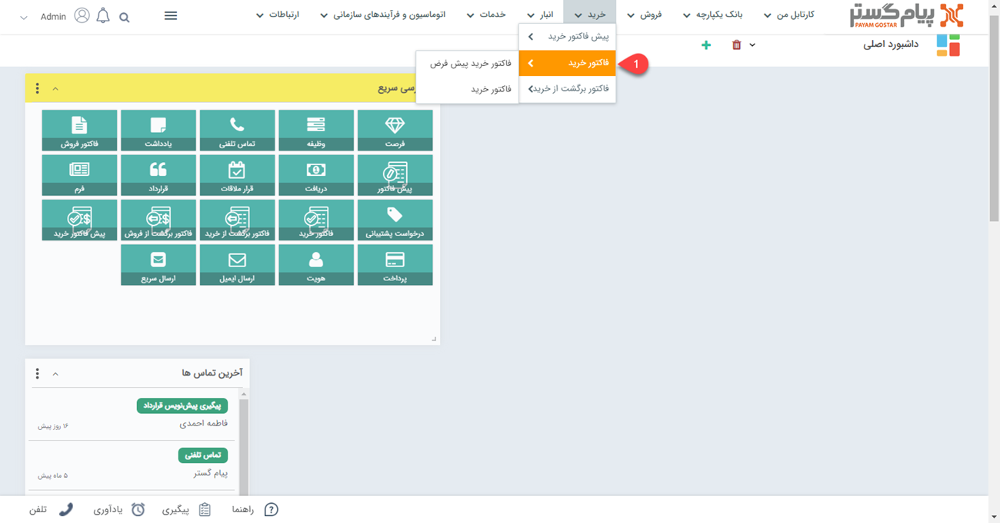

# لیست  فاکتورهای خرید
مشاهده لیست فاکتورهای خرید از دو طریق امکان پذیر است:
- [مشاهده لیست فاکتورهای ثبت شده برای تمامی هویت ها](#AllPurchaseInvoiceList)
- [مشاهده فاکتور های ثبت شده برای یک هویت](#customerPurchaseInvoiceList)

## مشاهده لیست همه فاکتورهای خرید {#AllPurchaseInvoiceList}
برای مشاهده لیست همه فاکتورهای ثبت شده دو روش وجود دارد:
- از طریق **تب خرید** > **فاکتور خرید**، تمامی فاکتورهای خرید قابل مشاهده است.

- از طریق **تب بانک یکپارچه** > **تاریخچه CRM**  می توانید با اعمال فیلتر روی "نوع"، تمامی فاکتورهای خرید ثبت شده را مشاهده نمایید.

## مشاهده لیست فاکتورهای خرید ثبت شده برای یک هویت{#customerPurchaseInvoiceList}
برای مشاهده لیست فاکتورهای خرید صادر شده برای یک مشتری می توانید از طریق دو روش زیر اقدام نمایید.
- 	در صفحه اصلی هویت مشتری از قسمت سوابق با اعمال فیلتر روی "نوع آیتم" می توانید فاکتورهای خرید مشتری مورد نظر خود را مشاهده نمایید.  

- با کلیک روی تب اصلی خرید و انتخاب فاکتورهای خرید
 با انتخاب نام هویت در قست پروفایل مرتبط می توانید فاکتورهای برگشت از خرید مرتبط با هویت مورد نظر را مشاهده نمایید.

- 	در صفحه اصلی هویت مشتری و تب خرید با انتخاب "نوع فاکتور" می توانید لیست فاکتورهای خرید را مشاهده کنید.

