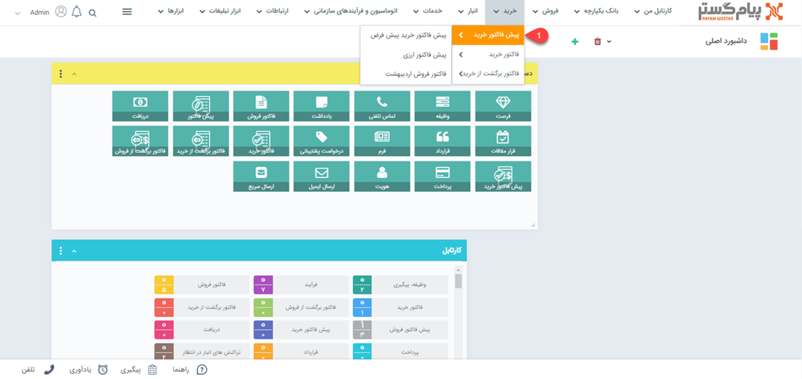
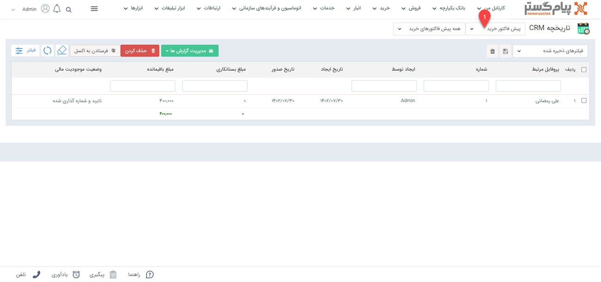

# لیست پیش فاکتورهای خرید
مشاهده لیست پیش فاکتورهای خرید از دو طریق امکان پذیر است:

- [مشاهده لیست پیش فاکتورهای ثبت شده برای تمامی هویت ها](#AllPurchaseQuoteList)
- [مشاهده پیش فاکتور های ثبت شده برای یک هویت](#customerQuotList)

## مشاهده لیست همه پیش فاکتورهای خرید {#AllPurchaseQuoteList}
برای مشاهده لیست همه پیش فاکتورهای ثبت شده دو روش وجود دارد:
- از طریق **تب خرید** > **پیش فاکتور خرید**، تمامی پیش فاکتورهای خرید قابل مشاهده است.

- از طریق **تب بانک یکپارچه** > **تاریخچه CRM**  می توانید با اعمال فیلتر روی "نوع"، تمامی پیش فاکتورهای خرید ثبت شده را مشاهده نمایید.

## مشاهده لیست پیش فاکتورهای خرید ثبت شده برای یک هویت{#customerPurchaseQuoteList}
برای مشاهده لیست پیش فاکتورهای خرید صادر شده برای مشتری می توانید از طریق دو روش زیر اقدام نمایید.
- 	در صفحه اصلی هویت مشتری از قسمت سوابق با اعمال فیلتر روی "نوع آیتم" می توانید پیش فاکتورهای خرید مشتری مورد نظر خود را مشاهده نمایید.  

- 	در صفحه اصلی هویت مشتری و تب خرید با انتخاب "نوع فاکتور" می توانید لیست پیش فاکتورهای خرید را مشاهده کنید. با انتخاب نام هویت در قست پروفایل مرتبط می توانید  فاکتور های مرتبط با هویت مورد نظر را مشاهده نمایید.

- 	در صفحه اصلی هویت مشتری و تب خرید با انتخاب "نوع فاکتور" می توانید لیست پیش فاکتورهای خرید را مشاهده کنید.

