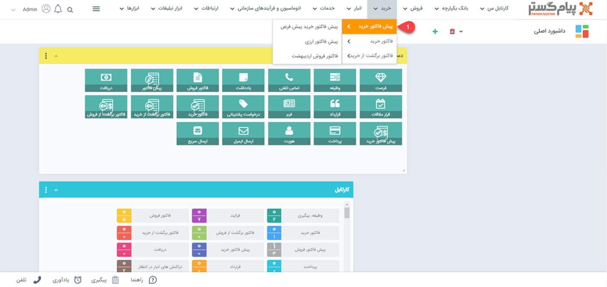
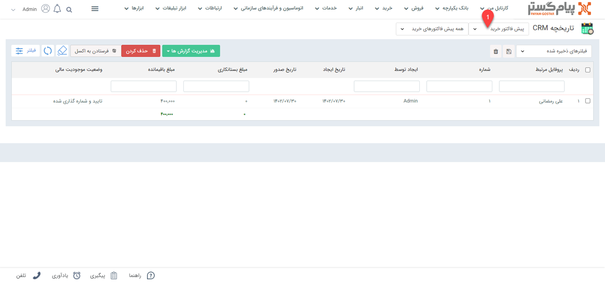

# لیست پیش فاکتورهای خرید
دراین مقاله روش‌های مشاهده‌ی لیست پیش‌فاکتورهای خرید در دو حالت بررسی می‌شود: 
- [مشاهده لیست پیش فاکتورهای ثبت شده برای تمامی هویت ها](#AllPurchaseQuoteList)
- [مشاهده پیش فاکتور های ثبت شده برای یک هویت](#customerQuotList)

## مشاهده لیست همه پیش فاکتورهای خرید {#AllPurchaseQuoteList}
برای مشاهده لیست همه پیش‌فاکتورهای خرید ثبت شده در سیستم، می‌توانید از دو مسیر اقدام نمایید: 

- از مسیر **تب خرید** > **پیش‌فاکتور خرید** > **زیرنوع پیش‌فاکتور خرید**
با انتخاب یکی از زیرنوع‌های پیش‌فاکتور خرید، وارد صفحه پیش‌فاکتورها می‌شوید. در این حالت، تمامی پیش‌فاکتورهای خرید ثبت‌شده از زیرنوع انتخابی به شما نمایش داده‌می‌شود. 

از قسمت بالای صفحه می‌توانید سایر زیرنوع‌ها و یا همه را برای نمایش انتخاب نمایید. با انتخاب همه، تمامی پیش‌فاکتورهای خرید (از همه زیرنوع‌ها) در لیست به شما نمایش داده می‌شود.

- از طریق **تب بانک یکپارچه** > **تاریخچه CRM**  می‌توانید با اعمال فیلتر "نوع" بر روی پیش‌فاکتور و انتخاب زیرنوع مورد نظر/همه در فیلتر کناری، تمامی پیش‌فاکتورهای خرید ثبت شده را مشاهده نمایید.

> **نکته** 
> در صورت داشتن مجوز مشاهده لیست و مشاهده آیتم زیرنوع‌های پیش‌فاکتورهای خرید، شما می‌توانید تمامی پیش‌فاکتورهای خرید ثبت شده را در این قسمت‌ها مشاهده نمایید. در این صورت تنها مجاز به مشاهده پیش‌فاکتورهای خریدی که خودتان ثبت کرده‌اید خواهید بود. 

## مشاهده لیست پیش فاکتورهای خرید ثبت شده برای یک هویت{#customerPurchaseQuoteList}
برای مشاهده لیست پیش‌فاکتورهای خرید ثبت شده برای یک مخاطب می‌توانید یکی از چهار مسیر زیر را انتخاب نمایید: 

- از طریق صفحه **پروفایل مخاطب** > **تب خرید** می‌توانید به پیش‌فاکتورهای فروش مشتری دسترسی داشته‌باشید. بدین منظور با استفاده از ویجت جستجوی سریع، وارد صفحه پروفایل هویت مورد نظر شوید. در صفحه اصلی پروفایل هویت از قسمت «خرید» می‌توانید تمامی فاکتورهای مخاطب را مشاهده نمایید.  
توجه داشته‌باشید که در این صفحه همه‌ی انواع فاکتور خرید (پیش‌فاکتور خرید، فاکتور خرید و فاکتور برگشت از خرید) به شما نمایش داده‌می‌شود. برای اینکه فقط پیش‌فاکتورهای خرید را مشاهده نمایید، با استفاده از فیلتر بالای صفحه، در قسمت نوع، «پیش‌فاکتور» را انتخاب نمایید. 
 

- از طریق صفحه **پروفایل مخاطب** > **تب خرید** می‌توانید به پیش‌فاکتورهای خرید مشتری دسترسی داشته باشید. بدین منظور با استفاده از ویجت جستجوی سریع صفحه پروفایل هویت موردنظر را باز کنید. در صفحه اصلی پروفایل هویت از قسمت فروش می‌توانید تمامی پیش‌فاکتورهای خرید مخاطب را (در کنار ‌فاکتورها و فاکتورهای برگشت از خرید وی) مشاهده نمایید. برای مشاهده پیش‌فاکتورهای خرید به تنهایی، می‌توانید از فیلتر استفاده نمایید. بدین منظور کافیست در بخش فیلتر، نوع را بر روی پیش‌فاکتور خرید تنظیم کرده و بر روی اعمال کلیک کنید.  

- از طریق **تب خرید** > **پیش‌فاکتور خرید** > **زیرنوع پیش‌فاکتور خرید** به صفحه لیست پیش‌فاکتورهای خرید رفته و در صورت نیاز زیرنوع پیش‌فاکتور خرید را به «همه پیش‌فاکتورهای خرید» تغییر دهید (از فلش کنار کادر قرمز بالا استفاده کنید). با استفاده از جستجوی «پروفایل مرتبط» پیش‌فاکتورهای خرید ثبت شده برای هویت مورد نظر را جدا کنید. بدین منظور کافیست نام هویت را در  قسمت مربوطه نوشته و Enter کنید.
 

- از طریق **تب بانک یکپارچه** > **تاریخچه CRM** با اعمال فیلتر(کادر قرمز بالا)،  پیش‌فاکتورها را یافته  و با استفاده از جستجوی «پروفایل مرتبط» (کادر قرمز پایین) پیش‌فاکتورهای خرید هویت مورد نظر را جدا کنید. بدین منظور کافیست نام هویت را در قسمت مربوطه نوشته و Enter کنید.

> **نکته** 
> برای مشاهده پیش‌فاکتور خرید در سابقه یک هویت باید مجوز مشاهده سوابق را بر روی آن زیرنوع هویت و همچنین مشاهده آیتم را در زیرنوع‌های پیش‌فاکتور خرید داشته باشید.  