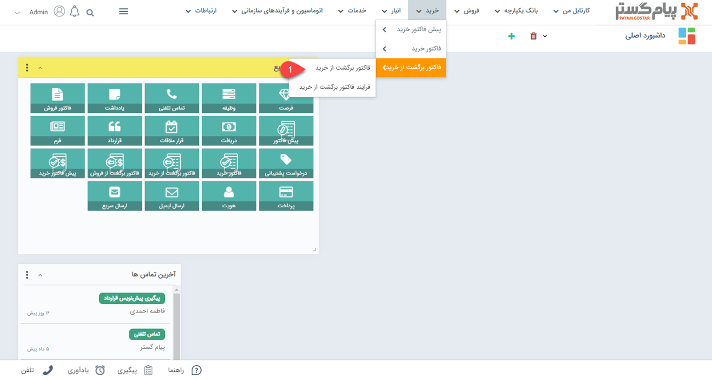
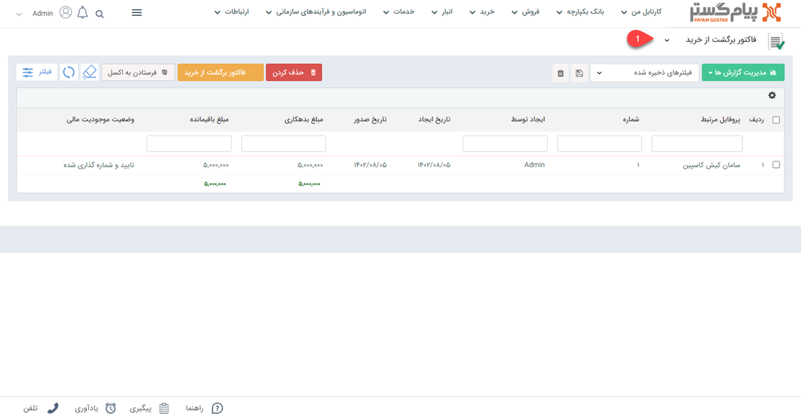

# لیست  فاکتورهای برگشت از خرید
مشاهده لیست فاکتورهای برگشت از خرید از دو طریق امکان پذیر است:
- [مشاهده لیست همه فاکتورهای برگشت از خرید ثبت شده](#AllPurchaseReurnInvoiceList)
- [مشاهده فاکتورهای برگشت از خرید ثبت شده برای یک هویت](#customerPurchaseReurnInvoiceList)

## مشاهده لیست همه فاکتورهای برگشت از خرید {#AllPurchaseReurnInvoiceList}
برای مشاهده لیست همه فاکتورهای برگشت از خرید ثبت شده دو روش وجود دارد:
- از طریق **تب خرید** > **فاکتوربرگشت از خرید**، تمامی فاکتورهای برگشت از خرید قابل مشاهده است.

- از طریق **تب بانک یکپارچه** > **تاریخچه CRM**  می توانید با اعمال فیلتر روی "نوع"، تمامی فاکتورهای برگشت از خرید ثبت شده را مشاهده نمایید.

## مشاهده لیست فاکتورهای خرید ثبت شده برای یک هویت{#customerPurchaseReurnInvoiceList}
برای مشاهده لیست فاکتورهای برگشت از خرید صادر شده برای مشتری می توانید از طریق دو روش زیر اقدام نمایید.
- 	در صفحه اصلی هویت مشتری از قسمت سوابق با اعمال فیلتر روی "نوع آیتم" می توانید فاکتورهای خرید مشتری مورد نظر خود را مشاهده نمایید.  

- با کلیک روی تب  اصلی خرید و انتخاب فاکتورهای برگشت از خرید،
 با انتخاب نام هویت در قست پروفایل مرتبط می توانید فاکتورهای برگشت از خرید مرتبط با هویت مورد نظر را مشاهده نمایید.

- 	در صفحه اصلی هویت مشتری و تب خرید با انتخاب "نوع فاکتور" می توانید لیست فاکتورهای برگشت از خرید را مشاهده کنید.

