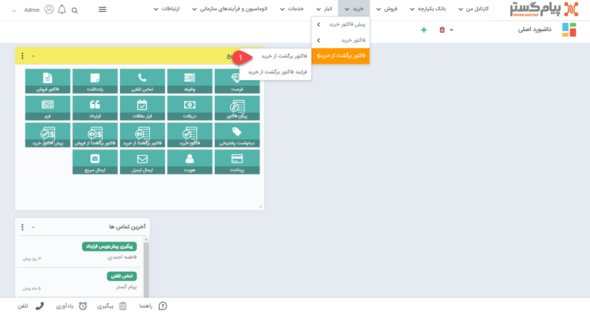
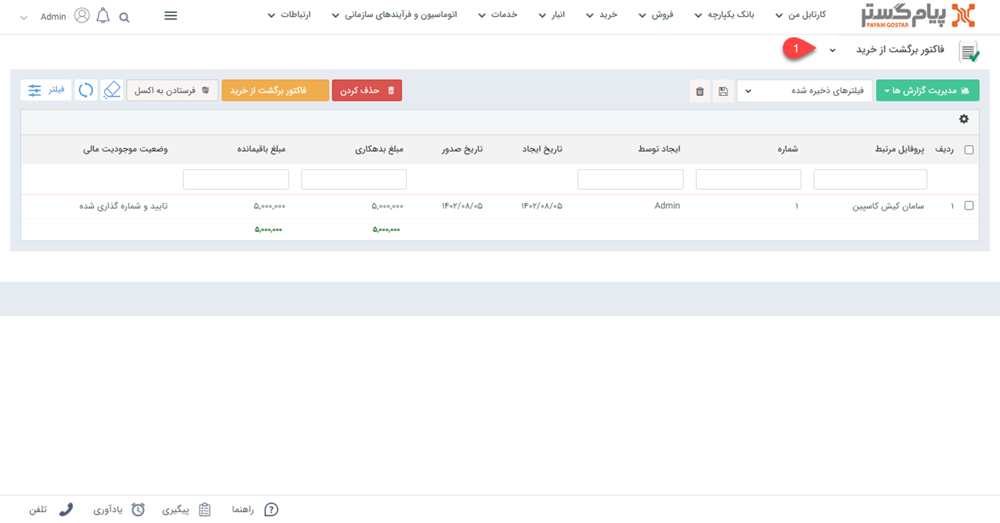
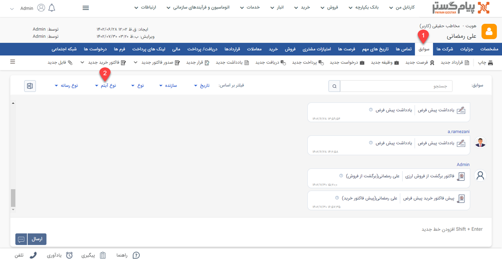
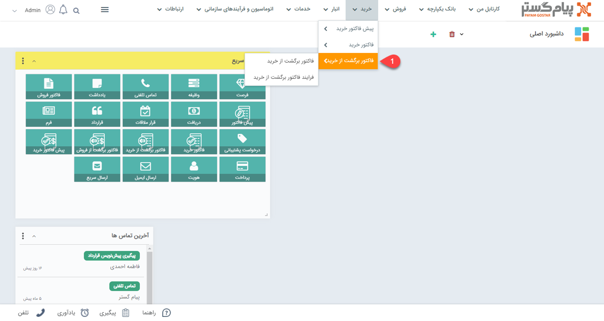
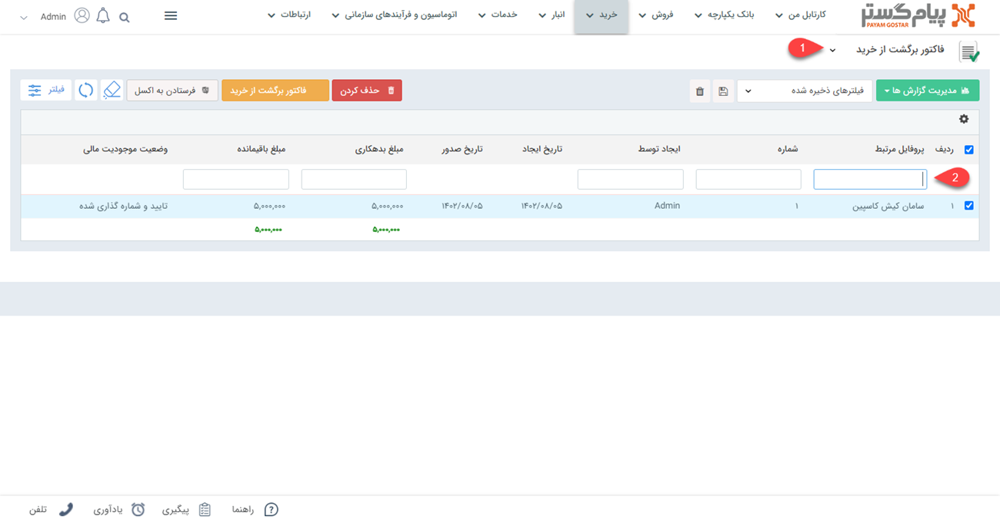
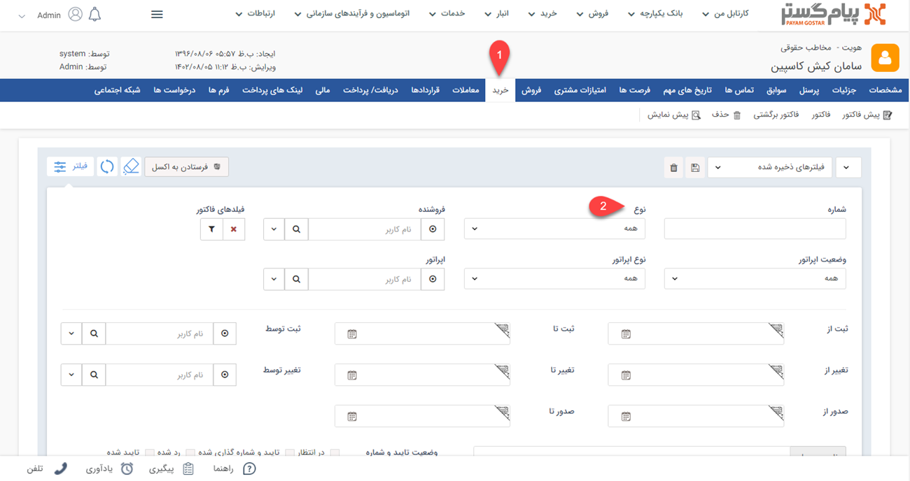

# لیست  فاکتورهای برگشت از خرید
فاکتور‌های برگشت از خرید ثبت شده را از دو مسیر اصلی می‌توانید مشاهده نمایید که عبارتند از:
- [مشاهده لیست همه فاکتورهای برگشت از خرید ثبت شده](#AllPurchaseReurnInvoiceList)
- [مشاهده فاکتورهای برگشت از خرید ثبت شده برای یک هویت](#customerPurchaseReurnInvoiceList)

## مشاهده لیست همه فاکتورهای برگشت از خرید {#AllPurchaseReurnInvoiceList}
برای مشاهده لیست همه فاکتورهای برگشت از خرید ثبت شده دو روش وجود دارد:
- از طریق **تب خرید** > **فاکتوربرگشت از خرید**، تمامی فاکتورهای برگشت از خرید قابل مشاهده است.

- از  **تب بانک یکپارچه** > **تاریخچه CRM**  می‌توانید با انتخاب فاکتور برگشت از خرید در آیتم‌های crm و انتخاب زیر نوع موردنظر از  فاکتورهای برگشت از خرید، لیست تمامی فاکتورهای برگشت از خرید ثبت شده در سیستم را مشاهده نمایید.

## مشاهده لیست فاکتورهای خرید ثبت شده برای یک هویت{#customerPurchaseReurnInvoiceList}
برای مشاهده لیست فاکتورهای برگشت از خرید صادر شده برای مشتری می‌توانید از طریق دو روش زیر اقدام نمایید.
- 	در **صفحه اصلی هویت مشتری** >  **سوابق** با اعمال فیلتر روی "نوع آیتم" می‌توانید فاکتورهای خرید مشتری مورد نظر خود را مشاهده نمایید.  

-  با کلیک روی **تب خرید**  در صفحه هویت مشتری و اعمال فیلتر روی "**نوع**" می‌توانید تمامی فاکتورهای برگشت از خرید ثبت شده برای این هویت را مشاهده نمایید.

- با کلیک روی **تب اصلی فروش** و انتخاب فاکتورهای برگشت از فروش،
 با انتخاب نام هویت در قسمت **پروفایل مرتبط** می‌توانید فاکتورهای برگشت از فروش مرتبط با هویت مورد نظر را مشاهده نمایید.
 

- 	در صفحه اصلی هویت مشتری و تب خرید با انتخاب "نوع فاکتور" می توانید لیست فاکتورهای برگشت از خرید را مشاهده کنید.

