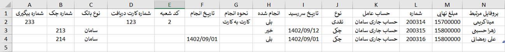
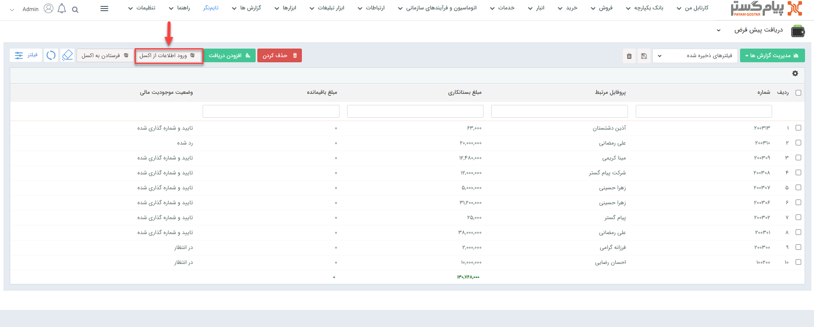
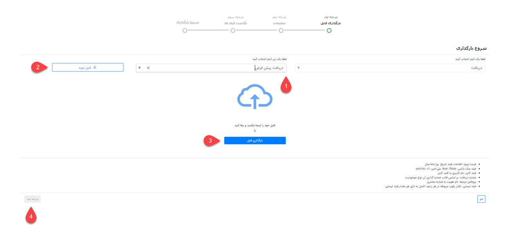
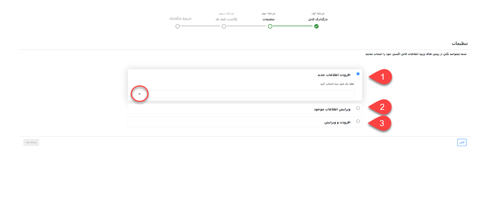
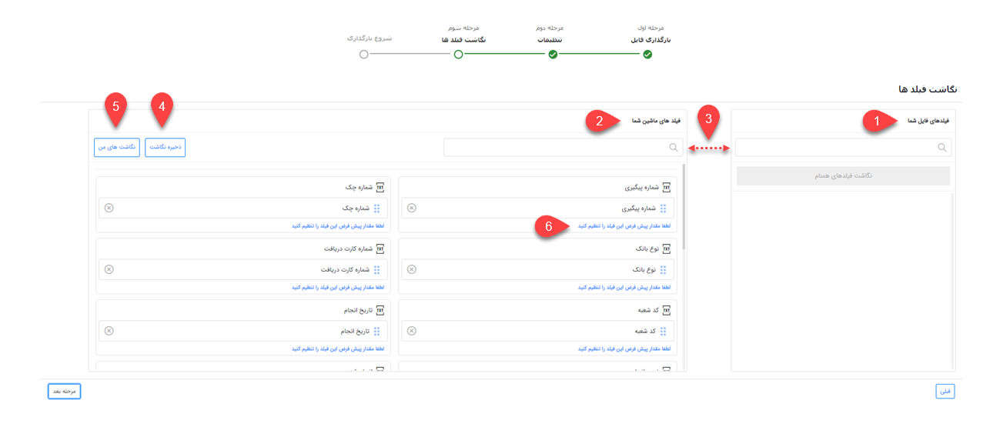

# ثبت دریافت از طریق اکسل
در صورت نیاز به ورود تعدادی دریافت به صورت یکجا می‌توانید از روش ورود اکسلی استفاده نمایید. بدین ترتیب می‌توانید اطلاعات دریافت‌های مورد نظر را در اکسل درج نمایید (یا از سایر نرم‌افزارهای خود خروجی بگیرید) و سپس بارگذاری کنید. در این حالت دریافت‌های مورد نظر ایجاد شده و اطلاعات آن در فیلدهای مربوطه وارد می‌شود. علاوه بر آن از این روش می‌توانید برای ویرایش اطلاعات دریافت‌های موجود استفاده نمایید. 
برای اینکه ورود اطلاعات بدون مواجهه با خطا و با موفقیت به اتمام برسد،‌ در این مقاله تمامی موارد لازم به همراه شیوه بارگذاری مطرح شده است. بر این اساس مقاله شامل عناوین زیر می‌باشد:

- [شیوه‌ی تهیه و تنظیم فایل اکسل دریافت‌ها](#ReceiptExcelSetting)
- [روش بارگذاری فایل اکسل دریافت‌ها](#ReceiptExcelUploading)
- [مجوزهای لازم برای بارگذاری اکسل دریافت‌ها](#ReceiptExcelPermision)

{#ReceiptExcelSetting}
## تنظیمات فایل اکسل
برای بارگذاری و ورود اطلاعات دریافت‌ها از طریق اکسل، ابتدا باید اکسل مورد نظر را بر اساس فرمت مورد پذیرش نرم‌افزار تنظیم کنید. در تهیه اکسل توجه داشته باشید که تمامی اطلاعات در یک Sheet ذخیره شده باشد. در غیر این صورت بارگذاری اکسل با موفقیت انجام نخواهد شد.

تصویر فوق،‌ ستون‌های مورد نیاز برای بارگذاری دریافت را بر اساس فیلدهای پیش‌فرض نشان می‌دهد.
برای تکمیل اطلاعات مربوط به فیلدهای پیش‌فرض به راهنمایی‌های زیر توجه داشته باشید:
- **پروفایل مرتبط:** نام هویت و یا شماره مشتری را در این قسمت وارد نمایید.
- **حساب عامل:** حسابی که مبلغ به آن واریز شده است را در این ستون درج نمایید. توجه داشته باشید حساب درج شده در این قسمت باید از بین حساب‌های تعریف شده در نرم‌افزار انتخاب شود. (برای بررسی این موضوع کافیست یک دریافت جدید از زیرنوع مورد نظر باز کرده و لیست «واریز به» را بررسی کنید)
- **شماره دریافت:** شماره دریافت را بر اساس الگوی شماره‌گذاری‌ای که برای آن تعریف شده است مشخص نمایید. برای ثبت درست شماره بر اساس الگوی شماره‌گذاری، آخرین شماره‌ی اختصاص داده شده به آخرین دریافت ثبت شده‌ در سیستم را چک کرده و شماره‌ی بعدی را به اولین دریافت مندرج اکسل خود اختصاص دهید.

> **نکته** 
>  در حالت پیش‌فرض،‌ «شماره» در مرحله‌ی بعد مبنای شناسایی انتخاب می‌شود. در نتیجه درج آن الزامی است. مگر اینکه فیلد دیگری به عنوان مبنای شناسایی انتخاب گردد. 

- **مبلغ نهایی:** مبلغ مورد نظر (مبلغ دریافت شده) را در این ستون وارد نمایید. توجه داشته باشید مبلغ را به ریال درج کنید.
- **توضیحات:** در صورت نیاز توضیحات دریافت را در این قسمت درج نمایید.
- **نوع:** نوع دریافت را از بین گزینه‌های نقدی، چکی و اعتباری انتخاب نمایید. توجه داشته باشید که نوع انتخابی،‌ در زیرنوع دریافتی که قصد بارگذاری آن را دارید فعال  باشد (برای بررسی این موضوع کافیست یک دریافت جدید از زیرنوع مورد نظر باز کرده و لیست نوع دریافت را بررسی کنید).
- **شماره چک:** در صورت انتخاب نوع دریافت چکی، شماره چک را در این ستون وارد نمایید.
- **نوع بانک:** در صورت انتخاب نوع دریافت چکی، نام بانک را در این ستون وارد نمایید. توجه داشته باشید که نام بانک را از بین بانک‌های تعریف شده در نرم‌افزار انتخاب کنید. (برای بررسی این موضوع یک دریافت جدید ب از زیرنوع انتخابی را باز کرده، نوع را بر روی چکی تنظیم کرده و در لیست بانک،‌ اسامی موجود را مشاهده نمایید ).
- **شماره پیگیری:** در صورت انتخاب نوع دریافت نقدی، شماره پیگیری را در این ستون وارد نمایید.
- **کد شعبه:** در صورت انتخاب نوع دریافت نقدی، کد شعبه را در این ستون وارد نمایید.
- **شماره کارت:** در صورت انتخاب نوع دریافت نقدی، شماره کارت را در این ستون وارد نمایید.
- **نحوه انجام:** صورت انتخاب نوع دریافت نقدی، روش دریافت را از بین گزینه‌های کارت به کارت، واریز به حساب بانکی،‌ پرداخت آنلاین، پرداخت حضوری و لینک پیام گستر پرداخت انتخاب نمایید.
- **تاریخ سررسید:** در صورت انتخاب نوع دریافت چکی یا اعتباری، تاریخ سررسید دریافت را در این ستون وارد نمایید.
- **انجام شده:** در صورت انتخاب نوع دریافت چکی یا اعتباری، دریافت شدن و یا نشدن آن را مشخص نمایید. دریافت شدن مبلغ را با ذکر «بلی» و عدم دریافت را با ذکر «خیر» در این ستون مشخص کنید.
- **تاریخ انجام:** تاریخ دریافت را در این ستوان درج نمایید.

چنانچه زیرنوع دریافت مورد نظر دارای فیلدهای اضافه (اضافه شده در شخصی‌سازی) می‌باشد، ستونی هم نام با فیلد خود به ستون‌های موجود در اکسل اضافه و اطلاعات مورد نظر را در ستون مربوطه وارد نمایید. در این خصوص به نکات زیر توجه داشته باشید: 
- امکان ورود اطلاعات فیلدهایی از نوع فایل، تصویر، html، کمپین، برچسب، لیست مرتبط، فیلد آیتم‌های CRM (مثل فیلد دریافت،‌فاکتور و... به جز فیلد شخص/شرکت)، فیلد اضافه از نوع رنگ، فیلد لیستی از نوع فایل و فیلد لیستی از نوع کاربر/گروه از طریق اکسل وجود ندارد.
- در صورت استفاده از فیلد چک باکس،‌ با استفاده از «بلی» چک باکس تیک خورده و در صورت ذکر «خیر» چک باکس بدون تیک لحاظ می‌شود. البته از عبارات yes/no و true/false و همچنین اعداد 1/0 نیز می‌توانید بدین منظور استفاده نمایید.
- در صورت استفاده از فیلد کاربر، از بین کاربران تعریف شده در نرم‌افزار نام کاربر و یا کد کاربر مورد نظر را در این قسمت درج نمایید.
- برای ورود اطلاعات به فیلدهایی از نوع لیست کشویی فقط از عبارات موجود در لیست می‌توانید استفاده نمایید. فیلدهای لیست کشویی پیش‌فرض نرم‌افزار در بخش مدیریت آیتم‌های سیستم و لیست‌های کشویی اضافه‌ شده توسط شما در بخش شخصی‌سازی آن آیتم قابل مشاهده و ویرایش می‌باشند. چنانچه برای یک فیلد لیست کشویی، دو گزینه با عنوان مشابه تعریف شده باشد، ورود اطلاعات (مقداردهی) آن از طریق اکسل با خطا مواجه می‌شود.

> **نکته** 
> برای بارگذاری اکسل دریافت، درج «مرتبط با»، «مبلغ نهایی» و «شماره» الزامی است. 

{ReceiptExcelUploading}
## مراحل بارگذاری فایل اکسل
برای بارگذاری فایل اکسل دریافت‌ها به این ترتیب اقدام نمایید:
### مسیر بارگذاری
در ابتدا از مسیر تب **فروش** > **دریافت** > **زیرنوع دریافت** وارد صفحه دریافت‌ها شوید. در صفحه‌ی نمایش داده شده بر روی «ورود اطلاعات از اکسل» کلیک کنید.

### بارگذاری فایل
در قسمت بالا، نوع آیتم به صورت خودکار دریافت انتخاب شده است؛  زیر نوع دریافت مورد نظر را در قسمت کناری (شماره ۱) انتخاب نمایید.

با کلیک بر روی «فایل نمونه» (شماره ۲) می‌توانید اکسل نمونه برای تهیه اکسل دریافت با فرمت صحیح را دریافت نمایید. چنانچه از راهنمای بالا برای تهیه اکسل خود استفاده کرده‌اید نیاز به دانلود این فایل نیست.
در این مرحله فایل اکسل خود را انتخاب (شماره ۳) یا از طریق drag & drop بارگذاری کنید. پس از بارگذاری فایل،‌ کلید «مرحله بعد» (شماره ۴) فعال می‌شود.

### تنظیمات بارگذاری فایل
در این بخش باید تنظیمات لازم جهت تعیین روش ورود اطلاعات را مشخص کنید.

**1. افزودن اطلاعات جدید** 
با انتخاب این گزینه، تمامی دریافت‌های جدید موجود در اکسل بر اساس مبنای در نظر گرفته شده (مثل شماره دریافت) شناسایی و بارگذاری می‌شود. چنانچه قصد بارگذاری دریافت‌های جدید در سیستم را دارید (منظور از دریافت جدید دریافت‌هایی است که پیش‌تر در سیستم وجود نداشته) این گزینه را انتخاب کرده و در کادر پایین، «شماره» را به عنوان مبنای شناسایی انتخاب کنید. برای نمایش این گزینه در کادر،‌ بر روی آیکون طوسی رنگ سمت چپ کادر کلیک کنید. 
 بدیهی است در صورت یکسان بودن شماره‌ی دریافت درج شده در اکسل با یکی از دریافت‌های موجود در سیستم، دریافت تکراری در نظر گرفته شده و بارگذاری نمی‌شود.
**2. ‌ویرایش اطلاعات موجود** 
در این حالت براساس شماره دریافت (فیلد مبنا)، جستجو انجام می‌شود. در صورت وجود دریافت با شماره مشابه در نرم‌افزار، اطلاعات دریافت مربوطه ویرایش شده و اطلاعات موجود در اکسل برای آن درج می‌شود. در صورت یافت نشدن دریافت با شماره مشابه،‌ اطلاعات آن سطر از اکسل بارگذاری نخواهد شد.
برای انتخاب این گزینه، در قسمت کادر پایین بر روی آیکون طوسی رنگ سمت چپ کلیک کرده و «شماره» را به عنوان فیلد مبنا انتخاب کنید. 

> **نکته** 
> در هنگام ویرایش، باید زیر نوع دریافت در حال ویرایش و زیر نوع آیتم انتخاب شده در گام اول یکسان باشد؛ در غیر این صورت بارگذاری انجام نمی‌شود.

با انتخاب چک باکس " فقط فیلد‌های خالی پر شوند" تنها فیلدهای خالی دریافت‌های موجود مقداردهی شده و فیلدهایی که دارای اطلاعات می‌باشند بدون تغییر باقی می‌مانند. 

**3. افزودن و ویرایش** 
در این حالت براساس شماره دریافت (فیلد مبنا)، جستجو انجام می‌شود. در صورت وجود دریافت با شماره درج شده در اکسل، دریافت مربوطه ویرایش می‌شود و در صورت یافت نشدن دریافت با این شماره، ردیف مربوطه به عنوان دریافت جدید در نرم‌افزار ثبت می‌شود. 
با انتخاب چک باکس " فقط فیلد‌های خالی پر شوند"،‌ در دریافت‌هایی که نیازمند ویرایش می‌باشند (دریافت‌هایی که شماره آن‌ها پیش‌تر در سیستم وجود داشته)، ‌تنها فیلدهای خالی مقداردهی شده و فیلدهایی که دارای اطلاعات می‌باشند بدون تغییر باقی می‌مانند.

> **نکته** 
> اگر در شخصی‌سازی، فیلدی از نوع متن، عدد و یا شناسه خودکار را به دریافت اضافه کرده باشید،‌ از این فیلدها هم می‌توانید برای مبنای شناسایی دریافت‌‌های تکراری استفاده کنید. 

### نگاشت فیلدها
در مرحله سوم، سرستون‌های فایل اکسل در بخش «فیلدهای فایل شما» (شماره ۱) و فیلدهای موجود در آیتم دریافت در بخش «فیلدهای ماشین شما» (شماره ۲) نمایش داده می‌شود. در واقع در این بخش مشخص می‌شود اطلاعات هر ستون اکسل باید در کدام فیلد وارد شود.

در صورتی که نام ستون‌های اکسل خود را بر اساس راهنمای تنظیم فایل (بخش اول توضیحات) تنظیم کرده باشید،‌ نگاشت به صورت خودکار انجام می‌گیرد. در غیر این صورت با drag & drop باید نام هر ستون را از بخش فیلدهای فایل شما (سمت راست) به فیلد مربوطه در بخش فیلدهای ماشین شما (سمت چپ) متصل نمایید. در این شرایط برای یافتن عنوان مورد نظر در هر دو بخش می‌توانید از قابلیت جستجو (شماره ۳)‌ استفاده کنید. 
پس از نگاشت (اتصال نام ستون به فیلدها) می‌توانید نگاشت خود را ذخیره نمایید (شماره ۴). در صورت استفاده مجدد از این اکسل یا اکسل مشابه برای بارگذاری، با کلیک بر روی نگاشت‌های من (شماره ۵)، نگاشت به صورت خودکار انجام می‌شود. شما می‌توانید نگاشت‌های پرکاربرد خود را در سیستم ذخیره نمایید. در لیست نگاشت‌های من امکان ویرایش یا حذف نگاشت ذخیره شده وجود دارد. 
برای هر فیلد می‌توانید مقدار پیش‌فرض تعیین نمایید (شماره ۶). در صورت خالی بودن مقدار فیلد در اکسل، فیلد با مقدار پیش‌فرض که در این قسمت تعریف کرده‌اید پر می‌شود.

### شروع بارگذاری
در صورت بارگذاری موفق اکسل،‌ انجام موفقیت‌آمیز آن در این صفحه اعلام می‌شود. در صورت عدم موفقیت در بارگذاری اطلاعات، پیغام زیر نمایش داده می‌شود.

در منوی گزارش‌ها، بخش وضعیت عملیات انبوه می‌توانید نتایج ورود اطلاعات را مشاهده کنید. همچنین در صورت بروز خطا با دانلود فایل اکسل از این بخش می‌توانید خطا و علت خطا را مشاهده نمایید. برای دانلود فایل، بر روی جزئیات رکورد مربوطه کلیک کرده و خروجی اکسل دریافت کنید. در اکسل دریافتی، سطرهای دارای مشکل با رنگ قرمز مشخص شده و در ستون آخر دلیل بروز خطا درج شده است.

{#ReceiptExcelPermision}
## مجوزهای مورد نیاز برای بارگذاری دریافت از طریق اکسل
برای ثبت دریافت از طریق اکسل،‌ کاربر باید دارای مجوزهای زیر باشد:
- **برای افزودن اطلاعات جدید** 
برای افزودن اطلاعات جدید (مورد ۱ در تنظیمات بارگذاری فایل) باید مجوز **ذخیره اولیه** زیرنوع دریافت انتخابی را داشته باشید.
- **برای ویرایش اطلاعات موجود** 
برای ویرایش اطلاعات موجود (مورد ۲ در تنظیمات بارگذاری فایل) باید مجوز **ویرایش** زیرنوع دریافت انتخابی را داشته باشید.
- **برای افزودن و ویرایش** 
برای افزودن و ویرایش اطلاعات (مورد ۳ در تنظیمات بارگذاری فایل) باید مجوز **ذخیره اولیه** و همچنین مجوز **ویرایش** زیرنوع دریافت انتخابی را داشته باشید.
- **برای انتخاب نوع دریافت** 
برای انتخاب هر نوع دریافت نقدی/چکی/اعتباری باید به ترتیب مجوز **تعیین نوع دریافت نقدی**، **تعیین نوع دریافت چکی** و **تعیین نوع دریافت اعتباری** را در زیرنوع دریافت انتخابی داشته باشید.

> **نکته** 
> در صورت داشتن مجوز مدیر سیستم و یا مجوز مدیر مالی می‌توانید بارگذاری اکسل در تمامی حالت‌ها را به انجام برسانید.