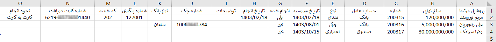
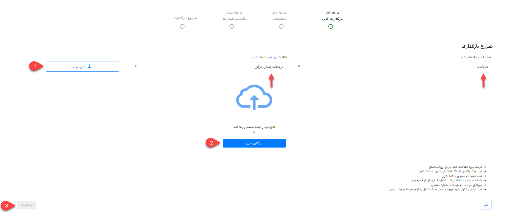
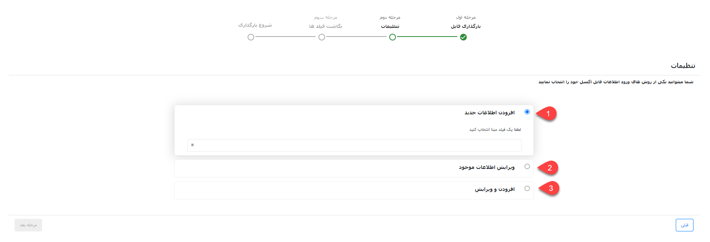
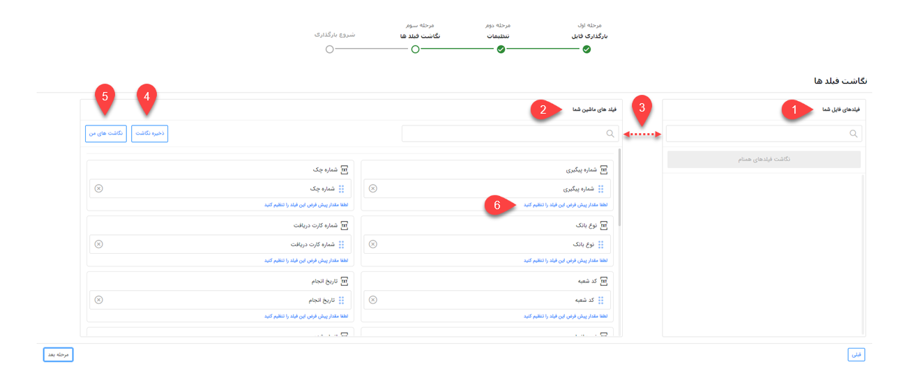

# ثبت دریافت از طریق اکسل

در صورت نیاز به بارگذاری اطلاعات تعدادی از دریافت‌ها به صورت یکجا می‌توانید از روش ورود اکسلی استفاده نمایید. بدین ترتیب می‌توانید اطلاعات دریافت‌های مورد نظر را در اکسل درج نمایید (یا از سایر نرم‌افزارهای خود خروجی بگیرید) و سپس بارگذاری کنید. در این حالت دریافت‌های مورد نظر ایجاد شده و اطلاعات آن در فیلدهای مربوطه وارد می‌شود. علاوه بر آن از این روش می‌توانید برای ویرایش اطلاعات دریافت‌های موجود استفاده نمایید. 
برای اینکه ورود اطلاعات بدون مواجهه با خطا و با موفقیت به اتمام برسد،‌ در این مقاله تمامی موارد لازم به همراه شیوه بارگذاری مطرح شده است. بر این اساس مقاله شامل عناوین زیر می‌باشد:
- [تنظیمات فایل اکسل](#ReceiptExcelSetting)
- [روش بارگذاری فایل اکسل دریافت‌ها](#ReceiptExcelUploading)
- [مجوزهای لازم برای بارگذاری اکسل دریافت‌ها](#ReceiptExcelPermision)

## تنظیمات فایل اکسل{#ReceiptExcelSetting}
برای ورود اطلاعات دریافت‌ها از طریق اکسل، ابتدا باید اکسل مورد نظر را بر اساس فرمت مورد پذیرش نرم‌افزار تنظیم کنید. بدین منظور می‌توانید اکسلی با ستون‌هایی که در تصویر می‌بینید (فیلدهای آیتم دریافت) ایجاد کنید و یا از فایل نمونه استفاده نمایید. فایل نمونه در مرحله‌ی اول بارگذاری به شما ارائه می‌شود (جلوتر به آن می‌رسیم). 

تصویر فوق،‌ ستون‌های مورد نیاز برای بارگذاری دریافت را بر اساس فیلدهای پیش‌فرض آیتم دریافت نشان می‌دهد. در صورت افزودن فیلدهای اضافه (در شخصی‌سازی)، برای هر فیلد یک ستون با نام مشابه آن ایجاد نمایید. چنانچه از فایل نمونه‌ای که نرم‌افزار به شما می‌دهد استفاده می‌کنید، این فیلدها به صورت خودکار در فایل اکسل قرار داده‌می‌شود. 
برای تکمیل اطلاعات مربوط به فیلدهای پیش‌فرض به راهنمایی‌های زیر توجه داشته باشید:
- **پروفایل مرتبط:** نام هویت و یا شماره مشتری را در این قسمت وارد نمایید.
- **مبلغ نهایی:** مبلغ مورد نظر (مبلغ دریافت شده) را در این ستون وارد نمایید. توجه داشته باشید مبلغ را به ریال درج کنید.
- **شماره:** شماره دریافت را بر اساس الگوی شماره‌گذاری‌ای که برای آن تعریف شده است مشخص نمایید. برای ثبت درست شماره بر اساس الگوی شماره‌گذاری، آخرین شماره‌ی اختصاص داده شده به آخرین دریافت ثبت شده‌ در سیستم را چک کرده و شماره‌ی بعدی را به اولین دریافت مندرج اکسل خود اختصاص دهید.

> **نکته** 
>  در حالت پیش‌فرض،‌ «شماره» در مرحله‌ی بعد مبنای شناسایی انتخاب می‌شود. در نتیجه درج آن الزامی است. مگر اینکه فیلد دیگری به عنوان مبنای شناسایی انتخاب گردد. 

- **حساب عامل:** حسابی که مبلغ به آن واریز شده است را در این ستون درج نمایید. توجه داشته باشید حساب درج شده در این قسمت باید از بین حساب‌های تعریف شده در نرم‌افزار انتخاب شود. (برای بررسی این موضوع کافیست یک دریافت جدید از زیرنوع مورد نظر باز کرده و لیست «واریز به» را بررسی کنید)
- **نوع:** نوع دریافت را از بین گزینه‌های نقدی، چکی و اعتباری انتخاب نمایید. توجه داشته باشید که نوع انتخابی،‌ در زیرنوع دریافتی که قصد بارگذاری آن را دارید فعال  باشد (برای بررسی این موضوع کافیست یک دریافت جدید از زیرنوع مورد نظر باز کرده و لیست نوع دریافت را بررسی کنید).
- **تاریخ سررسید:** در صورت انتخاب نوع دریافت چکی یا اعتباری، تاریخ سررسید دریافت را در این ستون وارد نمایید.
- **انجام شده:** در صورت انتخاب نوع دریافت چکی یا اعتباری، دریافت شدن و یا نشدن آن را مشخص نمایید. دریافت شدن مبلغ را با ذکر «بلی» و عدم دریافت را با ذکر «خیر» در این ستون مشخص کنید.
- **تاریخ انجام:** تاریخ دریافت را در این ستوان درج نمایید.
- **توضیحات:** در صورت نیاز توضیحات دریافت را در این قسمت درج نمایید.
- **شماره چک:** در صورت انتخاب نوع دریافت چکی، شماره چک را در این ستون وارد نمایید.
- **نوع بانک:** در صورت انتخاب نوع دریافت چکی، نام بانک را در این ستون وارد نمایید. توجه داشته باشید که نام بانک را از بین بانک‌های تعریف شده در نرم‌افزار انتخاب کنید. (برای بررسی این موضوع یک دریافت جدید از زیرنوع انتخابی را باز کرده، نوع را بر روی چکی تنظیم کرده و در لیست بانک،‌ اسامی موجود را مشاهده نمایید ).
- **شماره پیگیری:** در صورت انتخاب نوع دریافت نقدی، شماره پیگیری را در این ستون وارد نمایید.
- **کد شعبه:** در صورت انتخاب نوع دریافت نقدی، کد شعبه را در این ستون وارد نمایید.
- **شماره کارت دریافت:** در صورت انتخاب نوع دریافت نقدی، شماره کارت را در این ستون وارد نمایید.
- **نحوه انجام:** صورت انتخاب نوع دریافت نقدی، روش دریافت را از بین گزینه‌های کارت به کارت، واریز به حساب بانکی،‌ پرداخت آنلاین، پرداخت حضوری و لینک پیام گستر پرداخت انتخاب نمایید. 

چنانچه دریافت شما دارای اطلاعاتی بیشتر از فیلدهای پیش‌فرض باشد، باید فیلد مورد نیاز آن را از طریق شخصی‌سازی در زیرنوع دریافت مورد نظر ایجاد نمایید. پس از آن کافی است برای هر فیلد، ستونی هم نام با آن به ستون‌های موجود در اکسل اضافه نمایید. در این خصوص به نکات زیر توجه داشته‌باشید: 
- امکان ورود اطلاعات فیلدهایی از نوع فایل، تصویر، html، کمپین، برچسب، لیست مرتبط، فیلد آیتم‌های CRM (مثل فیلد دریافت،‌فاکتور و... به جز فیلد شخص/شرکت)، فیلد اضافه از نوع رنگ، فیلد لیستی از نوع فایل و فیلد لیستی از نوع کاربر/گروه از طریق اکسل وجود ندارد.
- در صورت استفاده از فیلد چک باکس،‌ با استفاده از «بلی» چک باکس تیک خورده و در صورت ذکر «خیر» چک باکس بدون تیک لحاظ می‌شود. البته از عبارات yes/no و true/false و همچنین اعداد 1/0 نیز می‌توانید بدین منظور استفاده نمایید.
- در صورت استفاده از فیلد کاربر، از بین کاربران تعریف شده در نرم‌افزار نام کاربر و یا کد کاربر مورد نظر را در این قسمت درج نمایید.
- برای ورود اطلاعات به فیلدهایی از نوع لیست کشویی فقط از عبارات موجود در لیست می‌توانید استفاده نمایید. فیلدهای لیست کشویی پیش‌فرض نرم‌افزار در بخش مدیریت آیتم‌های سیستم و لیست‌های کشویی اضافه‌ شده توسط شما در بخش شخصی‌سازی آن آیتم قابل مشاهده و ویرایش می‌باشند. چنانچه برای یک فیلد لیست کشویی، دو گزینه با عنوان مشابه تعریف شده باشد، ورود اطلاعات (مقداردهی) آن از طریق اکسل با خطا مواجه می‌شود.

>**نکته** 
> توجه داشته‌باشید که امکان بارگذاری چند نوع دریافت (زیرنوع‌های مختلف) به صورت یکجا وجود ندارد. برای بارگذاری دریافت، برای هر زیرنوع دریافت به یک اکسل جداگانه نیاز دارید. 

## مراحل بارگذاری فایل اکسل{ReceiptExcelUploading}
برای بارگذاری فایل اکسل دریافت‌ها به این ترتیب اقدام نمایید:
### بارگذاری فایل 
برای بارگذاری فایل اکسل از مسیر تب **دریافت** > **دریافت** > **زیرنوع دریافت** مورد نظر را انتخاب کنید و وارد صفحه لیست دریافت‌ها شوید. بر روی کلید «ورود اطلاعات از اکسل» کلیک کنید تا صفحه بارگذاری به شما نمایش داده‌شود. 
در گام اول **نوع** و **زیرنوع** آیتم انتخاب شده نمایش داده‌می‌شود. توجه داشته‌باشید که زیرنوع دریافتی که قصد بارگذاری آن را دارید در قسمت زیرنوع انتخاب شده‌باشد. در غیر این صورت، چنانچه زیرنوع دریافت به درستی انتخاب نشده‌است، آن را به زیرنوع مورد نظر تعییر دهید. 

با کلیک بر روی کلید فایل نمونه (شماره ۱) می‌توانید قالب نمونه اکسل را دریافت نمایید. همان طور که پیش‌تر به آن اشاره شد، در این قالب ستون‌هایی برای درج اطلاعات فیلدهای پیش‌فرض دریافت تعبیه شده‌است و در صورت اضافه شدن فیلدهای اضافه طی شخضی‌سازی، برای وارد کردن اطلاعات آن‌ها نیز ستون‌هایی به فایل افزوده می‌شود. 
پس از تنظیم فایل اکسل، با کلیک بر روی کلید بارگذاری فایل (شماره ۲)، فایل مورد نظر را انتخاب و بارگذاری کنید. پس از اتمام بارگذاری، کلید مرحله‌ی بعد (شماره ۳) در پایین صفحه برای شما فعال می‌شود. با کلیک بر روی این کلید، برای اعمال تنظیمات به مرحله‌ی بعدی می‌روید. 

### تنظیمات بارگذاری فایل
در این بخش باید تنظیمات لازم جهت تعیین روش ورود اطلاعات را مشخص کنید.

**1. افزودن اطلاعات جدید** 
با انتخاب این گزینه، تمامی دریافت‌های جدید موجود در اکسل بر اساس مبنای انتخابی شما شناسایی و بارگذاری می‌شود. در این مرحله باید فیلد «شماره» را مبنای شناسایی انتخاب کنید. براساس فیلد انتخابی جستجوی تکراری بودن انجام شود. در صورت تکراری نبودن مبنای انتخاب شده، آن آیتم به نر‍‌م‌‌افزار اضافه می‌شود. 
**2. ‌ویرایش اطلاعات موجود** 
در این حالت براساس فیلدی که به عنوان مبنا انتخاب شده است، جستجو انجام می‌شود. در صورت وجود دریافت با اطلاعات فیلد مبنا، دریافت مربوطه ویرایش شده و اطلاعات موجود در اکسل برای آن درج می‌شود. در صورت  یافت نشدن دریافت بر اساس فیلد مبنا،‌ اطلاعات آن سطر از اکسل بارگذاری نخواهد شد.
با انتخاب چک باکس " فقط فیلد‌های خالی پر شوند" تنها فیلدهای خالی هویت مقداردهی شده و فیلدهایی که دارای اطلاعات می‌باشند بدون تغییر باقی می‌مانند.

>**نکته** 
 هنگام ویرایش، باید زیر نوع آیتم در حال ویرایش و زیر نوع آیتم انتخاب شده در گام اول یکسان باشد، در غیر این صورت بارگذاری انجام نمی‌شود. 

**3. افزودن و ویرایش** 
در این حالت بر اساس فیلد مبنای انتخاب شده جستجو انجام می‌شود. در صورت وجود دریافت با اطلاعات فیلد مبنا، دریافت مربوطه ویرایش می‌شود و در صورت یافت نشدن دریافت با عنوان یا شماره یکسان (فیلد مبنا)، آن رکورد به عنوان دریافت جدید به نرم‌افزار اضافه می‌شود. 
با انتخاب چک باکس "فقط فیلد‌های خالی پر شوند"،‌ در دریافت‌هایی که بر اساس فیلد مبنا یافت شده (دریافت‌های موجود) و نیازمند ویرایش می‌باشند، ‌تنها فیلدهای خالی مقداردهی شده و فیلدهایی که دارای اطلاعات می‌باشند بدون تغییر باقی می‌مانند. 

>**نکته** 
در حالت ویرایش (حالت ۲ و ۳)، چنانچه بر اساس مبنای جستجو، چند دریافت با اطلاعات مورد نظر یافت شود، (مثلا در حالتی که مبنا شماره دریافت است،‌ چند هویت دارای یک شماره دریافت یکسان باشند) ویرایش بر روی هیچ یک از دریافت‌ها انجام نمی‌گیرد. 

به این موضوع توجه داشته‌باشید که در زمان ویرایش، مقادیر مندرج در اکسل جایگزین مقادیر قبلی می‌شوند. بنابراین در صورتی که نیاز است مقادیر جدید بدون حذف مقادیر قبلی به آن‌ها اضافه شوند، باید مقادیر قبلی موجود هر فیلد که قصد حفظ آن را دارید، در اکسل تکرار شوند. به عنوان مثال، اگر در بخش توضیحات، عبارت «نیازمند به تایید کارشناس مالی» درج شده و شما قصد دارید توضیحات را با ویرایش به «نیازمند به تایید کارشناس مالی قبل از موعد مقرر» تغییر دهید، لازم است که عبارت دوم را به صورت کامل در اکسل خود درج کنید تا طی ویرایش جایگزین قبلی شود. 
برای ادامه‌ی فرآیند بارگذاری، بر روی کلید مرحله بعدی کلیک کنید. 

## نگاشت فیلدها
در مرحله سوم، سرستون‌های فایل اکسل در بخش «فیلدهای فایل شما» (شماره ۱) و فیلدهای موجود در مشخصات دریافت در بخش «فیلدهای ماشین شما» (شماره ۲) نمایش داده‌می‌شود. در واقع در این بخش مشخص می‌شود که اطلاعات هر ستون اکسل باید در کدام فیلد دریافت وارد شود. 
در صورت یکسان بودن نام ستون با نام فیلد مربوطه،‌ نگاشت به صورت خودکار انجام می‌گیرد. در غیر این صورت باید با drag & drop نام هر ستون را از بخش فیلدهای فایل شما (سمت راست) به فیلد مربوطه در بخش فیلدهای ماشین شما (سمت چپ) متصل نمایید. در این شرایط برای یافتن عنوان مورد نظر در هر دو بخش می‌توانید از قابلیت جستجو (شماره ۳)‌ استفاده کنید. 

اگر نگاشت خود را به صورت دستی انجام داده‌اید، می‌توانید نگاشت خود را ذخیره نمایید (شماره ۴). در صورت استفاده مجدد از این اکسل یااکسل مشابه برای بارگذاری، با کلیک بر روی نگاشت‌های من (شماره ۵)، نگاشت به صورت خودکار انجام می‌شود. شما می‌توانید نگاشت‌های پرکاربرد خود را در سیستم ذخیره نموده و در وقت خود صرفه‌جویی کنید. در لیست نگاشت‌های من امکان ویرایش یا حذف نگاشت ذخیره شده نیز وجود دارد. 
شما این امکان را دارید که برای هر فیلد مقداری را به عنوان مقدار پیش‌فرض (شماره ۶) در نظر بگیرید تا در صورت خالی بودن مقدار فیلد در اکسل، فیلد با مقدار پیش‌فرض که در این قسمت تعریف کرده‌اید پر می‌شود. 
برای شروع بارگذاری، روی کلید مرحله بعدی کلیک کنید.  

### شروع بارگذاری
بارگذاری فایل ممکن است لحظاتی زمان ببرد. پس از اتمام فرآیند بارگذاری، در صورت بارگذاری موفق اکسل،‌ انجام موفقیت‌آمیز آن در این صفحه اعلام می‌شود. پیشنهاد می‌شود که پس از آن به صفحه‌ی لیست دریافت‌ها بروید و نتیجه را بررسی کنید. افزوده شدن دریافت‌های جدید را با مقایسه تعداد دریافت‌ها با سطرهای اکسل و ویرایش دریافت‌ها را با بررسی چند نمونه‌ی تصادفی می‌توانید به راحتی چک کنید. 
چنانچه بارگذاری فایل با خطا مواجه شده‌باشد، پیغامی مشابه تصویر زیر به شما نمایش داده‌می‌شود. 

در منوی گزارش‌ها، بخش وضعیت عملیات انبوه می‌توانید نتایج ورود اطلاعات را مشاهده کنید. در صورت بروز خطا در فرآیند بارگذاری، با دانلود فایل اکسل از این بخش می‌توانید خطا و علت خطا را مشاهده نمایید. برای دانلود فایل، بر روی جزئیات رکورد مربوطه کلیک کرده و خروجی اکسل دریافت کنید. در اکسل دریافتی، سطرهای دارای مشکل با رنگ قرمز مشخص شده و در ستون آخر دلیل بروز خطا درج شده‌است. 

## مجوزهای مورد نیاز برای بارگذاری دریافت از طریق اکسل{#ReceiptExcelPermision}
برای ثبت دریافت از طریق اکسل،‌ کاربر باید دارای مجوزهای زیر باشد:
- **برای افزودن اطلاعات جدید** 
برای افزودن اطلاعات جدید (مورد ۱ در تنظیمات بارگذاری فایل) باید مجوز **ذخیره اولیه** زیرنوع دریافت انتخابی را داشته باشید.
- **برای ویرایش اطلاعات موجود** 
برای ویرایش اطلاعات موجود (مورد ۲ در تنظیمات بارگذاری فایل) باید مجوز **ویرایش** زیرنوع دریافت انتخابی را داشته باشید.
- **برای افزودن و ویرایش** 
برای افزودن و ویرایش اطلاعات (مورد ۳ در تنظیمات بارگذاری فایل) باید مجوز **ذخیره اولیه** و همچنین مجوز **ویرایش** زیرنوع دریافت انتخابی را داشته باشید.
- **برای انتخاب نوع دریافت** 
برای انتخاب هر نوع دریافت نقدی/چکی/اعتباری باید به ترتیب مجوز **تعیین نوع دریافت نقدی**، **تعیین نوع دریافت چکی** و **تعیین نوع دریافت اعتباری** را در زیرنوع دریافت انتخابی داشته باشید.

> **نکته** 
> اگر زیرنوع دریافتی که قصد بارگذاری اکسل آن را دارید، در حالت نیازمند تایید تنظیم شده‌است، به صورت موقت گزینه‌ی نیازمند تایید بودن آن را غیرفعال نموده، دریافت‌های خود را بارگذاری و سپس آن را به حالت نیازمند تایید تغییر دهید. چرا که در غیر این صورت، تمامی دریافت‌های بارگذاری برای تایید به کارتابل مسئول تایید منتقل می‌شوند. به طور مشابه، اگر چرخه‌ای بر روی آیتم دریافت فعال است که نیاز نیست دریافت‌های بارگذاری‌شده آن را طی کنند، چرخه را پیش از بارگذاری فایل به صورت موقت غیرفعال نمایید. 
