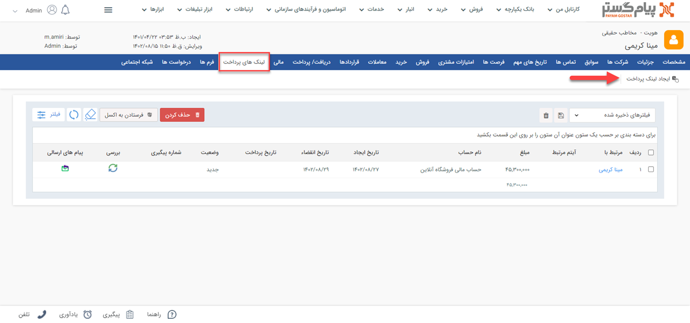

# ارسال لینک پرداخت جدید
یکی از قابلیت‌های پیام‌گستر،‌ امکان ایجاد و ارسال لینک پرداخت برای مشتریان است. در صورت داشتن این ماژول می‌توانید یک لینک پرداخت برای مخاطب ایجاد کرده و پیامی حاوی این لینک را از طریق رسانه‌های مختلف (پیام کوتاه، ایمیل یا شبکه اجتماعی) با متن مورد نظر ارسال کنید. مخاطب با استفاده از این لینک به صفحه درگاه پرداخت آنلاین هدایت می‌شود تا عملیات پرداخت را انجام دهد. پس از پرداخت مبلغ توسط مخاطب، یک دریافت در سوابق ایشان به صورت خودکار ثبت خواهد شد. 
بر این اساس، لینک پیام‌گستر پرداخت امکاناتی به شرح ذیل را برای شما فراهم می‌سازد: 
- امکان تعیین مبلغ و زمان اعتبار لینک
- امکان بررسی انجام گرفتن پرداخت توسط مشتری به صورت خودکار
- امکان ثبت خودکار دریافت،‌ به هنگام پرداخت مبلغ توسط مشتری
- امکان تنظیم پیام کوتاه و یا ایمیل دلخواه برای ارسال

## مسیرهای ایجاد لینک پرداخت
برای ارسال لینک پرداخت برای مشتری خود،‌ از یکی از چهار مسیر زیر اقدام نمایید: 

- **تب فروش** > **لینک پرداخت**

- **صفحه اصلی پروفایل مخاطب** > **ایجاد لینک پرداخت**

- **صفحه اصلی پروفایل مخاطب** > **لینک‌های پرداخت** > **ایجاد لینک پرداخت**

- **آیتم ثبت شده برای یک هویت** > **ایجاد لینک پرداخت** 
با ثبت یک آیتم CRM مثل انواع فاکتور،‌ قرارداد،‌ فرم و... کلید ایجاد لینک پرداخت در بالای صفحه به شما نمایش داده می‌شود. این کلید بر روی نوار بالای تمامی آیتم‌‌ها به جز آیتم‌های انبار قابل مشاهده می‌باشد.

## شیوه ایجاد و ارسال لینک پرداخت
 از طریق یکی از مسیرهای بالا برای ایجاد لینک پرداخت اقدام نمایید. نحوه تنظیم و ارسال لینک پرداخت در ادامه در چهار گام توضیح داده شده است:

### A. مشخصات لینک پرداخت 
برای ایجاد لینک پرداخت برای مشتری ابتدا مشخصات لینک را بر اساس راهنمایی‌های زیر تکمیل نمایید: 
1. **نام حساب:** حساب مالی‌ای که قابلیت پرداخت واسط برای آن‌ فعال شده است را انتخاب کنید تا مبلغ به آن واریز گردد. 
2. **مرتبط با:** هویت پرداخت‌کننده را مشخص کنید. «مرتبط با» انتخاب شده در این قسمت،‌ همان هویتی است که آیتم «دریافت» برایش ثبت می‌شود. به عبارت دیگر،‌ در صورت پرداخت از طریق این لینک،‌از بدهکاری هویت «مرتبط با» کاسته می‌شود. 
> **نکته** 
> در برخی شرایط ممکن است که شخص دریافت‌کننده پیام حاوی لینک،‌ با هویتی که پرداخت برای او انجام می‌شود متفاوت باشد (به عنوان مثال شما لینک را برای رابط/مدیر یک شرکت ارسال می‌کنیداما مبلغ پرداخت شده باید از حساب شرکت کم شود). در این حالت توجه داشته باشید که هویت اصلی که دریافت باید برای او ثبت شود (در مثال بالا شرکت) به عنوان «مرتبط با» انتخاب شود. در قسمت «گیرندگان» می‌توانید هویت دریافت‌کننده پیام را تعیین نمایید. 

چنانچه از مسیری غیر از تب فروش (مسیر دوم،‌سوم و چهارم) اقدام به ایجاد لینک پرداخت کرده باشید،‌«مرتط با» به صورت خودکار در فیلد مربوطه وارد می‌شود. 
3. **ثبت دریافت پس از تایید:** در صورت فعال بودن این گزینه، پس از انجام واریزی توسط مشتری از طریق لینک پرداخت و تایید آن از طرف بانک میزبان،‌ به صورت خودکار دریافت مربوطه در سوابق هویت ثبت می‌شود. 
4. **نوع دریافت:**
در صورت فعال کردن گزینه «ثبت دریافت پس از تایید»، می‌توانید از بین زیرنوع‌های دریافت‌های تعریف شده در شخصی‌سازی، یک زیر نوع برای ثبت این دریافت انتخاب کنید. دریافت متناظر با این لینک که پس از پرداخت ایجاد می‌‌شود از این نوع خواهد بود. 
5. **مبلغ:** مبلغی که مخاطب باید پرداخت کند را وارد کنید. 
> **نکته** 
> چنانچه از صفحه هویت اقدام به ایجاد لینک پرداخت نمایید (مسیر دوم و سوم)، مبلغ **مانده حساب** مخاطب به صورت خودکار در فیلد مبلغ درج خواهد شد. همچنین اگر از روی آیتم‌های مالی CRM مثل انواع فاکتور اقدام به ایجاد لینک کرده باشید (مسیر چهارم) فیلد مبلغ تعیین شده در آن آیتم به صورت خودکار در فیلد مبلغ لینک پرداخت درج خواهد شد. مبالغ مذکور توسط کاربر قابل ویرایش است. 

6. **تاریخ انقضا:** در این قسمت مشخص کنید که لینک پرداخت ایجاد شده تا چه زمانی اعتبار دارد. این مدت زمان می‌تواند بر اساس تاریخ یا تعداد روز باشد. پس از گذشتن تاریخ انقضای لینک، امکان پرداخت از طریق آن وجود ندارد.
7. **توضیحات:** توضیحات مرتبط با این لینک پرداخت را در این قسمت وارد کنید. می‌توانید از مقدار وارد شده در این فیلد به عنوان یک پارامتر هوشمند در متن پیام ارسالی برای مشتری استفاده کنید.
> **نکته** 
> چنانچه از صفحه هویت اقدام به ایجاد لینک پرداخت نمایید (مسیر دوم و سوم)، به صورت خودکار عبارت «بابت مانده حساب مشتری به مبلغ n ریال» در بخش توضیحات ذکر خواهد شد. . همچنین اگر از روی آیتم‌های CRM مثل انواع فاکتور اقدام به ایجاد لینک کرده باشید (مسیر چهارم)، نام آیتم، شماره، تاریخ و مبلغ آن در توضیحات درج می‌شود. در صورت نیاز، کاربر می‌تواند آن را به شیوه دلخواه ویرایش نماید.

### B. لیست گیرندگان
در این قسمت مشخص می‌کنید که پیام ارسالی حاوی لینک پرداخت به چه شخصی ارسال گردد. همانطور که ملاحظه می‌کنید این پیام می‌تواند به مدیر، رابط یا هر سمت انتخابی دیگری از یک شرکت (هویت حقوقی) ارسال گردد. علاوه بر این، می‌توانید یک شماره موبایل یا ایمیل به صورت دستی در این قسمت به عنوان گیرنده پیام وارد کنید. توجه داشته باشید که این گزینه‌ها به صورت چک باکس هستند، بنابراین امکان انتخاب بیش از یک گزینه نیز وجود دارد.  

در صورت عدم انتخاب هیچ یک از گزینه‌ها، پیامک برای شماره موبایل پیش‌فرض و ایمیل برای آدرس ایمیل اول هویت ارسال می‌شود. 

### عملیات پس از تایید .C
در صورتی که لینک پرداخت را روی یکی از آیتم‌ها مانند فاکتور، فرم یا ... ایجاد کنید و به این آیتم یک فیلد از نوع دریافت اضافه کرده باشید، می‌توانید در این قسمت تنظیماتی اعمال کنید که دریافت ثبت شده پس از پرداخت توسط مشتری (مورد ۳ و ۴ در بخش A) به فیلد دریافت اضافه شده به آیتم متصل گردد. به این منظور ابتدا چک باکس «اتصال به فیلد» را فعال کرده و سپس فیلد مورد نظر خود را انتخاب کنید. 

### پیام‌های ارسالی .D
در این مرحله پیام ارسالی برای مشتری را تنظیم کنید
1. **پیام پیش فرض:** در صورتی که این گزینه را انتخاب کنید، پیام تنظیم شده در قسمت [مدیریت پیام‌های سیستم](https://github.com/1stco/PayamGostarDocs/blob/master/Help/Basic-Information/Manage-system-messages/2.6.0/Manage-system-messages.md) برای **درگاه پرداخت واسط** برای مشتری ارسال خواهد شد.
2. **پیام سفارشی:** در صورت انتخاب این گزینه می‌توانید یک پیام سفارشی برای این لینک پرداخت برای مشتری تنظیم و ارسال کنید. رسانه یا رسانه‌های مورد نظر خود را انتخاب کرده و سپس متن پیام را تنظیم کنید.

