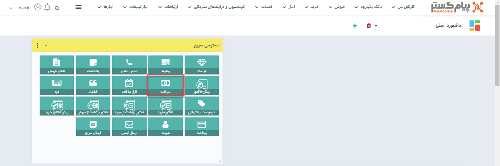
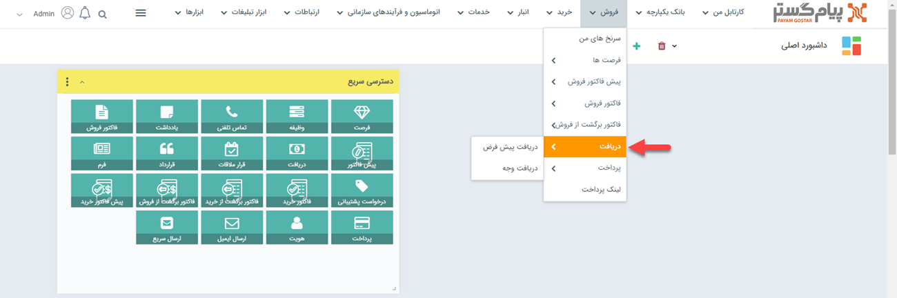
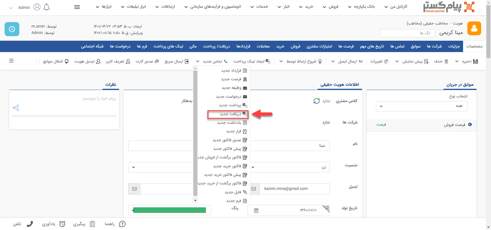
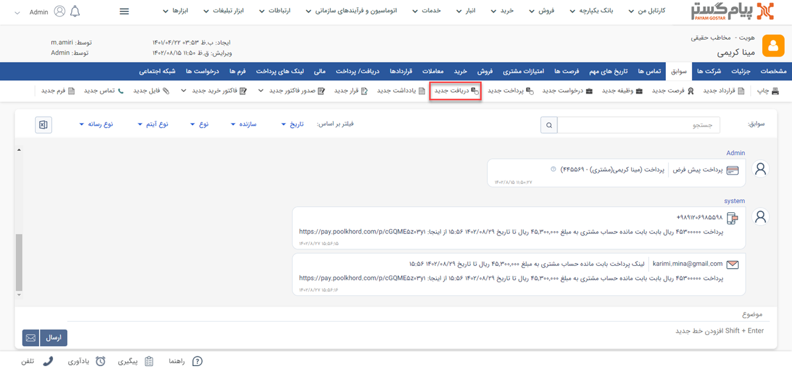
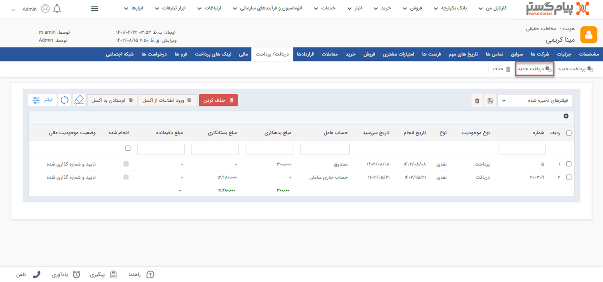

#  ثبت دریافت جدید
چنانچه مبلغی توسط سازمان شما دریافت شده باشد، باید با استفاده از آیتم دریافت آن را در سوابق هویت (پرداخت‌کننده) ثبت کنید. با استفاده از این آیتم می‌توانید دریافت‌های نقدی، چکی یا اعتباری مرتبط با مشتریان خود را ثبت نمایید. با ثبت و تایید دریافت برای یک هویت، به میزان درج شده در آیتم دریافت از بدهکاری او کم می‌شود. 

## مسیر‌های ثبت دریافت
برای ثبت دریافت جدید مسیرهای‌ مختلفی وجود دارد. از طریق یکی از مسیرهای زیر اقدام به ثبت دریافت نمایید: 

- **ویجت دسترسی سریع** > **دریافت**

- **تب فروش** > **دریافت** > **زیرنوع دریافت** > **افزودن دریافت**

- **صفحه اصلی پروفایل مخاطب** > **آیتم جدید** > **دریافت جدید**

برای مشاهده لیست «آیتم‌های جدید» بر روی فلش کنار «تماس جدید» (قابل مشاهده در نوار سفید بالای صفحه) مراجعه نمایید.

- **صفحه اصلی پروفایل مخاطب** > **تب سوابق** > **دریافت جدید**

- **صفحه اصلی پروفایل مخاطب** > **تب دریافت/پرداخت** > **دریافت جدید**

## شیوه‌ی ثبت دریافت

در صورت داشتن چند زیرنوع دریافت، به انتخاب صحیح آن توجه داشته باشید. زیرنوع آیتم در قسمت بالای صفحه قابل مشاهده و قابل تغییر می‌باشد. در تصویر زیر، «دریافت پیش‌فرض» برای ثبت نمونه انتخاب شده است. 
برای ثبت دریافت لازم است فیلدهای مورد نیاز آیتم را با اطلاعات موجود تکمیل و سپس ذخیره نمایید. مشخصات دریافت‌ها در پیام‌گستر به شرح زیر می‌باشد:

1. **مرتبط با**: نام هویتی که این دریافت برای او ثبت شده را در این قسمت درج کنید.

> **نکته** 
> در صورت ثبت دریافت از صفحه هویت (مسیر سوم، چهارم و پنجم) این بخش به صورت خودکار با نام هویت پر می‌شود.  

2. **فاکتور مرتبط:** در صورتی که این دریافت مرتبط با یک فاکتور فروش ثبت شده در پیام‌گستر باشد، از قسمت فاکتور مرتبط می‌توانید از لیست فاکتورهای صادر شده برای این مشتری، فاکتور مورد نظر را انتخاب و به این دریافت الصاق کنید.
3. **شماره دریافت:** در صورتی که مجوز شماره‌گذاری این نوع دریافت را داشته باشید، می‌توانید به صورت دستی این دریافت را شماره‌گذاری کنید. در غیر این صورت پس از ذخیره دریافت، کاربرانی که مجوز شماره‌گذاری داشته باشند آن را در کارتابل دریافت‌های خود مشاهده خواهند نمود و می‌توانند آن را شماره‌گذاری کنند. در صورت نیاز، کاربر دارای مجوز شماره‌گذاری دریافت، ویرایش شماره پس از شماره‌گذاری یا مدیر مالی می‌تواند این شماره را به دلخواه تغییر دهد.

> **نکته** 
 توجه داشته باشید در صورتی که در تنظیمات این نوع دریافت در شخصی‌سازی، قسمت "نیاز به شمار‌ه‌گذاری دارد" غیر فعال باشد، این دریافت پس از ثبت به صورت خودکار شماره‌گذاری خواهد شد. 

4. **مبلغ:** مبلغ دریافت شده را تعیین کنید.
5. **واریز به:** حسابی که مبلغ به آن واریز شده است را تعیین کنید.
لیست حساب‌های مالی نمایش داده شده در این قسمت را می‌توانید از قسمت [مدیریت حساب های مالی](https://github.com/1stco/PayamGostarDocs/blob/master/Help/Basic-Information/Financial-account-management/Financial-account-management.md) ویرایش کنید.
6. **نوع دریافت:** نوع دریافت را از بین عناوین نمایش داده شده انتخاب نمایید. این دریافت می‌تواند به صورت نقدی، چکی یا اعتباری باشد.

7. **جزئیات دریافت:** این بخش با توجه به نوع دریافتی که مشخص کرده‌اید متفاوت خواهد بود. در صورت انتخاب هر یک از انواع دریافت (نقدی/چکی/اعتباری) فیلدهای متناسب با آن در این بخش نمایش داده می‌شود.

### فیلدهای دریافت نقدی
- **روش دریافت نقدی:** در این فیلد می‌توانید روش دریافت وجه را از بین گزینه‌های کارت به کارت، واریز به حساب بانکی، پرداخت آنلاین، پرداخت حضوری و لینک پیام‌گستر پرداخت انتخاب کنید.
- **کد شعبه:** در صورت نیاز، کد شعبه‌ای که واریز در آن انجام شده است را در این قسمت درج کنید.
- **شماره کارت/رسید:** شماره رسید واریزی و یا شماره کارتی که واریز به آن انجام گرفته است را در این قسمت درج نمایید.
- **شماره پیگیری:** در شرایط واریز مبلغ از طرف مشتری می‌توانید شماره پیگیری مندرح در فیش واریز را در این قسمت ثبت نمایید.
### فیلدهای دریافت چکی
- **بانک:** مشخص کنید چک دریافت شده از کدام بانک صادر شده است.
- **شماره چک:** شماره چکی که دریافت کرده‌اید را درج نمایید تا در صورت نیاز بتوانید آن را پیگیری نمایید.
- **سررسید:** تاریخ سررسید چک را در این قسمت ثبت نمایید تا بتوانید برای پیگیری و نقد کردن چک از آن استفاده کنید.
### فیلدهای دریافت اعتباری
- **سررسید:** تاریخی که برای دریافت با مشتری خود مقرر کرده‌اید را ثبت نمایید.

8. **دریافت شده:** در صورتی که نوع دریافت شما نقدی باشد،‌این چک باکس به صورت خودکار فعال است؛ چراکه وجه قطعا از جانب مشتری پرداخت شده است. در صورت انتخاب دریافت چکی یا اعتباری، شما باید بعد از دریافت این گزینه را فعال کنید.
9. **تاریخ دریافت:** در حالت دریافت نقدی،‌ درج تاریخ دریافت به هنگام ثبت الزامی است. این تاریخ لزوما با تاریخ ثبت آیتم دریافت یکسان نیست. به عنوان مثال ممکن است شما وجه را از طرف مشتری روز گذشته دریافت کرده باشید اما بعد از یک روز اقدام به ثبت دریافت در سیستم نمایید. در این قسمت باید تاریخ دریافت اصلی (در مثال قبل، روز گذشته) را لحاظ کنید. در صورت دریافت چکی و یا اعتباری می‌توانید آن را در آینده و به هنگام تسویه چک و یا بستانکاری اعتباری خود ثبت نمایید.
10. **یادآوری به پرداخت کننده:** پس از ثبت و ذخیره دریافت می‌توانید یادآوری به پرداخت‌کننده را فعال نمایید. با این کار در زمان تعیین‌شده توسط شما،‌ برای پرداخت‌کننده (مرتبط با) پیامی با متن انتخابی شما ارسال می‌شود. برای تنظیم پیام کافیست بر روی «ندارد» آبی رنگ،‌ کلیک نمایید.
در صورت نیاز به راهنمایی برای نحوه تنظیم پیام به [ارسال پیام]() مراجعه نمایید.
11. **توضیحات:** توضیحات بیشتری که مرتبط با این دریافت وجود دارد را می‌توانید در این قسمت وارد کنید.
> **نکته** 
> چنانچه دریافت ثبت شده نیازمند تایید و شماره‌گذاری باشد (در قسمت [شخصی‌سازی](https://github.com/1stco/PayamGostarDocs/tree/master/Help/Settings/Personalization-crm/Factor-management/Factor-management.md) گزینه نیاز به تایید و شماره‌گذاری برای فعال شده باشد)، پس از ثبت، مسئول تایید و شماره‌گذاری باید اقدام به این کار نماید. برای اطلاع از شیوه تایید، مقاله [تایید و شماره‌گذاری پرداخت](https://github.com/1stco/PayamGostarDocs/tree/master/Help/Receipt/ReceiptConfirmation.md) را مطالعه نمایید.
>> پرداخت تایید نشده در سیستم از بستانکاری هویت نمی‌کاهد.