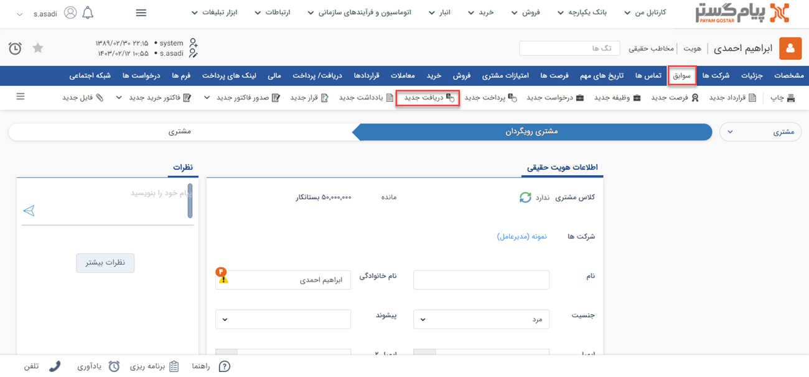
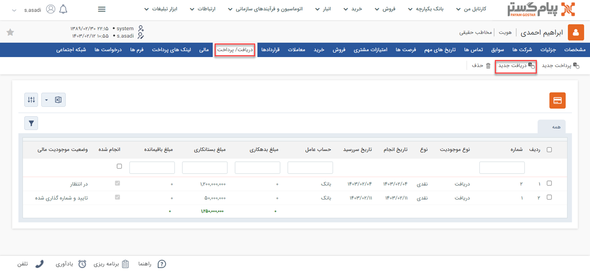

#  ثبت دریافت جدید
چنانچه مبلغی توسط سازمان شما دریافت شده باشد، باید با استفاده از آیتم دریافت آن را در سوابق هویت (پرداخت‌کننده) ثبت کنید. با استفاده از این آیتم می‌توانید دریافت‌های نقدی، چکی یا اعتباری مرتبط با مشتریان خود را ثبت نمایید. با ثبت و تایید دریافت برای یک هویت، به میزان درج شده در آیتم دریافت **از بدهکاری او کم می‌شود**. 

## مسیر‌های ثبت دریافت
برای ثبت دریافت جدید مسیرهای‌ مختلفی وجود دارد. از طریق یکی از مسیرهای زیر اقدام به ثبت دریافت نمایید: 

- **ویجت دسترسی سریع** > **دریافت**

- **تب فروش** > **دریافت** > **زیرنوع دریافت** > **افزودن دریافت**

- **صفحه اصلی پروفایل مخاطب** > **آیتم جدید** > **دریافت جدید**

برای مشاهده لیست «آیتم‌های جدید» بر روی فلش کنار «تماس جدید» (قابل مشاهده در نوار سفید بالای صفحه) کلیک نمایید.

- **صفحه اصلی پروفایل مخاطب** > **تب سوابق** > **دریافت جدید**

- **صفحه اصلی پروفایل مخاطب** > **تب دریافت/پرداخت** > **دریافت جدید**

> **نکته** 
> توجه داشته باشید که چنانچه از صفحه هویت مورد نظر اقدام به ثبت دریافت نمایید (مسیر سوم، چهارم و پنجم)، بخش «مرتبط با» به صورت خودکار با نام هویت پر می‌شود. به عبارت دیگر دریافت به نام هویت ثبت می‌شود. اما اگر از مسیرهای صفحه اصلی (مسیر اول و دوم) اقدام به ثبت دریافت نمایید، باید نام هویت را در قسمت «مرتبط با» جستجو و انتخاب کنید. 

## شیوه‌ی ثبت دریافت
در صورت داشتن چند زیرنوع دریافت، به انتخاب صحیح آن توجه داشته باشید. زیرنوع آیتم در قسمت بالای صفحه قابل مشاهده و قابل تغییر می‌باشد. در تصویر زیر، «دریافت پیش‌فرض» برای ثبت نمونه انتخاب شده‌است. 
برای ثبت دریافت لازم است فیلدهای مورد نیاز آیتم را با اطلاعات موجود تکمیل و سپس ذخیره نمایید. مشخصات دریافت‌ها در پیام‌گستر به شرح زیر می‌باشد:

1. **مرتبط با**: نام هویتی که این دریافت برای او ثبت شده را در این قسمت درج کنید. چنانچه پیش‌تر به آن اشاره شد، اگر از صفحه هویت اقدام به ثبت دریافت کرده‌باشید، نام هویت به صورت خودکار در این بخش ثبت شده‌است. 
2. **فاکتور مرتبط:** در صورتی که این دریافت مرتبط با یک فاکتور فروش باشد، از قسمت «فاکتور مرتبط» می‌توانید از لیست فاکتورهای صادر شده برای این مشتری، فاکتور مورد نظر را انتخاب و به این دریافت الصاق کنید. 
3. **شماره دریافت:** در صورتی که مجوز شماره‌گذاری این نوع دریافت را داشته باشید، می‌توانید به صورت دستی این دریافت را شماره‌گذاری کنید. در غیر این صورت پس از ذخیره دریافت، کاربرانی که مجوز شماره‌گذاری داشته باشند آن را در کارتابل دریافت‌های خود مشاهده خواهند‌نمود و می‌توانند آن را شماره‌گذاری کنند. در صورت نیاز، کاربر دارای مجوز شماره‌گذاری دریافت، ویرایش شماره پس از شماره‌گذاری یا مدیر مالی می‌تواند این شماره را به دلخواه تغییر دهد. 
4. **مبلغ:** مبلغ دریافت شده را وارد کنید. 
5. **واریز به:** حسابی که مبلغ به آن واریز شده‌است را مشخص کنید. توجه داشته باشید که شما فقط می‌توانید از بین حساب‌‌های تعریف شده، گزینه‌ی مورد نظر را انتخاب نمایید. در صورت نیاز به تعریف حساب دیگر (افزودن گزینه‌ی جدید) آن را از مدیر سیستم خود بخواهید. 

> **راهنمای مدیر سیستم** 
> لیست حساب‌های مالی نمایش داده شده در این قسمت را می‌توانید از قسمت [مدیریت حساب های مالی](https://github.com/1stco/PayamGostarDocs/blob/master/Help/Basic-Information/Financial-account-management/Financial-account-management.md) ویرایش کنید. 

6. **نوع دریافت:** نوع دریافت را از بین عناوین نمایش داده‌شده انتخاب نمایید. این دریافت می‌تواند به صورت نقدی، چکی یا اعتباری باشد. توجه داشته باشید که که ممکن است امکان انتخاب همه‌ی انواع دریافت برای شما مجاز نباشد. این محدودیتی است که از طرف مدیر سیستم برای این زیرنوع دریافت اعمال شده‌است. 
7. **جزئیات دریافت:** این بخش با توجه به نوع دریافتی که مشخص کرده‌اید متفاوت خواهد بود. در صورت انتخاب هر یک از انواع دریافت (نقدی/چکی/اعتباری) فیلدهای متناسب با آن در این بخش نمایش داده‌می‌شود.

### فیلدهای دریافت نقدی
- **روش دریافت نقدی:** در این فیلد می‌توانید روش دریافت وجه را از بین گزینه‌های کارت به کارت، واریز به حساب بانکی، پرداخت آنلاین، پرداخت حضوری و لینک پیام‌گستر پرداخت انتخاب کنید.
- **کد شعبه:** در صورت نیاز، کد شعبه‌ای که واریز در آن انجام شده‌است را در این قسمت درج کنید.
- **شماره کارت/رسید:** شماره رسید واریزی و یا شماره کارتی که واریز به آن انجام گرفته‌است را در این قسمت درج نمایید.
- **شماره پیگیری:** در شرایط واریز مبلغ از طرف مشتری می‌توانید شماره پیگیری مندرح در فیش واریز را در این قسمت ثبت نمایید.

### فیلدهای دریافت چکی
- **بانک:** مشخص کنید چک دریافت شده از کدام بانک صادر شده‌است.
- **شماره چک:** شماره چکی که دریافت کرده‌اید را درج نمایید تا در صورت نیاز بتوانید آن را پیگیری نمایید.
- **سررسید:** تاریخ سررسید چک را در این قسمت ثبت نمایید تا بتوانید برای پیگیری و نقد کردن چک از آن استفاده کنید.

### فیلدهای دریافت اعتباری
- **سررسید:** تاریخی که برای دریافت با مشتری خود مقرر کرده‌اید را ثبت نمایید.

8. **دریافت شده:** در صورتی که نوع دریافت شما نقدی باشد،‌این چک باکس به صورت خودکار فعال است؛ چراکه وجه قطعاً از جانب مشتری پرداخت شده است. در صورت انتخاب دریافت چکی یا اعتباری، شما باید بعد از دریافت این گزینه را فعال کنید. 
9. **تاریخ دریافت:** در حالت دریافت نقدی،‌ درج تاریخ دریافت به هنگام ثبت الزامی است. این تاریخ لزوماً با تاریخ ثبت آیتم دریافت یکسان نیست. به عنوان مثال ممکن است شما وجه را از طرف مشتری روز گذشته دریافت کرده‌باشید؛ اما بعد از یک روز اقدام به ثبت دریافت در سیستم نمایید. در این قسمت باید تاریخ دریافت اصلی (در مثال قبل، روز گذشته) را لحاظ کنید. در صورت دریافت چکی و یا اعتباری می‌توانید آن را در آینده و به هنگام تسویه ثبت نمایید. 
10. **یادآوری به پرداخت‌کننده:** پس از ثبت و ذخیره دریافت می‌توانید یادآوری به پرداخت‌کننده را فعال نمایید. با این کار در زمان تعیین‌شده توسط شما،‌ برای پرداخت‌کننده (مرتبط با) پیامی با متن انتخابی شما ارسال می‌شود. برای تنظیم پیام کافیست بر روی «ندارد» آبی رنگ،‌ کلیک نمایید. 

در صفحه نمایش داده‌شده، تاریخ و زمان ارسال را مشخص نمایید. در صورت نیاز می‌توانید رسانه و خط ارسال پیام یادآوری را نیز تغییر دهید. این بخش در واقع یک دسترسی به بخش «تاریخ‌های مهم» پروفایل هویت است. فلذا با تنظیم پیام یادآوری در این بخش، یک برنامه ارسال در تاریخ‌های مهم هویت ایجاد می‌شود. لازم به ذکر است که با توجه به این که هدف از ارسال این پیام، یادآوری زمان پرداخت است، نوع آن به صورت پیش‌فرض «تکی» انتخاب شده و امکان تنظیم آن به صورت «گروهی» که در برنامه‌ی ارسال دوره‌ای است، فراهم نمی‌باشد.  

> **نکته** 
> توجه داشته باشید که این پیام به منظور یادآوری برای مشتری (شخص پرداخت‌کننده) ارسال می‌شود. فلذا در نوشتن متن پیام دقت نمایید. 

در صورت نیاز به تغییر متن پیام پیش‌فرض، آن را از همین بخش ویرایش نمایید. در متن پیام خود می‌توانید از عبارات هوشمند کنار صفحه نیز استفاده کنید. با این کار متن پیام با اطلاعات مخاطب شما پر می‌شود. به عنوان مثال اگر در متن پیام خود از عبارت کلیدی «شماره مشتری» استفاده کنید، شماره/کد مشتری در پیام‌گستر به صورت خودکار به جای عبارت قرار می‌گیرد. پس از تکمیل اطلاعات، یادآوری تنظیم شده را ذخیره کرده و در صفحه دریافت به تکمیل فیلدهای آیتم دریافت ادامه دهید. 

11. **توضیحات:** اگر توضیحات بیشتری مرتبط با این دریافت وجود دارد، می‌توانید در این قسمت ثبت کنید.

> **نکته**  
> اگر طی روند شخصی‌سازی، فیلدی برای ثبت اطلاعات در دریافت در نظر گرفته‌شده باشد، آن را در  قسمت «مشخصات اضافه» مشاهده می‌کنید. 

در نهایت کافیست بر روی دکمه «ذخیره» در سمت راست بالای صفحه کلیک نمایید. پس از ذخیره دریافت، سایر اطلاعات و قابلیت‌های موجود در مورد آن به شما نمایش داده‌می‌شود. برای کسب اطلاعات بیشتر در این خصوص به راهنمای [ اطلاعات مشترک سوابق](https://github.com/1stco/PayamGostarDocs/blob/master/Help/Integrated-bank/Database/Records/Joint-record-information/Joint-record-information.md) مراجعه نمایید. 
