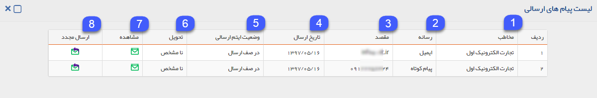
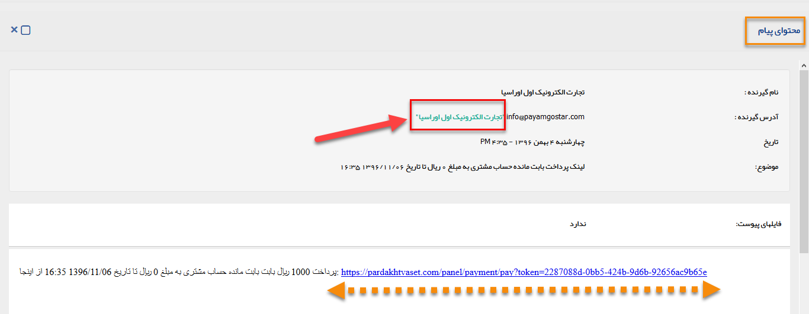

# مشاهده لیست لینک‌های پرداخت 
دراین مقاله روش‌های مشاهده‌ی لیست لینک‌‌های پرداخت در دو حالت بررسی می‌شود:
- [مشاهده لیست لینک‌های پرداخت ثبت شده برای تمامی هویت ها](#AllPaymentLinkList)
- [مشاهده لینک‌های پرداخت ثبت شده برای یک هویت](#CostumerPaymentLinkList)

## مشاهده لیست همه لینک‌های پرداخت ارسال شده {#AllPaymentLinkList}
برای مشاهده لیست همه لینک‌های پرداخت ثبت شده از طریق روش زیر اقدام نمایید:
- از طریق **تب فروش** > **لینک پرداخت**، تمامی لینک‌های پرداخت ثبت شده قابل مشاهده است. با کلیک بر روی هر زیرنوع، لیست آن به شما نمایش داده می‌شود.

## مشاهده لیست لینک‌های پرداخت ارسال شده برای یک هویت{#CostumerPaymentLinkList}
برای مشاهده لیست لینک‌های پرداخت ارسال شده برای یک مشتری می‌توانید از طریق روش زیر اقدام نمایید.
- 	در صفحه اصلی **پروفایل هویت** > **لینک‌های پرداخت** تمامی لینک‌های‌پرداخت ارسال شده برای یک هویت نمایش داده می‌شود.

>**نکته** 
لینک‌های ارسال شده برای مشتری در **پروفایل مشتری** و قسمت **سوابق** به صورت پیام نمایش داده خواهد شد. 

## جزئیات پیام های ارسالی در لینک‌های پرداخت 
لیست پیام های ارسالی لینک‌های پرداخت به همراه جزئیات آن در این قسمت قابل مشاهده است.

1. **مخاطب:** در این قسمت نام مخاطب دریافت‌کننده پیام که حاوی لینک پرداخت است، نمایش داده می‌شود.

> **نکته**  چنانچه در قسمت  گزینه ارسال مجدد انتخاب گردد، این پیام به ایمیل دیگری نیز ارسال شود که نام مخاطب در این ستون درج نخواهد شد. 

2. **رسانه:** نوع رسانه پیام‌های ارسال شده را نشان می‌دهد.
3. **مقصد:** با توجه به نوع رسانه، مقصدی که پیام‌ها به آن ارسال شده اند را نشان می‌دهد.
4. **تاریخ ارسال:** تاریخی که پیام‌ها در آن ارسال شده‌اند را نشان می‌دهد.
5. **وضعیت آیتم ارسالی:** وضعیت ارسال پیام‌های ارسالی، در این ستون نمایش داده می‌شود .
6. **تحویل:** وضعیت تحویل پیام‌های ارسالی، در این ستون نمایش داده می‌شود.

> **نکته** 
برای اطلاع از انواع وضعیت ارسال و تحویل  می‌توانید به صفحه اطلاعات مشترک لیست ارسال پیام مراجعه کنید.

7. **مشاهده:** برای مشاهده‌ی محتوای پیام‌های ارسالی و لینک پرداخت ایجاد شده بر روی این دکمه کلیک کنید. با کلیک بر روی لینک پرداخت ایجاد شده به درگاه پرداخت واسط وارد شده و می‌توانید پرداخت مرتبط را به صورت آنلاین انجام دهید.

> **نکته**  چنانچه درقسمت آدرس گیرنده، بر روی نام مخاطب کلیک کنید،می‌توانید به پروفایل مخاطب وارد شوید.

8. **ارسال مجدد:** برای ارسال مجدد پیام‌های حاوی لینک پرداخت ایجاد شده می‌توانید بر روی این دکمه کلیک کنید. برای ارسال مجدد می‌توانید ارسال به مخاطب مرتبط و یا ارسال به سایرین را انتخاب نمایید.

> **نکته**  در نظر داشته باشید در ارسال مجدد برای ارسال به سایرین، باید آدرس ایمیل گیرنده یا مقصد مورد نظر را وارد نمایید.  
