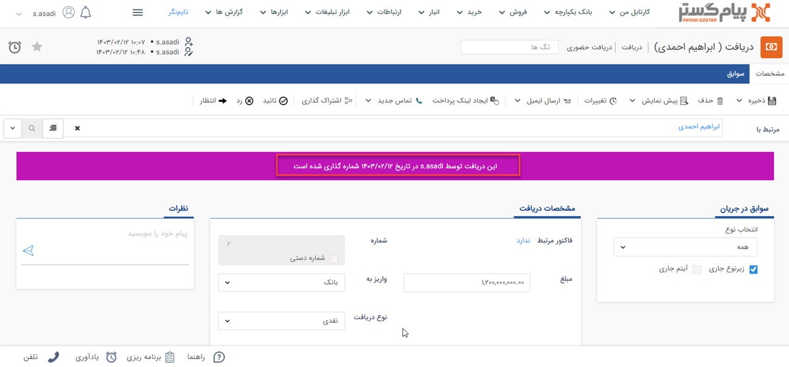
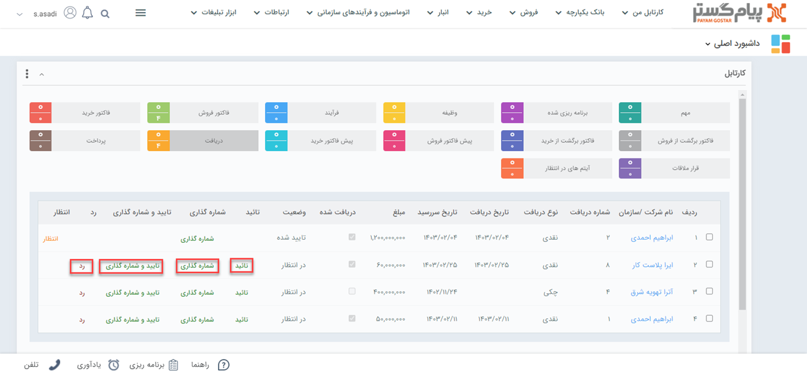
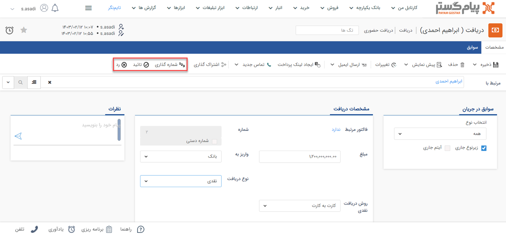

# تایید و شماره‌گذاری دریافت

آیتم‌های مالی پس از ثبت در سیستم باید تایید و شماره‌گذاری شوند. این کار ممکن است به صورت دستی توسط کاربر و یا به صورت خودکار توسط سیستم انجام شود. 
دریافت تایید نشده در پیام‌گستر فاقد اعتبار محسوب می‌شود. این بدین معناست که بر بدهی هویت تاثیر نمی‌گذارد (از بدهی مخاطب کم نمی‌کند) و در گزارشات نمایش داده‌نمی‌شود. 
چنانچه پس از ذخیره‌ی دریافت، آیتم با نوار سبزرنگ، تایید و شماره‌گذاری آن را اعلام کرد، یعنی دریافت به صورت خودکار تایید و شماره‌‌گذاری شده و نیاز به اقدامی در این راستا نیست. 

> **نکته** 
> با کلیک بر روی کلید «انتظار»‌ در نوار بالا، دریافت از حالت تایید و شماره‌گذاری خارج می‌شود. 

در غیراین صورت، چنانچه با نوار آبی‌رنگ مواجه شدید، دریافت به صورت خودکار تایید شده و برای شماره‌گذاری، به کارتابل شخصی که مجوز شماره‌گذاری این زیرنوع دریافت را دارد، می‌رود. 

در صورتی که پس از ثبت دریافت، نوار بنفش‌رنگ را بالای آیتم مشاهده کردید، دریافت به صورت خودکار شماره‌گذاری شده و برای تایید، به کارتابل شخصی که مجوز تایید این زیرنوع دریافت را دارد، می‌رود. 

## روش تایید و شماره‌گذاری دریافت
تمامی دریافت‌هایی که به صورت خودکار تایید و/یا شماره‌گذاری  نشده‌باشند، در **کارتابل** کاربری که مسئول انجام این کار است، به وی نمایش داده‌می‌شود. مسئول انجام این کار، اشخاصی هستند که مجوز تایید/رد و شماره‌گذاری زیرنوع دریافت را داشته‌باشند. در نتیجه اگر مسئول تایید/رد و یا شماره‌گذاری دریافت هستید: 
از طریق کارتابل خود (تب کارتابل من در بالای صفحه و یا ویجت کارتابل) بر روی گزینه «دریافت» کلیک کنید. تمامی دریافت‌هایی که باید تایید و یا شماره‌گذاری آن را انجام دهید، در این بخش به شما نمایش داده‌می‌شود. 

کلیدهای مقابل هر رکورد دریافت،‌امکان تایید، رد و شماره‌گذاری دریافت را در اختیار شما قرار می‌دهند. چنانچه جهت بررسی به مشاهده دریافت نیاز دارید، با کلیک بر روی هر ردیف، دریافت مربوطه باز خواهدشد. پس از انجام بررسی‌های مورد نظر می‌توانید با استفاده از کلیدهای شماره‌گذاری، تایید و رد در نوار سفید بالای صفحه،‌ اقدام مورد نیاز را در خصوص این دریافت انجام دهید.  

ممکن است برای اطلاع‌رسانی ورود آیتم‌های مالی (از جمله دریافت) به کارتابل شما، پیام سیستمی تنظیم شده‌باشد. در این حالت هر دریافت که به منظور بررسی (تایید/رد و شماره‌گذاری) وارد کارتابل شما شود، ورود آن با یک پیغام به شما اطلاع داده‌می‌شود. این پیام‌ها ممکن است برای اعلام نتیجه نیز تنظیم شده‌باشند. در این حالت تایید/رد دریافت توسط شما (یا هر شخص دیگری که مسئول این کار باشد)، با یک پیام سیستمی به ثبت‌کننده دریافت اطلاع داده‌می‌شود. این اطلاع‌رسانی‌ها ممکن است از طریق پیامک، ایمیل و یا پیام‌های سیستمی انجام پذیرد. این پیغام اگر از نوع پیام‌های سیستمی باشد، در قسمت «یادآوری‌های سیستم من» (آیکون زنگوله‌‌ی بالای صفحه) به شما نمایش داده‌می‌شود.  

> **راهنمای مدیر سیستم** 
> برای آگاهی از نحوه تنظیم پیام اطلاع‌رسانی ورود یا تایید/رد دریافت، به راهنمای [پیام‌های سیستمی](https://github.com/1stco/PayamGostarDocs/blob/master/Help/home/NotificationManagement2.6.0.md) مراجعه نمایید. 

## نکات مرتبط با تایید و شماره‌گذاری دریافت
- پس از **شماره‌گذاری** توسط مسئول، تنها کاربر دارای مجوز «ویرایش شماره پس از شماره‌گذاری» یا «مدیر مالی» قادر به ویرایش شماره‌ی دریافت خواهد بود.
- پس از تایید/رد و شماره‌گذاری دریافت توسط مسئول، تنها کاربر دارای مجوز «ویرایش پس از شماره‌گذاری، تایید یا رد» یا «مدیر مالی» امکان ویرایش آن را خواهد داشت.
- پس از تایید/رد و شماره‌گذاری دریافت توسط مسئول، تنها کاربر دارای مجوز «حذف پس از شماره گذاری، تایید یا رد» یا «مدیر مالی» امکان حذف آن را خواهد داشت.

> **نکته** 
> دریافت‌ها پیش از تایید و یا پس از رد،‌ **اعتبار ندارند**. بر این اساس تاثیری بر  مانده حساب هویت نخواهند‌داشت. 