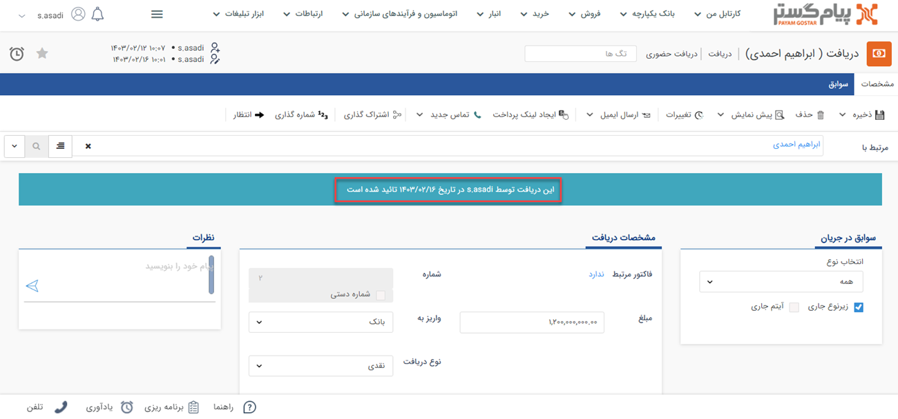
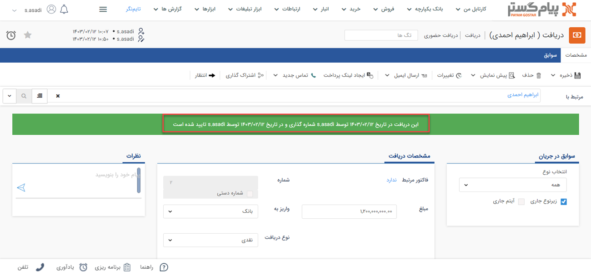
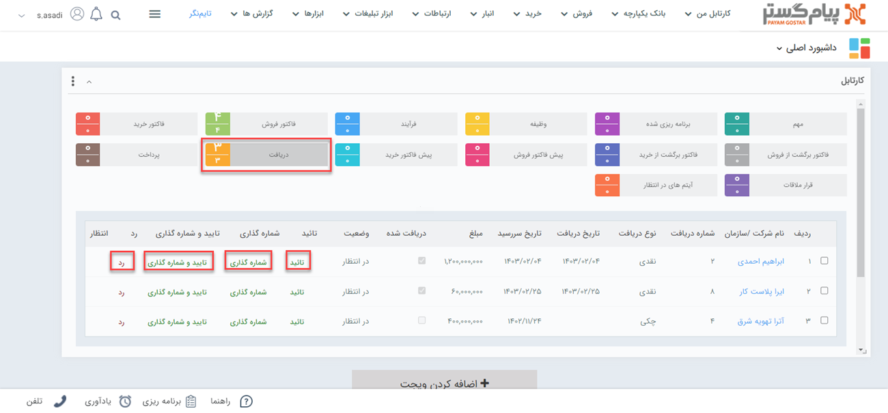

# تایید و شماره‌گذاری دریافت

پس از ثبت دریافت مادامیکه این دریافت تایید نشود موجودی محصول و بدهی مشتری تغییری نخواهد کرد، دریافت تایید هم در پیام‌گستر فاقد اعتبار است.

دریافت در مرحله تایید و شماره‌گذاری با پیام‌های متفاوت نمایش داده می‌شوند که به شرح زیر می‌باشد: 
در صورتیکه دریافت‌ها به صورت خودکار تایید شوند در قسمت ابتدایی دریافت این پیغام با نوار آبی نمایش داده می‌شود. 

 

گاهی برای دسترسی بهتر به دریافت در مرحله ثبت، بهتر است آنها را شماره‌گذاری کنید. در این مرحله پیغام زیر با نوار بنفش رنگ نمایش داده می‌شود. لازم به ذکر است شما می‌توانید قبل از اینکه فاکتور تایید شود آن را شماره‌گذاری نمایید.

می‌توانید دو مرحله قبل را به صورت خودکار انجام دهید. پس از تایید و شماره‌گذاری پیام زیر با نوار سبز رنگ را مشاهده خواهید کرد.

پس از ثبت دریافت چنانچه مجوز تایید، رد و شماره‌گذاری آیتم را داشته باشید 
در صورتی که دریافت ثبت‌شده نیازمند تایید و شماره‌گذاری باشند (در قسمت [شخصی‌سازی](https://github.com/1stco/PayamGostarDocs/tree/master/Help/Settings/Personalization-crm/Factor-management/Factor-management.md) گزینه نیاز به تایید و شماره‌گذاری فعال شده باشد) و شما به عنوان مسئول تایید/رد و یا مسئول شماره‌گذاری آن زیرنوع از دریافت تعیین شده باشید، تمامی دریافت ثبت شده از آن زیرنوع برای بررسی در کارتابل شما قرار می‌گیرد. دریافتی که به تایید/رد و یا شماره‌گذاری نیاز داشته باشند، از طریق **کارتابل** به شخص مسئول نمایش داده می‌شوند.
برای رد، تایید و شماره‌گذاری دریافت از طریق کارتابل می‌توانید از طریق دو مسیر زیر اقدا نمایید:  
- روش اول از طریق **ویجت کارتابل** می‌باشد.
 با  کلیک بر روی کارتابل دریافت، دریافت‌های در انتظار تایید در جدول پایین  نمایش داده می‌شود. در این حالت امکان تایید/رد و شماره‌‌گذاری از طریق کلیدهای نمایش داده شده در هر سطر (در کارتابل)وجود دارد. 
 
 

 - روش دوم از طریق **صفحه اصلی دریافت** است. بدین منظور با  کلیک بر روی کارتابل دریافت، دریافت‌های در انتظار تایید در جدول پایین  نمایش داده می‌شود. با کلیک بر روی هر ردیف، دریافت مربوط به مخاطب باز خواهد شد. با زدن دکمه‌های شماره‌گذاری، تایید و رد در نوار سفید بالای صفحه، اقدام مورد نیاز را انجام دهید.  

 

> **نکته** 
> اگر برای اطلاع‌رسانی به مسئول تایید و شماره‌گذاری و یا ثبت‌کننده آیتم، پیام تنظیم شده باشد، از طریق [پیام‌های سیستمی](https://github.com/1stco/PayamGostarDocs/blob/master/Help/home/NotificationManagement2.6.0.md) به کاربر مربوطه اطلاع داده می‌شود. در چنین حالتی ورود دریافت جدید به کارتابل به مسئول تایید و شماره‌گذاری و نتیجه آن شامل تایید،‌رد و شماره‌گذاری دریافت به ثبت‌کننده اطلاع‌ داده می‌شود. 

## نکات مرتبط با تایید و شماره‌گذاری دریافت
- پس از **شماره‌گذاری** توسط مسئول، تنها کاربر دارای مجوز «ویرایش شماره پس از شماره‌گذاری» یا «مدیر مالی» قادر به ویرایش شماره‌ی دریافت خواهد بود.
- پس از تایید/رد و شماره‌گذاری دریافت توسط مسئول، تنها کاربر دارای مجوز «ویرایش پس از شماره‌گذاری، تایید یا رد» یا «مدیر مالی» امکان ویرایش آن را خواهد داشت.
- پس از تایید/رد و شماره‌گذاری دریافت توسط مسئول، تنها کاربر دارای مجوز «حذف پس از شماره گذاری، تایید یا رد» یا «مدیر مالی» امکان حذف آن را خواهد داشت.

> **نکته** 
> دریافت‌های نیازمند به تایید، پیش از تایید و یا پس از رد،‌ **اعتبار ندارند**. بر این اساس تاثیری بر بدهی مشتری و تعداد موجودی نخواهند داشت. 