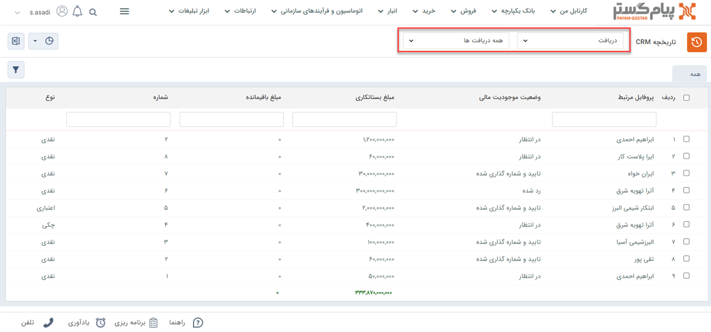
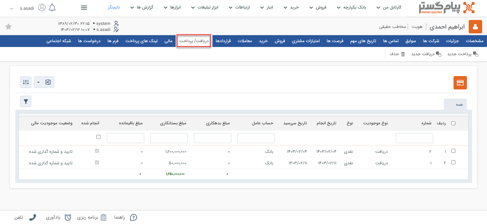

# مشاهده لیست دریافت‌ها
دراین مقاله روش‌های مشاهده‌ی لیست دریافت‌ها در دو حالت بررسی می‌شود: 
- [مشاهده لیست تمامی دریافت‌های ثبت شده](#AllReceipts)
- [مشاهده دریافت‌های ثبت شده برای یک هویت](#CustomerReceipts)

## مشاهده لیست همه دریافت‌ها{#AllReciepts}
برای مشاهده لیست همه دریافت‌های ثبت شده در سیستم، می‌توانید از دو مسیر اقدام نمایید: 

- از مسیر **تب فروش** > **دریافت** > **زیرنوع دریافت** با انتخاب یکی از زیرنوع‌های دریافت، وارد صفحه دریافت‌ها می‌شوید. در این حالت، تمامی دریافت‌های ثبت‌شده از زیرنوع انتخابی به شما نمایش داده‌می‌شود. 

از قسمت بالای صفحه می‌توانید سایر زیرنوع‌ها و یا همه را برای نمایش انتخاب نمایید. با انتخاب همه، تمامی دریافت‌ها (از همه زیرنوع‌ها) در لیست به شما نمایش داده‌می‌شود.

- از مسیر **تب بانک یکپارچه** > **تاریخچه CRM**  می توانید با اعمال فیلتر «نوع» بر روی دریافت و انتخاب زیرنوع مورد نظر/همه در فیلتر کناری، تمامی دریافت‌های ثبت شده را مشاهده نمایید.

> **نکته** 
> در صورت داشتن مجوز مشاهده لیست زیرنوع‌های دریافت، شما می‌توانید تمامی دریافت‌های ثبت شده را در این قسمت‌ها مشاهده نمایید. در غیراین صورت تنها مجاز به مشاهده دریافت‌هایی که خودتان ثبت کرده‌اید، خواهید بود. 

## مشاهده لیست دریافت‌های یک هویت{#customerReciepts}
برای مشاهده لیست دریافت‌های ثبت شده برای یک مخاطب می‌توانید یکی از چهار مسیر زیر را انتخاب نمایید: 

- از طریق صفحه **پروفایل مخاطب** > **تب دریافت/پرداخت** می‌توانید به دریافت‌های مشتری دسترسی داشته‌باشید. بدین منظور با استفاده از ویجت جستجوی سریع، وارد صفحه پروفایل هویت مورد نظر شوید. در صفحه اصلی پروفایل هویت از قسمت «دریافت/پرداخت» می‌توانید تمامی دریافت‌های مخاطب را مشاهده نمایید.  
توجه داشته‌باشید که در این صفحه همه‌‌ی دریافت‌ها و پرداخت‌ها در کنار هم به شما نمایش داده‌می‌شود. برای اینکه فقط دریافت‌ها را مشاهده نمایید، با استفاده از فیلتر بالای صفحه، در قسمت نوع، «دریافت» را انتخاب نمایید. 

- از طریق صفحه **پروفایل مخاطب** > **تب سوابق** نیز می‌توانید به دریافت‌های ثبت شده برای مخاطب دسترسی داشته‌باشید. بدین منظور با استفاده از ویجت جستجوی سریع، وارد صفحه پروفایل هویت مورد نظر شوید. در صفحه اصلی پروفایل هویت، در تب سوابق، گزینه «دریافت» را در لیست «نوع آیتم» انتخاب نمایید تا دریافت‌های  ثبت‌شده برای هویت مورد نظر را مشاهده کنید. 

- از طریق **تب فروش** > **دریافت** > **زیرنوع دریافت** به صفحه لیست دریافت‌ها رفته و در صورت نیاز، زیرنوع دریافت را به «همه دریافت‌ها» تغییر دهید. با استفاده از جستجوی «پروفایل مرتبط» دریافت‌های ثبت شده برای هویت مورد نظر را جدا کنید. بدین منظور کافیست نام هویت را در  قسمت مربوطه نوشته و Enter کنید.

- از طریق **تب بانک یکپارچه** > **تاریخچه CRM** با اعمال فیلتر،  دریافت‌ها را یافته  و با استفاده از جستجوی «پروفایل مرتبط» دریافت‌های هویت مورد نظر را جدا کنید. بدین منظور کافیست نام هویت را در قسمت مربوطه نوشته و Enter کنید.

> **نکته** 
> برای مشاهده دریافت‌ها در سابقه یک هویت باید مجوز مشاهده سوابق را بر روی آن زیرنوع هویت و همچنین مشاهده آیتم را در زیرنوع‌های دریافت داشته‌باشید.  