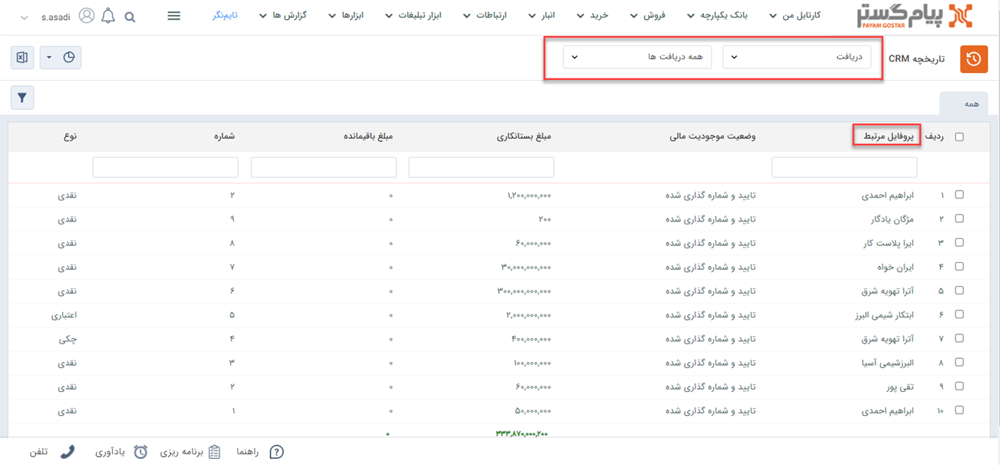

# مشاهده لیست دریافت‌ها
دراین مقاله روش‌های مشاهده‌ی لیست دریافت‌ها در دو حالت بررسی می‌شود:
- [مشاهده لیست تمامی دریافت‌های ثبت شده](#AllReceipts)
- [مشاهده دریافت‌های ثبت شده برای یک هویت](#CustomerReceipts)

## مشاهده لیست همه دریافت‌ها{#AllReciepts}
برای مشاهده لیست همه دریافت‌های ثبت شده دو روش وجود دارد: 
- از طریق **تب فروش** > **دریافت** > **زیرنوع دریافت**، تمامی دریافت‌های ثبت شده از نوع زیر نوع انتخابی شما،‌ نمایش داده می‌شود.

از قسمت بالای صفحه می‌توانید سایر زیرنوع‌ها و یا همه را برای نمایش انتخاب نمایید. با انتخاب همه، تمامی دریافت‌ها (از همه زیرنوع‌ها) در لیست به شما نمایش داده می‌شود.

- از طریق **تب بانک یکپارچه** > **تاریخچه CRM**  می توانید با انتخاب فیلتر نوع  بر روی دریافت‌ها و انتخاب زیرنوع مورد نظر/همه، تمامی دریافت‌های ثبت شده را مشاهده نمایید.

## مشاهده لیست دریافت‌های یک هویت{#customerReciepts}
برای مشاهده لیست دریافت‌های ثبت شده برای یک مخاطب (پرداخت مخاطب به شما) می‌توانید از چهار روش زیر اقدام نمایید: 
- از طریق صفحه **پروفایل مخاطب** > **تب سوابق** می‌توانید به دریافت‌های مخاطب دسترسی داشته باشید. بدین منظور با استفاده از ویجت جستجوی سریع، صفحه پروفایل هویت مورد نظر را باز کنید. در صفحه اصلی پروفایل هویت از قسمت سوابق با اعمال فیلتر روی "نوع آیتم"و انتخاب «دریافت» می‌توانید دریافت‌های هویت مورد نظر خود را مشاهده نمایید.

- از طریق صفحه **پروفایل مخاطب** > **تب دریافت/پرداخت** می‌توانید به دریافت‌های مشتری دسترسی داشته باشید. بدین منظور با استفاده از ویجت جستجوی سریع صفحه پروفایل هویت مورد نظر را باز کنید. در صفحه اصلی پروفایل هویت از قسمت دریافت/پرداخت می‌توانید تمامی دریافت‌های مخاطب را (در کنار پرداخت‌های وی) مشاهده نمایید.

- از طریق **تب فروش** > **دریافت** > **زیرنوع دریافت** به صفحه لیست دریافت‌ها رفته و در صورت نیاز زیرنوع دریافت را به «همه دریافت‌ها» تغییر دهید. با استفاده از جستجوی «پروفایل مرتبط» دریافت‌های 
ثبت شده برای هویت مورد نظر را جدا کنید. بدین منظور کافیست نام هویت را در  قسمت مربوطه نوشته و Enter کنید.

- از طریق **تب بانک یکپارچه** > **تاریخچه CRM** با اعمال فیلتر،  دریافت‌ها را یافته  و با استفاده از جستجوی «پروفایل مرتبط» دریافت‌های 
هویت مورد نظر را جدا کنید. بدین منظور کافیست نام هویت را در قسمت مربوطه نوشته و Enter کنید.

> **نکته** 
> در دریافت‌هایی که در سابقه هویت ثبت می‌شود، مخاطب (مرتبط با در دریافت)‌ پرداخت‌کننده و شما دریافت‌کننده هستید.