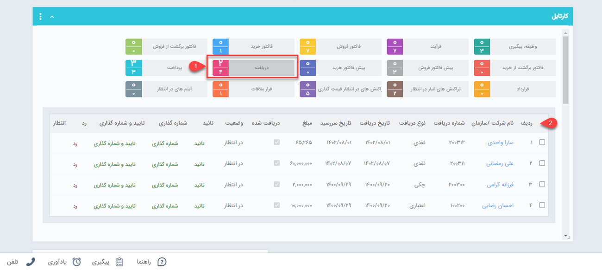

# تایید و شماره گذاری دریافت‌ها
در صورتی که دریافت‌های ثبت‌شده نیازمند تایید و شماره‌گذاری باشند (در قسمت [شخصی‌سازی](https://github.com/1stco/PayamGostarDocs/tree/master/Help/Settings/Personalization-crm/Factor-management/Factor-management.md)، گزینه نیاز به تایید و شماره‌گذاری فعال شده باشد) و شما به عنوان مسئول تایید/رد و یا مسئول شماره‌گذاری آن زیرنوع از دریافت تعیین شده باشید، تمامی دریافت‌های ثبت شده از آن زیرنوع برای بررسی به دست شما می‌رسد. 
دریافت‌هایی که به تایید/رد و یا شماره‌گذاری نیاز داشته باشند، از طریق **کارتابل** به شخص مسئول نمایش داده می‌شوند. چنانچه مسئول انجام این امر هستید، برای مشاهده این دریافت‌ها از یکی از این دو مسیر اقدام نمایید:
- **ویجت کارتابل**
- **کارتابل من (نوار بالای صفحه) > دریافت **

 
 
 با  کلیک بر روی کارتابل دریافت (شماره ۱)، دریافت‌های در انتظار تایید در جدول پایین (شماره ۲) نمایش داده می‌شود. با کلیک بر روی هر ردیف، دریافت مربوط به مخاطب باز خواهد شد. با زدن دکمه‌های شماره‌گذاری، تایید و رد در بالای صفحه، اقدام مورد نیاز را انجام دهید. البته امکان تایید/رد و شماره‌‌گذای از طریق کلیدهای نمایش داده شده در هر سطر نیز امکان‌پذیر می‌باشد.
 
> **نکته** 
> اگر برای اطلاع‌رسانی به شما (به عنوان مسئول) از طریق [ مدیریت پیام‌های سیستم](https://github.com/1stco/PayamGostarDocs/blob/master/Help/Basic-Information/Manage-system-messages/Manage-system-messages.md) پیامی تنظیم شده باشد، ورود هر آیتم دریافت به کارتابل شما از طریق [پیام سیستمی](https://github.com/1stco/PayamGostarDocs/blob/master/Help/home/NotificationManagement2.6.0.md) به شما اعلام می‌شود. 

## نکات مرتبط با تایید و شماره‌گذاری دریافت
- پس از **شماره‌گذاری** توسط مسئول، تنها کاربر دارای مجوز «ویرایش شماره پس از شماره‌گذاری» یا «مدیر مالی» قادر به ویرایش شماره‌ی دریافت خواهد بود.
- پس از **تایید** 
پرداخت توسط مسئول، تنها کاربر دارای مجوز «بازگشت به وضعیت در انتظار تایید» یا «مدیر مالی» می‌تواند آن را به وضعیت در انتظار تایید بازگرداند.
- پس از تایید/رد و شماره‌گذاری دریافت توسط مسئول، تنها کاربر دارای مجوز «ویرایش پس از شماره گذاری، تایید یا رد» یا «مدیر مالی» امکان ویرایش آن را خواهد داشت.
- پس از تایید/رد و شماره‌گذاری دریافت توسط مسئول، تنها کاربر دارای مجوز «حذف پس از شماره گذاری، تایید یا رد» یا «مدیر مالی» امکان حذف آن را خواهد داشت.
