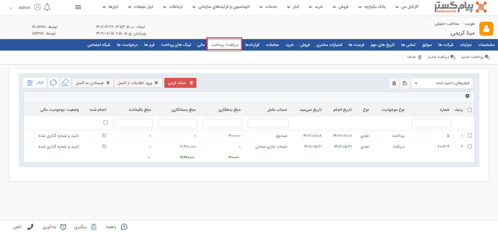

# مشاهده لیست دریافت‌ها
دراین مقاله روش‌های مشاهده‌ی لیست دریافت‌ها در دو حالت بررسی می‌شود:
- [مشاهده لیست تمامی دریافت‌های ثبت شده](#AllReciepts)
- [مشاهده دریافت‌های ثبت شده برای یک هویت](#CostumerReciepts)

{#AllReciepts}
## مشاهده لیست همه دریافت‌ها 
برای مشاهده لیست همه دریافت‌های ثبت شده دو روش وجود دارد: 
- از طریق **تب فروش** > **دریافت** > **زیرنوع دریافت**، تمامی دریافت‌های ثبت شده از نوع زیرنوع انتخابی شما،‌ نمایش داده می‌شود.

از قسمت بالای صفحه می‌توانید سایر زیرنوع‌ها و یا همه را برای نمایش انتخاب نمایید. با انتخاب همه، تمامی دریافت‌ها (از همه زیرنوع‌ها) در لیست به شما نمایش داده می‌شود.

- از طریق **تب بانک یکپارچه** > **تاریخچه CRM**  می توانید با اعمال فیلتر نوع (شماره ۱) بر روی دریافت‌ها و انتخاب زیرنوع مورد نظر/همه (شماره ۲)، تمامی دریافت‌های ثبت شده را مشاهده نمایید.

{#CostumerReciepts}
## مشاهده لیست دریافت‌های یک هویت
برای مشاهده لیست دریافت‌های ثبت شده برای یک مخاطب (پرداخت مخاطب به شما) می‌توانید از چهار روش زیر اقدام نمایید: 
- از طریق صفحه **پروفایل مخاطب** > **تب سوابق** می‌توانید به دریافت‌های مخاطب دسترسی داشته باشید. بدین منظور با استفاده از ویجت جستجوی سریع، صفحه پروفایل هویت مورد نظر را باز کنید. در صفحه اصلی پروفایل هویت از قسمت سوابق (شماره ۱) با اعمال فیلتر روی "نوع آیتم" (شماره ۲) و انتخاب «دریافت» می‌توانید دریافت‌های هویت مورد نظر خود را مشاهده نمایید.

- از طریق صفحه **پروفایل مخاطب** > **تب دریافت/پرداخت** می‌توانید به پرداخت‌های مشتری دسترسی داشته باشید. بدین منظور با استفاده از ویجت جستجوی سریع صفحه پروفایل هویت مورد نظر را باز کنید. در صفحه اصلی پروفایل هویت از قسمت دریافت/پرداخت می‌توانید تمامی دریافت‌های مخاطب را (در کنار پرداخت‌های وی) مشاهده نمایید.

- از طریق **تب فروش** > **دریافت** > **زیرنوع دریافت** به صفحه لیست دریافت‌ها رفته و در صورت نیاز زیرنوع دریافت (شماره ۱) را به «همه دریافت‌ها» تغییر دهید. با استفاده از جستجوی «پروفایل مرتبط» (شماره ۲) پرداخت‌های 
ثبت شده برای هویت مورد نظر را جدا کنید. بدین منظور کافیست نام هویت را در  قسمت مربوطه نوشته و Enter کنید.

- از طریق **تب بانک یکپارچه** > **تاریخچه CRM** با اعمال فیلتر(شماره ۱)،  دریافت‌ها را یافته  و با استفاده از جستجوی «پروفایل مرتبط» (شماره ۲) دریافت‌های 
هویت مورد نظر را جدا کنید. بدین منظور کافیست نام هویت را در قسمت مربوطه نوشته و Enter کنید.

> **نکته** 
> در دریافت‌هایی که در سابقه هویت ثبت می‌شود، مخاطب (مرتبط با در دریافت)‌ پرداخت‌کننده و شما دریافت‌کننده هستید.