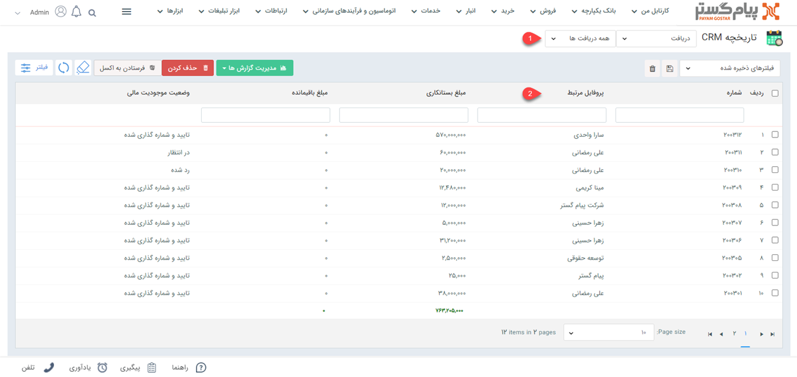

# لیست دریافت‌ها
دراین مقاله روش‌های مشاهده‌ی لیست دریافت‌ها در دو حالت بررسی می‌شود:
- [مشاهده لیست دریافت‌های ثبت شده برای تمامی هویت‌ها](#AllRecieptsList)
- [مشاهده دریافت‌های ثبت شده برای یک هویت](#CostumerRecieptsList)

## مشاهده لیست همه دریافت‌ها {#AllRecieptsList}
برای مشاهده لیست همه دریافت‌های ثبت شده دو روش وجود دارد: 
- از طریق **تب فروش** > **دریافت**، تمامی زیرنوع‌های دریافت قابل مشاهده است. با کلیک بر روی هر زیرنوع، لیست آن به شما نمایش داده می‌شود.

البته از قسمت بالای صفحه می‌توانید سایر زیرنوع‌ها و یا همه را برای نمایش انتخاب نمایید. با انتخاب همه، تمامی دریافت‌ها (از  همه زیرنوع‌ها) در لیست به شما نمایش داده می‌شود.

- از طریق **تب بانک یکپارچه** > **تاریخچه CRM**  می توانید با اعمال فیلتر نوع (شماره ۱) بر روی دریافت‌ها و انتخاب زیرنوع مورد نظر/همه (شماره ۲)، تمامی دریافت‌های ثبت شده را مشاهده نمایید.

## مشاهده لیست دریافت‌های ثبت شده برای یک هویت{#CostumerRecieptsList}
برای مشاهده لیست دریافت‌های صادر شده برای یک مشتری می‌توانید از طریق سه روش زیر اقدام نمایید. 
- 	در صفحه اصلی پروفایل هویت از قسمت سوابق (شماره ۱) با اعمال فیلتر روی "نوع آیتم" (شماره ۲) و انتخاب دریافت می‌توانید دریافت‌های هویت مورد نظر خود را مشاهده نمایید.  

- به مشابه **روش اول** برای مشاهده لیست دریافت از طریق **تب فروش** > **دریافت** به صفحه لیست دریافت‌ها رفته و با انتخاب زیرنوع موردنظر از دریافت‌ها(شماره۱) می‌توانید دریافت جدیدی برای یک هویت ثبت نمایید. پس از انتخاب زیرنوع مناسب می‌بایست از جستجوی «پروفایل مرتبط» (شماره۲) دریافت‌های 
هویت مورد نظر را جدا کنید. بدین منظور کافیست نام هویت را در این قسمت نوشته و Enter کنید.

- به مشابه **روش دوم** برای مشاهده لیست دریافت از طریق **تب بانک یکپارچه** > **تاریخچه CRM** به صفحه تاریخچه دریافت‌ها رفته و با انتخاب زیرنوع موردنظر (شماره ۱ ) دریافت جدیدی ثبت نمایید سپس با استفاده از جستجوی «پروفایل مرتبط» (شماره ۲) دریافت‌های 
هویت مورد نظر را جدا کنید. بدین منظور کافیست نام هویت را در این قسمت نوشته و Enter کنید.

