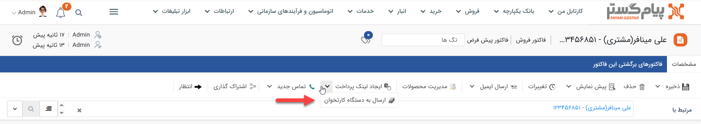
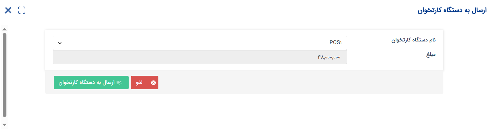

# ارسال به دستگاه کارتخوان
قابلیت اتصال پیام‌گستر به دستگاه کارتخوان این امکان را به شما می‌دهد که فرایند دریافت وجه را یکپارچه کنید. بر اساس عملکرد این قابلیت می‌توانید مبلغ صورتحساب مشتری را به دستگاه کارتخوانی که پیش‌تر به پیام‌گستر متصل شده‌است ارسال نمایید. پس از انجام پرداخت توسط مشتری، یک «دریافت» متناسب با این واریزی به صورت خودکار برای مشتری ثبت می‌شود.  

کلید «ارسال به دستگاه کارتخوان» را می‌توانید در صفحه  **پروفایل هویت** و همچنین انواع **پیش‌فاکتور** و **فاکتور فروش** مشاهده نمایید. برای ارسال درخواست به دستگاه کارتخوان: 

1. روی کلید «ارسال به دستگاه کارتخوان» کلیک کنید. بر روی فلش کنار کلید «ایجاد لینک پرداخت» کلیک کنید تا آن را مشاهده نمایید. 
2. دستگاه کارتخوانی که می‌خواهید پرداخت از طریق آن انجام شود را مشخص کنید.
3. اگر از صفحه‌ی پیش‌فاکتور/فاکتور اقدام به ارسال کرده‌باشید، به صورت خودکار مبلغ نهایی فاکتور به عنوان قیمت به دستگاه ارسال می‌شود.  لکن اگر این پرداخت مرتبط با پیش‌فاکتور/فاکتور مشخصی نیست و از صفحه‌ی پروفایل هویت ایجاد شده است، باید به صورت دستی مبلغ آن را درج کنید.
4. با تایید اطلاعات، مبلغ جهت پرداخت به دستگاه کارتخوان شما ارسال می‌شود.

> **نکته** 
> اگر از روی پیش‌فاکتور یا فاکتور اقدام به ارسال مبلغ به دستگاه کارتخوان کرده باشید، مبلغ نهایی فاکتور به صورت خودکار به عنوان مبلغ پرداختی درج شده و امکان ویرایش آن وجود ندارد. جهت درج مبلغ به صورت دستی باید از صفحه پروفایل هویت اقدام نمایید. 

## لیست واریزی‌های دستگاه کارتخوان
چنانچه پیش‌تر نیز به آن اشاره شد، پس از انجام تراکنش (پرداخت هزینه) از طریق دستگاه کارتخوان، یک دریافت به نام هویت مرتبط ثبت می‌شود. زیرنوع این دریافت بر اساس آنچه در بخش مدیریت دستگاه‌های کارتخوان مشخص شده می‌باشد و با درج نوع «نقدی» و روش «دستگاه کارتخوان» ثبت می‌شود. عنوان دستگاه کارتخوانی که واریزی از طریق آن انجام شده نیز در آن درج می‌شود. در نتیجه برای مشاهده‌ی لیست واریزی‌های هر دستگاه کافیست از طریق لیست دریافت‌ها یا تاریخچه‌ی CRM دریافت‌ها را بر اساس عنوان دستگاه POS خود فیلتر نمایید. 

> **راهنمای مدیر سیستم** 
> جهت آشنایی با نحوه‌ی تعریف دستگاه‌های کارتخوان و اعمال تنظیمات، از راهنمای [مدیریت دستگاه‌های کارتخوان](https://github.com/1stco/PayamGostarDocs/blob/master/Help/Settings/General-settings/POS-management/POSManagement_2.8.8.2.md) استفاده نمایید. 
