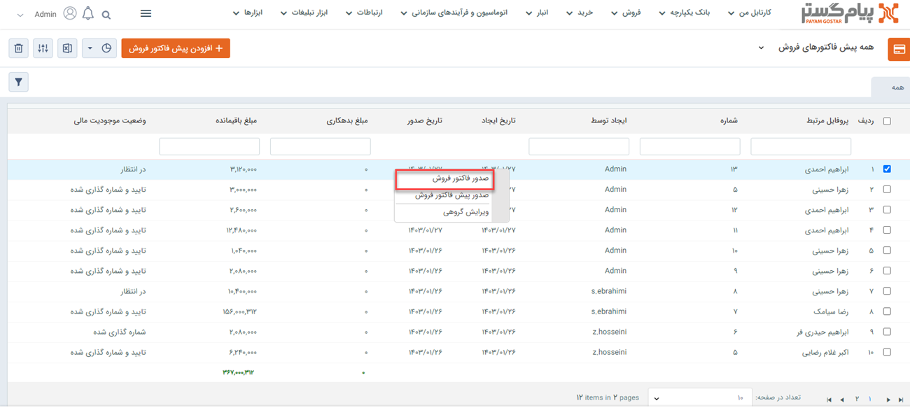
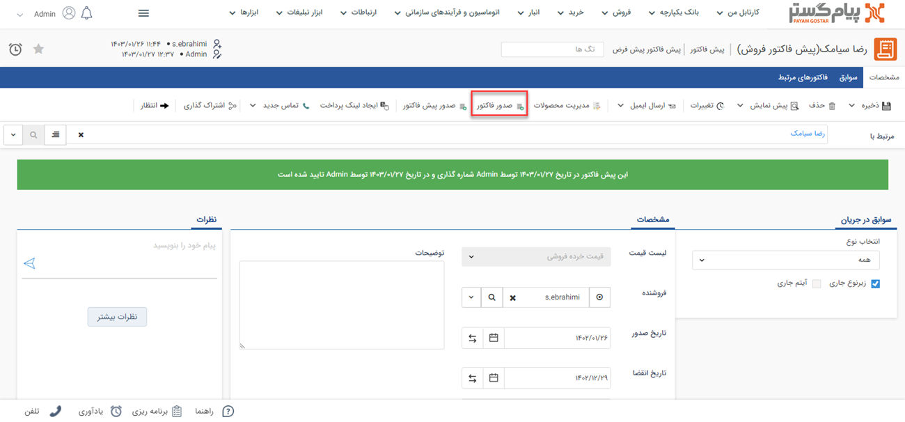

#  تبدیل پیش فاکتور فروش به فاکتور فروش
معمولا قبل از فروش نهایی، برای مشتری پیش‌فاکتور ثبت و ارسال می‌شود و درصورت تایید خریدار پیش‌فاکتور صادر شده به فاکتور تبدیل می‌شود. پیش‌فاکتور تعهدی برای خریدار به منظور پرداخت مبلغ قرارداد ایجاد نمی‌کند اما پس از صدور فاکتور مانده حساب مشتری به میزان مبلغ فاکتور منفی می‌شود.  
 در پیام‌گستر دو روش برای تبدیل پیش‌فاکتور فروش به فاکتور فروش وجود دارد:
- در پیش‌فاکتور با کلید راست روی پیش‌فاکتور و انتخاب **صدور فاکتور** می‌توان آن پیش‌فاکتور را به نوع فاکتور تبدیل کرد. 

در قسمت **پیش‌فاکتور** > **مشخصات** می‌توانید با کلیک روی **صدور فاکتور** پیش‌فاکتور را به فاکتور تبدیل کرد. 

> **نکته**  
در تبدیل پیش‌فاکتور به فاکتور، در صورتیکه فیلدهای اضافه شده با نام فیلدهای اضافه پیش‌فاکتور و فاکتور یکسان باشد، مقادیر وارد شده آن فیلد‌ها نیز از پیش‌فاکتور به فاکتور منتقل می‌شود.  