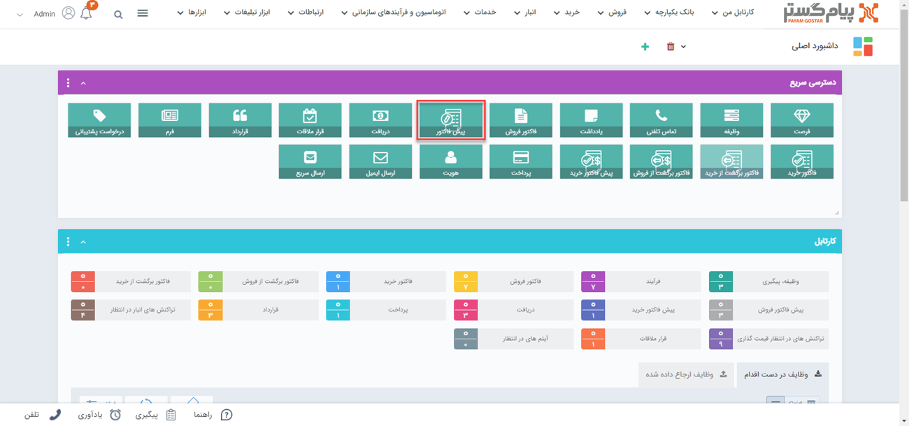
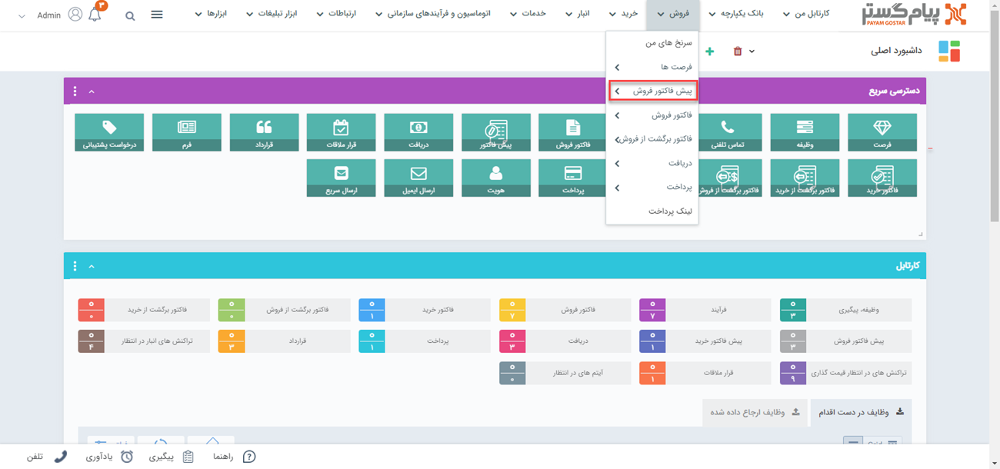
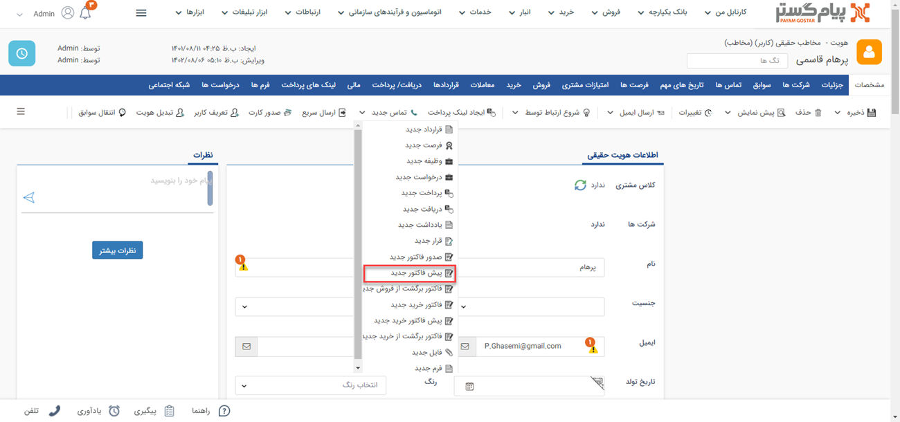
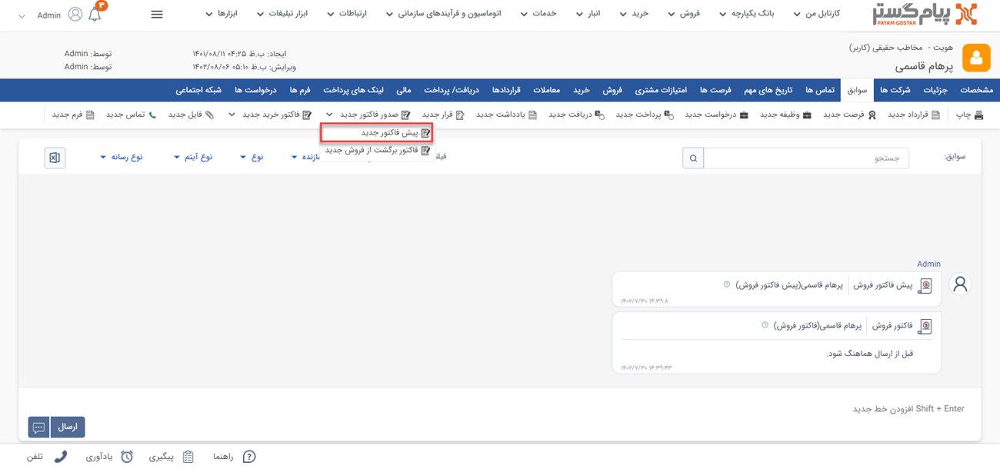
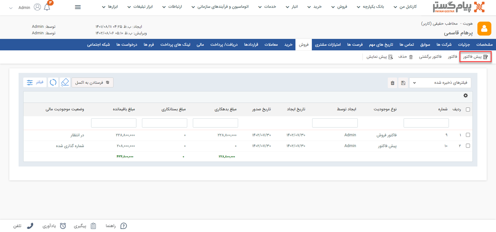

# پیش‌فاکتور فروش جدید 
شما از طریق مسیرهای زیر می‌توانید برای مشتری خود یک پیش فاکتور فروش جدید ثبت کنید. 
>**نکته**  
    مبلغ پیش‌فاکتور مشتری را به شما بدهکار نمی‌‌کند و تنها جنبه اعلام قیمت دارد، اما به اندازه مبلغی که در فاکتور فروش تعیین می‌شود مشتری در سیستم بدهکار می‌شود.
- **ویجت دسترسی سریع** > **پیش فاکتور**

- **تب فروش** > **پیش فاکتور فروش**

- **صفحه اصلی پروفایل مشتری** > **مشخصات** > **پیش فاکتور جدید**

- **صفحه اصلی پروفایل مشتری** > **سوابق** > **پیش فاکتور جدید**

- **صفحه اصلی پروفایل مشتری** > **فروش** > **پیش فاکتور**

> **نکته** 
 لطفا ابتدا قسمت[ اطلاعات مشترک سوابق ](https://github.com/1stco/PayamGostarDocs/blob/master/Help/Integrated-bank/Database/Records/Joint-record-information/Joint-record-information.md)را مطالعه کنید.

برای ثبت پیش‌فاکتور برای مشتری می‌بایست مشخصات زیر را برای پیش‌فاکتور ثبت نمایید. این اطلاعات به شرح زیر است:

1. **مدیریت محصولات:**  برای ثبت یک پیش‌فاکتور نیاز است که ابتدا لیست محصولات در نرم افزار وارد شده باشد. برای ورود اطلاعات محصولات باید از قسمت **اطلاعات پایه** > **مدیریت محصولات** اقدام نمایید. همچنین میانبر مدیریت محصولات در صفحه پیش‌فاکتور جدید موجود است.
2.  **وضعیت تایید و شماره‌گذاری:** در صورتی که در شخصی‌سازی آیتم‌های دارای قابلیت تایید و شماره‌گذاری (پیش فاکتور، فاکتور، دریافت/پرداخت و قرارداد) چک باکس‌های "نیاز به تایید دارد" و "نیاز به شماره‌گذاری دارد" غیر فعال باشند، پس از ذخیره آیتم، شماره‌گذاری و تایید به صورت خودکار انجام خواهد شد. اما اگر هرکدام از این چک باکس‌ها فعال باشند، پس از ذخیره آیتم باید توسط کاربران دارای مجوز، تایید و یا شماره گذاری شوند. در این قسمت می‌توانید وضعیت تایید و شماره‌گذاری این آیتم را مشاهده کنید.

> **نکته**  
توجه داشته باشید که پس از تایید فاکتور، مبلغ فاکتور در محاسبات مالی نرم‌افزار حساب می‌گردد و امضای تعریف شده نیز در قالب چاپ این فاکتور ظاهر می‌شود.

3. **لیست قیمت:** می‌توانید لیست قیمت مختص به این  پیش‌فاکتور را از این لیست انتخاب کنید، تا قیمت کالاهای این پیش‌فاکتور براساس آن محاسبه شود. از بخش (مدیریت لیست قیمت‌ها) می‌توانید بر حسب نیاز خود لیست قیمت‌های مختلفی براساس المان‌های مختلف مانند درصد تخفیف خاص و ...  را برای انواع پیش‌فاکتور ایجاد کنید.

> **نکته**  
در صورتی که ماژول[ کلاس بندی مشتریان ](https://github.com/1stco/PayamGostarDocs/blob/master/Help/Settings/Customer-classification-management/Customer-classification-management.md)فعال باشد، و مشتری در یکی از کلاس‌بندی‌ها قرار گرفته باشد، لیست قیمت براساس مقدار خرید مشتری که در آن کلاس بندی تعیین شده‌است، به صورت خودکار تعیین می‌گردد.

4. **فروشنده:** می‌توانید کارشناس فروش مرتبط با این پیش فاکتور را تعیین کنید. کاربران نرم افزار در لیست نمایش داده می‌شود و می‌توانید از لیست نام شخص فروشنده را انتخاب نمایید. به صورت پیش‌فرض نام کاربر ایجاد کننده در این فیلد قرار می‌گیرد.

>**نکته**  
لازم به ذکر است در صورت صدور فاکتور از پیش فاکتور، فروشنده پیش فاکتور به عنوان فروشنده فاکتور در نظر گرفته می‌شود.

5. **تاریخ صدور:** تاریخ صدور پیش‌فاکتور را تعیین نمایید.
6. **تاریخ انقضا:** این تاریخ تنها برای پیش‌فاکتورهایی معنا پیدا می‌کند که تاریخ اعتبار قیمت‌ها و شرایط پیش فاکتور را نشان می‌دهند.
7. **شماره:** اگر مجوز "شماره‌گذاری" این نوع از آیتم را داشته باشید، شماره پیش‌فاکتور را می‌توانید به صورت دستی تعیین کنید، در غیر اینصورت پس از شماره گذاری توسط کاربران دارای مجوز، نرم افزار بر اساس شماره پایه‌ای که در قسمت [مدیریت فاکتورها](https://github.com/1stco/PayamGostarDocs/blob/master/Help/Settings/Personalization-crm/Factor-management/Factor-management.md)  تعیین شده‌است، یک شماره خودکار به فاکتور و یا پیش‌فاکتور اختصاص می‌دهد.
8. **توضیحات:** می‌توانید توضیحات  بیشتر در خصوص این  پیش فاکتور را در این قسمت وارد نمایید.
9. **انتخاب محصول:** محصول مورد نظر را با توجه به دسته بندی‌هایی که در [مدیریت محصولات](https://github.com/1stco/PayamGostarDocs/blob/master/Help/Basic-Information/Product%20management/Product-management.md)    انجام داده اید، انتخاب کنید. محصولات به صورت لیست نمایش داده می‌شود و شما می‌توانید با تایپ حروف اول محصول، راحت تر به محصول مورد نظر خود در لیست محصولات برسید. همچنین می‌توانید در فیلد جستجوی کد، کد محصول وارد شده در قسمت مدیریت محصولات را وارد کرده و محصول را به ردیف‌های فاکتور اضافه نمایید. 

> **نکته**  
لازم به ذکر است برای اضافه کردن محصول مورد نظر که در مدیریت محصولات تعریف نشده است، می‌توانید از محصول سایر که بصورت پیش فرض در مدیریت محصولات موجوداست استفاده کرد و اطلاعات محصول سایر را با توجه به نیاز ویرایش کرد.

10. **موجودی انبار:** مقدار موجودی انبار و موجودی که توسط پیش‌فاکتور به حالت فریز شده (غیرقابل فروش) در آمده است را نمایش می‌دهد. در صورتی که از انبارداری پیشرفته(سریالی) استفاده می‌کنید، موجودی محصول به تفکیک انبارهای مختلف تعریف شده در این قسمت نمایش داده خواهد شد.

> **نکته** 
تنها کاربر دارنده مجوز صدور حواله در مدیریت انبارها، امکان مشاهده موجودی انبار را در هنگام صدور پیش فاکتور و یا فاکتور را دارد.
>> **نکته** 
  تنها شخص دارنده مجوز "ویرایش پس از شماره‌گذاری، تایید یا رد" می‌تواند محتوای یک فاکتور و یا پیش فاکتور تایید شده را تغییر دهد و سایر اشخاص دسترسی تغییر محتوای فاکتور و یا پیش فاکتور تایید شده را نخواهند داشت.

11. **مشخصات ردیف پیش فاکتور:** در این قسمت میتوانید مشخصات بیشتری از هر محصول برای درج در ردیف‌های پیش فاکتور را وارد کنید. این مشخصات شامل کد و نام محصول، مقدار، قیمت واحد(بر اساس قیمت تعیین شده در قسمت مدیریت محصولات تکمیل می‌گردد و در صورت نیاز می‌توانید برای این پیش فاکتور آن را تغییر دهید)، سریال، قیمت کل (قیمت بر اساس مقدار وارد شده بدون احتساب تخفیف و مالیات)، درصد و مقدار تخفیف، مالیات (مقدار مالیات بر اساس درصد مالیات تعیین شده برای این نوع از آیتم در قسمت شخصی سازی تکمیل خواهد شد و امکان تغییر آن به صورت دستی وجود ندارد) و قیمت نهایی (قیمت کل با احتساب تخفیف و مالیات) می‌باشد.

> **نکته** 
 در صورتی که ماژول مدیریت انواع فاکتور فروش را خریداری کرده باشید، در شخصی‌سازی هر کدام از پیش فاکتورها می‌توانید فیلدهایی از نوع متن (مانند رنگ، توضیحات تکمیلی و...) یا عدد (مانند هزینه نصب، هزینه حمل و ...) به فیلدهای ردیف‌های پیش فاکتور اضافه کنید. علاوه بر این از فیلدهای از نوع عدد اضافه شده می‌توان در فرمول محاسبه تعداد و فرمول محاسبه قیمت کل استفاده نمود.
>> **نکته** 
 در صورتی که برای تعداد( مقدار) کالا در قسمت[ مدیریت فاکتورها ](https://github.com/1stco/PayamGostarDocs/blob/master/Help/Settings/Personalization-crm/Factor-management/Factor-management.md) قسمت شخصی‌سازی CRM فرمول محاسبه تعیین کرده باشید، فیلد مقدار به صورت غیر فعال نمایش داده می‌شود تا براساس فرمول تعریف شده محاسبه گردد.

12. **توضیحات:** توضیحات مرتبط با محصول انتخاب شده را وارد کنید. برای نمایش این فیلد در پیش نمایش می‌توانید از پارامتر"توضیحات ردیف پیش فاکتور" در جدول محصولات استفاده کنید.
13. **درصد کل تخفیف:** در این قسمت درصد کل تخفیف در پیش فاکتور محاسبه می‌شود. که از فرمول روبرو به دست می‌آید:  
	(مبلغ کل فاکتور)/(مجموع کل مبالغ تخفیف ردیف‌ها)                                       
14. **مجموع تخفیف/مالیات/عوارض:** مجموع تخفیف و مالیات و عوارض لحاظ شده (مجموع مبالغ تمام ردیف‌ها) در این قسمت نمایش داده خواهد شد. اگر در شخصی سازی آیتم، چک باکس‌های "مجموع تخفیف/مالیات/عوارض قابل ویرایش باشد" فعال شده باشد می‌توان این مبالغ را به صورت دستی تغییر داد.

> **نکته** 
برای طراحی قالب پیش فاکتور به بخش **تنظیمات** > **مدیریت فاکتورها** مراجعه نمایید.
 با انتخاب کردن هر ردیف پیش فاکتور و کلیک بر روی بخش ویرایش ردیف می‌توانید آن را ویرایش و یا حذف کنید.
