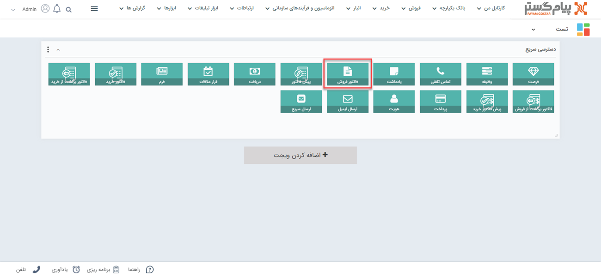
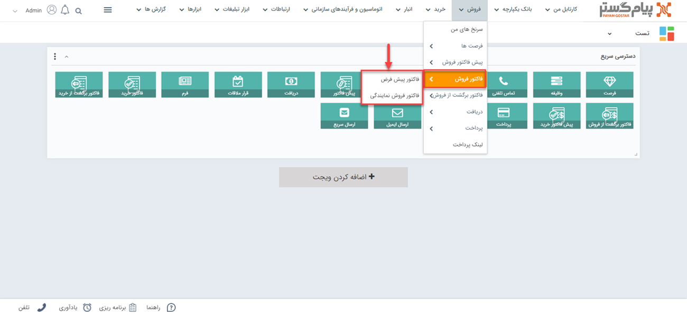
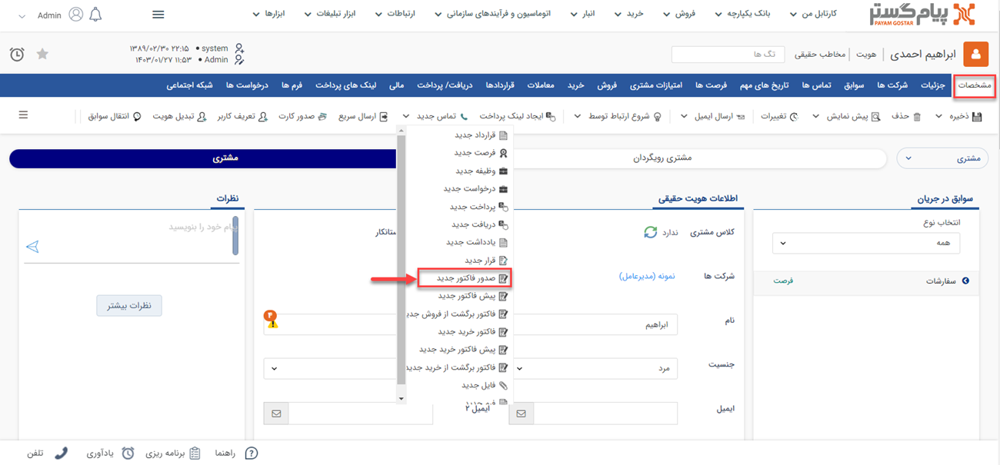
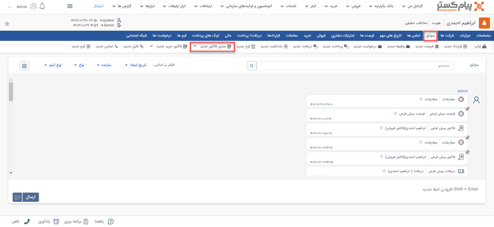
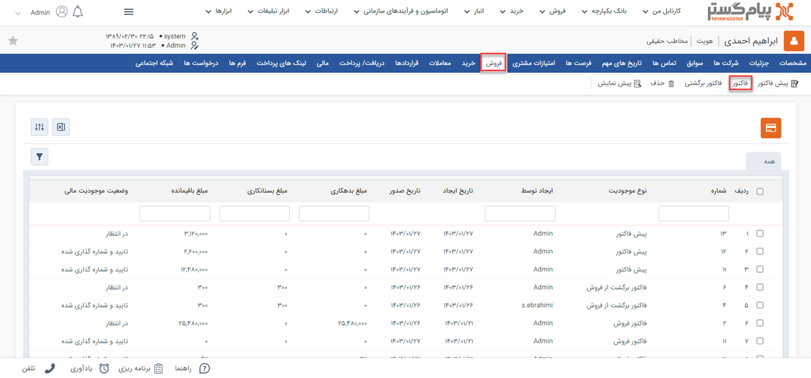
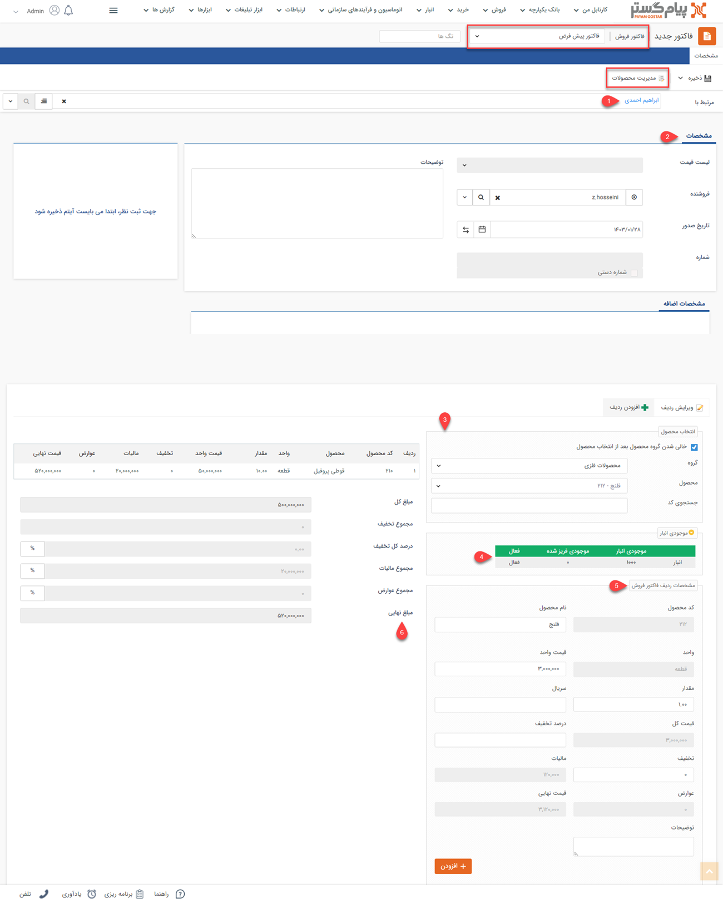

# فاکتور فروش جدید 
چنانچه نیاز به ثبت سفارش مشتری خود دارید می‌توانید از آیتم فاکتور فروش استفاده نمایید. در فاکتور فروش می‌توانید انواع محصولات و یا خدمات ارائه شده در مجموعه‌تان را به عنوان اقلام فروخته شده درج کنید. مخاطب به میزان مبلغ فاکتور فروش ثبت شده برای او به شما بدهکار می‌شود.

## مسیر‌های ثبت فاکتور فروش
شما از طریق مسیرهای زیر میتوانید برای مشتری خود یک فاکتور فروش جدید ثبت کنید. 
- **ویجت دسترسی سریع** > **فاکتور**

- **تب فروش** > **فاکتور فروش** > **زیرنوع فاکتور فروش** > **افزودن فاکتور فروش**

- **صفحه اصلی پروفایل مخاطب** > **آیتم جدید** > **فاکتور فروش جدید** 
برای مشاهده لیست «آیتم‌های جدید» بر روی فلش کنار «تماس جدید» (قابل مشاهده در نوار سفید بالای صفحه) مراجعه نمایید.

- **صفحه اصلی پروفایل مخاطب** > **تب سوابق** > **صدور فاکتور جدید**

- **صفحه اصلی پروفایل مخاطب** > **تب فروش** > **فاکتور**

## شیوه‌ی ثبت فاکتور فروش
در صورت داشتن چند زیرنوع فاکتور فروش، به انتخاب صحیح آن توجه داشته باشید. زیرنوع آیتم در قسمت بالای صفحه قابل مشاهده و قابل تغییر می‌باشد. در تصویر زیر، «فاکتور فروش پیش‌فرض» برای ثبت نمونه انتخاب شده است. 
برای ثبت فاکتور فروش لازم است فیلدهای مورد نیاز آیتم را با اطلاعات موجود تکمیل و سپس ذخیره نمایید. مشخصات فاکتورها در پیام‌گستر به شرح زیر می‌باشد: 

**مدیریت محصولات:**  برای ثبت یک پیش‌فاکتور نیاز است که ابتدا لیست محصولات در نرم افزار وارد شده باشد. برای ورود اطلاعات محصولات باید از قسمت اطلاعات پایه، مدیریت محصولات اقدام نمایید. ( مدیریت محصولات) همچنین میانبر مدیریت محصولات در صفحه پیش فاکتور جدید موجود است. 
**1. مرتبط با** 
نام هویتی که این فاکتور برای او ثبت شده را در این قسمت درج کنید. بدین منظور کافیست بخشی از نام هویت مورد نظر را تایپ نمایید تا لیست هویت‌های مشابه آن برای انتخاب به شما نمایش داده شود.

**2. مشخصات** 
- **لیست قیمت:** با استفاده از این قسمت می‌توانید لیست قیمت مورد نظر خود را انتخاب نمایید، تا قیمت خدمات/کالاهای این فاکتور بر اساس آن درج شود. با اتنخاب لیست قیمت در این قسمت، تمامی قیمت‌‌های درج شده در جدول مشخصات ردیف فاکتور بر اساس آن لحاظ می‌شود.  
در صورتی که ماژول[ کلاس بندی مشتریان ](https://github.com/1stco/PayamGostarDocs/blob/master/Help/Settings/Customer-classification-management/Customer-classification-management.md)فعال باشد، و مشتری در یکی از سطوح کلاس بندی‌ قرار گرفته باشد، به صورت خودکار تعیین می‌گردد.

> **نکته**  
> برای استفاده از لیست قیمت لازم است: ۱) ماژول لیست قیمت برای شما فعال باشد؛ ۲) لیست قیمت‌های مختلف (مثل لیست قیمت خرده‌فروشی و عمده‌فروشی) تعریف شده باشد؛ ۳) شما مجوز استفاده از لیست قیمت را داشته باشید. در صورت عدم امکان استفاده از این قابلیت علت یکی از سه مورد فوق است. 

- **فروشنده:** می‌توانید کارشناس فروش مرتبط با این فاکتور را تعیین کنید. کاربران نرم‌افزار در لیست نمایش داده می‌شود و می‌توانید از لیست نام شخص فروشنده را انتخاب نمایید. به صورت پیش‌فرض نام کاربر ایجادکننده در این فیلد قرار می‌گیرد. 

>**نکته**  
لازم به ذکر است در صورت صدور فاکتور از روی پیش‌فاکتور، فروشنده پیش‌فاکتور به عنوان فروشنده فاکتور در نظر گرفته می‌شود . 

- **تاریخ صدور:** تاریخ صدور فاکتور را تعیین نمایید. این تاریخ می‌تواند با تاریخ ایجاد متفاوت باشد. به عنوان مثال در شرایطی که فاکتوری که دیروز صادر شده است را امروز در سیستم ثبت می‌کنید، تاریخ ایجاد به صورت خودکار امروز ثبت می‌شود اما شما می‌توانید تاریخ صدور را روز قبل انتخاب کنید. 

- **شماره:** در صورتی که مجوز شماره‌گذاری این نوع فاکتور فروش را داشته باشید، می‌توانید به صورت دستی این فاکتور را شماره‌گذاری کنید. در غیر این صورت پس از ذخیره فاکتور، کاربرانی که مجوز شماره‌گذاری داشته باشند آن را در کارتابل فاکتورهای خود مشاهده خواهند نمود و می‌توانند آن را شماره‌گذاری کنند. در صورت نیاز، کاربر دارای مجوز شماره‌گذاری فاکتور، ویرایش شماره پس از شماره‌گذاری یا مدیر فروش می‌تواند این شماره را به دلخواه تغییر دهد.

- **توضیحات:** می‌توانید توضیحات بیشتر در خصوص این فاکتور فروش را در این قسمت درج نمایید. 

**3. انتخاب محصول** 
برای افزودن محصول/خدمت به فاکتور کافیست حروف اول عنوان آن را در فیلد «محصول» درج نمایید تا راحت‌تر بتوانید آن را از بین لیست محصولات انتخاب کنید.  
در صورت انتخاب دسته‌بندی محصول مورد نظر در فیلد «گروه» تنها محصولات همان دسته‌بندی در بخش «محصول» به شما نمایش داده می‌شود. به عنوان مثال اگر محصولات شما در سه دسته‌ی محصولات فلزی و محصولات پلاستیکی در سیستم تعریف شده باشد، شما برای انتخاب محصول قوطی پروفیل در فیلد «محصول»، می‌توانید در فیلد «گروه»، نوشت‌ابزار را انتخاب نمایید تا فقط محصولات این گروه به شما نمایش داده شود. با توجه به قابلیت جستجو در فیلد محصول، انتخاب این بخش الزامی نیست و شما می‌توانید مستقیم در فیلد بعدی محصول مورد نظر را بیابید. 
در صورت آگاهی از کد محصول،‌ می‌توانید در فیلد «کد محصول» را جستجو کرده و آن را برای افزودن به فاکتور انتخاب نمایید.

> **نکته**  
> شما تنها محصولاتی که از پیش در لیست محصولات تعریف شده باشند را می‌توانید در پیش‌فاکتور و فاکتورهای خود استفاده کنید. در صورت نیاز به اضافه کردن محصول/خدمت جدید به منظور استفاده در پیش‌فاکتور/فاکتور،‌ می‌توانید از بخش «مدیریت محصولات» (قابل مشاهده در بالای صفحه) استفاده کنید. این بخش در واقع میانبری به بخش [مدیریت محصولات](https://github.com/1stco/PayamGostarDocs/blob/master/Help/Basic-Information/Product-management/Product-management.md) در اطلاعات پایه است. برای این کار باید مجوز مدیریت فروش یا مدیریت محصولات را داشته باشید. 
>> در صورت نیاز به درج محصول در فاکتور که نام آن را در لیست مشاهده نمی‌کنید و قصد افزودن آن به لیست محصولات را ندارید، می‌توانید از محصول «سایر» که به صورت پیش‌فرض در مدیریت محصولات موجوداست استفاده کرد و اطلاعات محصول سایر را با توجه به نیاز ویرایش کرد. چنانچه از انبارداری سریالی استفاده می‌کنید و یا مجوز ویرایش نام کالا را ندارید، این امکان برای شما فراهم نمی‌باشد. 

**4. موجودی انبار:**
با انتخاب هر محصول، موجودی آن در این جدول به شما نمایش داده می‌شود. در صورتی که از انبارداری پیشرفته(سریالی) استفاده می‌کنید، موجودی محصول به تفکیک انبارهای مختلف، در این قسمت نمایش داده خواهد شد. 
منظور از موجودی فریز شده در این جدول، محصولاتی است که در پیش‌فاکتورهای تایید شده ثبت شده‌اند. 

> **نکته** 
> در انبارداری تعدادی تنها در صورتی که برای محصول گزینه انبارداری فعال شده باشد این جدول در پیش‌فاکتور و فاکتور به شما نمایش داده می‌شود. در انبارداری سریالی نیز تنها کاربر دارنده مجوز صدور حواله در مدیریت انبارها، امکان مشاهده موجودی انبار را در هنگام صدور پیش فاکتور و یا فاکتور را دارد. 

**5. مشخصات ردیف فاکتور فروش** 
در این قسمت می‌توانید مشخصات بیشتری از هر محصول برای درج در ردیف‌های فاکتور را وارد کنید. بدین منظور می‌توانید از راهنمایی‌های زیر استفاده نمایید: 
- با انتخاب محصول (قسمت ۳)، اطلاعاتی نظیر «نام محصول»، «کد محصول» و «واحد» آن به صورت خودکار در فیلدها ثبت می‌شود. 
- «قیمت واحد» بر اساس قیمت تعیین شده برای محصول در این قسمت درج می‌شود. چنانچه در قسمت مشخصات فاکتور، لیست قیمت مورد نظر را برای فاکتور انتخاب کرده باشید، قیمت بر اساس مبلغ لیست قیمت انتخابی در این قسمت درج می‌شود. در صورت داشتن مجوز ویرایش قیمت می‌توانید قیمت را از این قسمت ویرایش کنید. 
- در قسمت «مقدار» میزان مورد نظر را با توجه به واحد کالا درج نمایید.

> **نکته** 
 در صورتی که برای مقدار کالا در قسمت [شخصی‌سازی](https://github.com/1stco/PayamGostarDocs/blob/master/Help/Settings/Personalization-crm/Factor-management/Factor-management.md)، فرمول محاسبه تعیین کرده باشید، فیلد مقدار براساس فرمول تعریف شده محاسبه گردیده و به صورت غیرفعال نمایش داده می‌شود. 

- در صورت استفاده از انبارداری سریالی،‌ از قسمت «انبار» انتخاب نمایید که کالای مندرج از کدام موجودی، کدام انبار تامین شود و همچنین سریال کالا را در فیلد «سریال» وارد نمایید.
- در صورت نیاز به درج تخفیف، درصد مورد نظر را در بخش «درصد تخفیف» وارد نمایید. مقدار تخفیف اعمال شده (بر اساس درصد تخفیف، تعداد و قیمت واحد) در فیلد «تخفیف» به صورت خودکار محاسبه و نمایش داده می‌شود. البته شما می‌توانید مبلغ تخفیف مورد نظر خود را به صورت مستقیم در فیلد «تخفیف» نیز وارد نمایید.
- فیلدهای «مالیات» و «عوارض» نیز برای درج این مبالغ تعبیه شده است. در صورتی که فیلدها روی حالت خودکار تنظیم شده باشند، مجوز درج آن به صورت دستی را نخواهید داشت.
- فیلد «قیمت کل» بر اساس حاصل ضرب مقدار انتخابی در قیمت واحد به شما نمایش داده می‌شود «قیمت نهایی» مبلغ مذکور را پس از اعمال تخفیف، مالیات و عوارض نشان می‌دهد.
- در صورت نیاز به درج توضیحات اضافه در مورد محصولی که در حال افزودن آن به فاکتور هستید آن را در فیلد «توضیحات» درج نمایید. توجه داشته باشید توضیح درج شده در این قسمت صرفا مربوط به همین محصولی است که در حال افزودن آن به فاکتور هستید، در حالی که توضیحات مندرج در قسمت بالای فاکتور مربوط به کل فاکتور می‌باشد. 

> **نکته** 
> ممکن است از طریق شخصی‌سازی فاکتور فروش، فیلدهایی از نوع متن (مانند رنگ محصول، توضیحات تکمیلی و...) یا عدد (مانند هزینه نصب، هزینه حمل و ...) به فیلدهای ردیف‌های فاکتور اضافه شده باشد. در این صورت این فیلدها نیز در این برای شما نمایش داده می‌شود تا به هنگام افزودن محصول، اطلاعات مورد نیاز را در آن وارد کنید. فلیدهای عددی می‌توانند در فرمول محاسبه تعداد و فرمول محاسبه قیمت کل استفاده شده باشند. 

پس از تکمیل اطلاعات محصول مورد نظر، با کلیک بر روی دکمه «افزودن» آن را به فاکتور اضافه کنید. برای انتخاب محصول بعدی، همین مسیر را از انتخاب محصول مجدد طی نمایید. چنانچه گزینه «خالی شدن گروه محصول بعد از انتخاب محصول» (قسمت انتخاب محصول) فعال باشد، فیلد محصول برای انتخاب محصول بعدی خالی و آماده می‌باشد. 

**6. محصولات فاکتور** 
تمامی محصولات اضافه شده به فاکتور در این جدول قابل مشاهده می‌باشند. در صورت نیاز به ویرایش یک ردیف بر روی آن کلیک کرده و در کادر سمت راست اطلاعات آن را تغییر داده و بر روی کلید «ویرایش» کلیک نمایید.  
- **مبلغ کل:** مجموع مبلغ کل‌های ردیف‌‌های فاکتور می‌باشد. این مبلغ شامل هزینه محصولات/خدمات مندرج در فاکتور بدون اعمال تخفیف،‌ مالیات و عوارض است.
- **مجموع تخفیف:** در ایت قسمت مجموع تخفیف اعمال شده نمایش داده می‌شود.
- **درصد کل تخفیف:** در این قسمت درصد کل تخفیف در فاکتور ((مبلغ کل فاکتور)/( ۱۰۰ × مجموع کل مبالغ تخفیف ردیف‌ها) ) نمایش داده می‌شود. چنانچه مجوز ویرایش آن را داشته باشید می‌توانید تخفیف کل اعمال شده را از همین قسمت تغییر دهید. بدین منظور کافیست درصد تخفیف مورد نظر را در قسمت سمت چپ همین کادر وارد نمایید تا مبلغ آن برای شما محاسبه و نمایش داده شود.   
- **مجموع عوارض:** مجموع عوارض اعمال شده در ردیف‌ها در این قسمت نمایش داده می‌شود. چنانچه مجوز ویرایش آن را داشته باشید می‌توانید عوارض کل اعمال شده را از همین قسمت تغییر دهید. بدین منظور کافیست مبلغ مورد نظر برای عوارض را در قسمت سمت راست کادر وارد نمایید. در صورت تمایل می‌توانید درصد عوارض مورد نظر را در قسمت سمت چپ همین کادر  وارد نمایید تا مبلغ آن برای شما محاسبه و نمایش داده شود.     
- **مجموع مالیات:** مجموع مالیات اعمال شده در ردیف‌ها در این قسمت نمایش داده می‌شود. چنانچه مجوز ویرایش آن را داشته باشید می‌توانید مالیات کل اعمال شده را از همین قسمت تغییر دهید. بدین منظور کافیست مبلغ مورد نظر برای مالیات را در قسمت سمت راست کادر وارد نمایید. در صورت تمایل می‌توانید درصد مالیات مورد نظر را در قسمت سمت چپ همین کادر  وارد نمایید تا مبلغ آن برای شما محاسبه و نمایش داده شود. 

> **نکته**  
> اگر از طریق شخصی‌سازی،‌ مبلغ اضافات به فاکتور فروش شما اضافه شده باشد،‌ فیلد این مبلغ را در نیز در این بخش مشاهده می‌کنید. به عنوان مثال به مبلغ نهایی فاکتور، مبلغ بسته‌بندی و ارسال اضافه شود. 

در نهایت کافیست بر روی دکمه «ذخیره» در سمت راست بالای صفحه کلیک نمایید. 
پس از ذخیره فاکتور فروش، سایر اطلاعات و قابلیت‌های موجود در مورد آن به شما نمایش داده می‌شود. برای کسب اطلاعات بیشتر در این خصوص به راهنمای [ اطلاعات مشترک سوابق](https://github.com/1stco/PayamGostarDocs/blob/master/Help/Integrated-bank/Database/Records/Joint-record-information/Joint-record-information.md) مراجعه نمایید.

