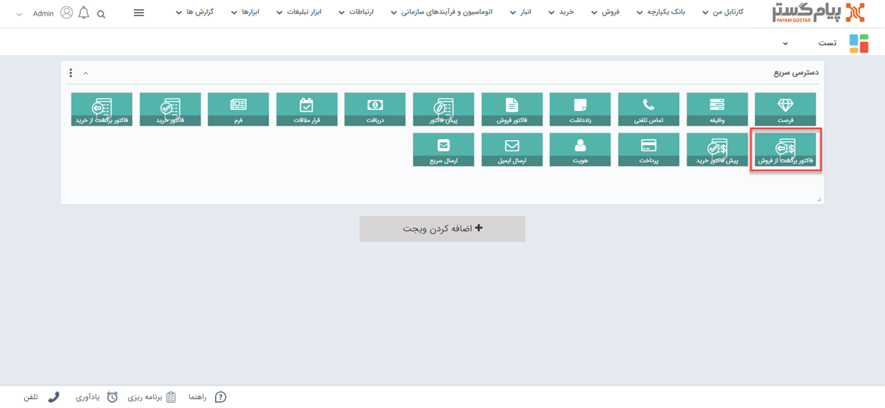
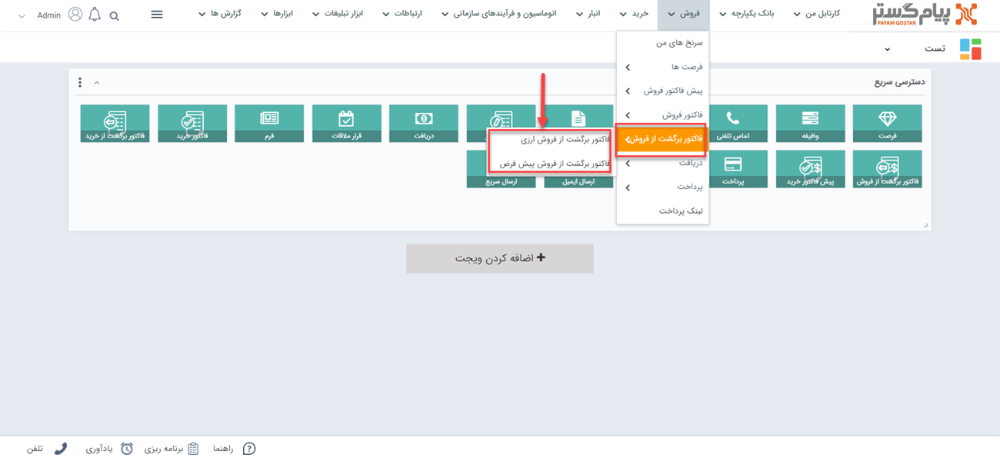
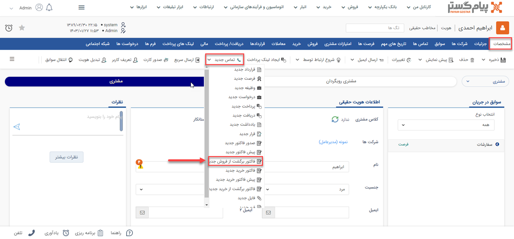
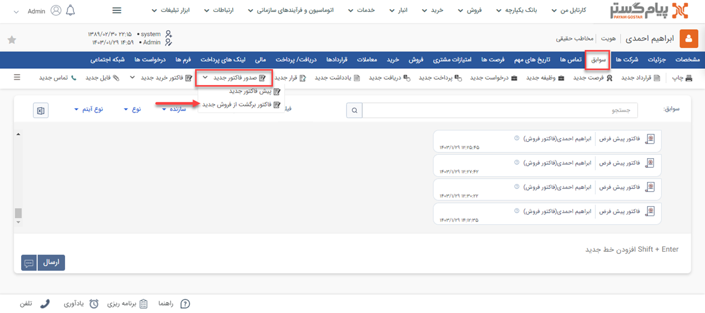
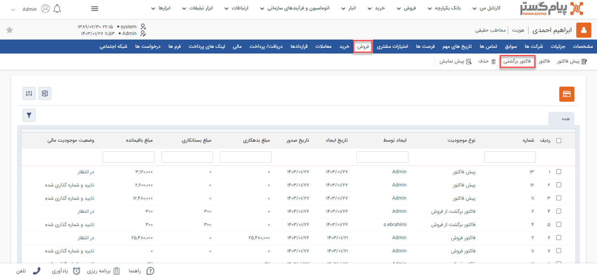
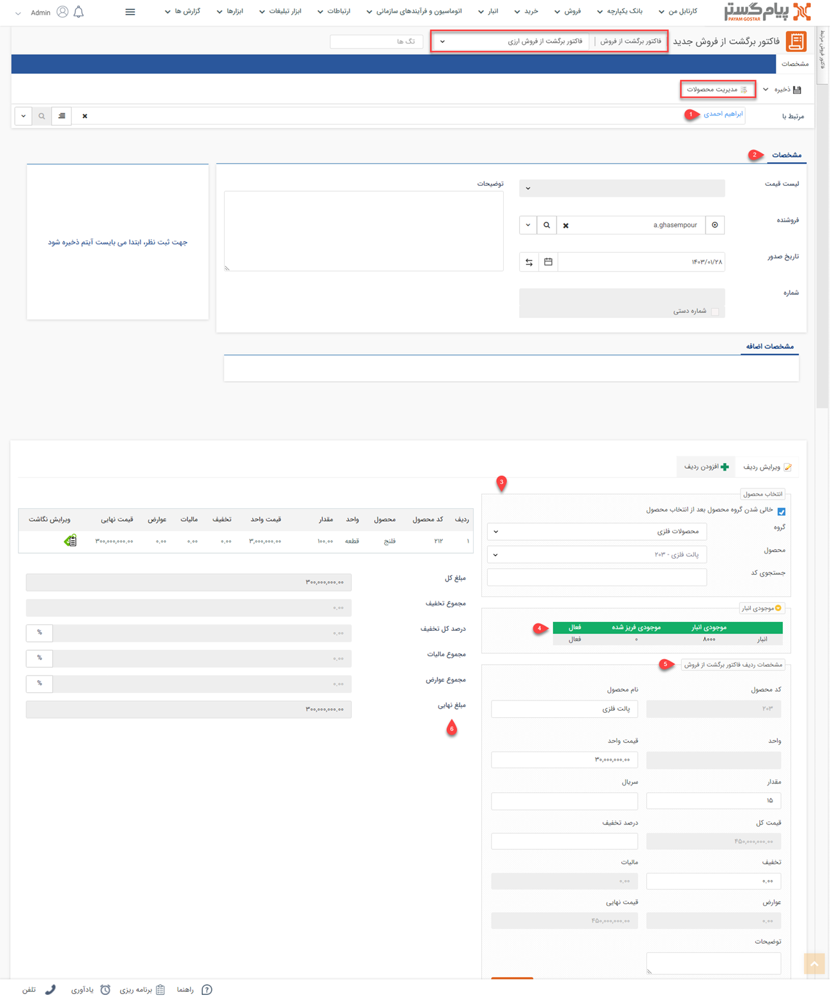

# فاکتور برگشت از فروش جدید 
چنانچه قصد ثبت مرجوع کالا را دارید باید از آیتم فاکتور برگشت از فروش استفاده نمایید. از این طریق می‌توانید برگشت محصولات را در سیستم ثبت کنید و مبلغ آن را از بدهی مشتری خود کم کنید. 

## مسیر‌های ثبت فاکتور برگشت از فروش
برای ثبت فاکتور برگشت از فروش در پیام‌گستر، مسیرهای مختلفی وجود دارد. بنا بر نیاز خود می‌توانید از مسیرهای زیر اقدام به ثبت فاکتور برگشتی جدید برای مشتری خود نمایید. 

- **ویجت دسترسی سریع** > **فاکتور برگشت از فروش**

- **تب فروش** > **فاکتور برگشت از فروش**

- **صفحه اصلی پروفایل مخاطب** > **آیتم جدید** > **فاکتور برگشت از فروش جدید** 
برای مشاهده لیست «آیتم‌های جدید» بر روی فلش کنار «تماس جدید» (قابل مشاهده در نوار سفید بالای صفحه) کلیک نمایید. 

- **صفحه اصلی پروفایل مخاطب** > **تب سوابق** > **فاکتور برگشت از فروش جدید**
برای مشاهده این گزینه بر روی فلش کنار «صدور فاکتور جدید» کلیک کنید. 

- **صفحه اصلی پروفایل مخاطب** > **تب فروش** > **فاکتور برگشتی**

> **نکته** 
> توجه داشته باشید که چنانچه از صفحه هویت مورد نظر اقدام به ثبت فاکتور برگشت از فروش نمایید (مسیر سوم، چهارم و پنجم)، بخش «مرتبط با» به صورت خودکار با نام هویت پر می‌شود. به عبارت دیگر فاکتور برگشتی به نام هویت ثبت می‌شود. اما اگر از مسیرهای صفحه اصلی (مسیر اول و دوم) اقدام به ثبت فاکتور برگشتی نمایید، باید نام هویت را در قسمت «مرتبط با» جستجو و انتخاب کنید. 

## شیوه‌ی ثبت فاکتور برگشت از فروش
در صورت داشتن چند زیرنوع فاکتور برگشت از فروش، به انتخاب صحیح آن توجه داشته‌باشید. زیرنوع آیتم در قسمت بالای صفحه قابل مشاهده و قابل تغییر می‌باشد. در تصویر زیر، «فاکتور برگشت از فروش پیش‌فرض» برای ثبت نمونه انتخاب شده‌است. 
برای ثبت فاکتور برگشت از فروش، لازم است فیلدهای مورد نیاز آیتم را با اطلاعات موجود تکمیل و سپس ذخیره نمایید. مشخصات فاکتورهای برگشت از فروش در پیام‌گستر به شرح زیر می‌باشد: 

### ۱. مرتبط با  
نام هویتی که می‌خواهید برایش فاکتور برگشتی ثبت کنید را در این قسمت درج کنید. بدین منظور کافیست بخشی از نام هویت مورد نظر را تایپ نمایید تا لیست هویت‌های مشابه آن برای انتخاب به شما نمایش داده‌شود. چنانچه پیش‌تر به آن اشاره شد، اگر از صفحه هویت اقدام به ثبت فاکتور برگشتی کرده‌باشید، نام هویت به صورت خودکار در این بخش ثبت شده‌است. 

### ۲. مشخصات  
- **لیست قیمت:** با استفاده از این قسمت می‌توانید لیست قیمت مورد نظر خود را انتخاب نمایید، تا قیمت خدمات/کالاهای این فاکتور برگشتی بر اساس آن درج شود. با اتنخاب لیست قیمت در این قسمت، تمامی قیمت‌‌های درج شده در جدول مشخصات ردیف فاکتور فروش بر اساس آن لحاظ می‌شود.  
در صورتی که مشتریان خود را کلاس‌بندی کرده‌باشید (ماژول [کلاس‌بندی مشتریان](https://github.com/1stco/PayamGostarDocs/blob/master/Help/Settings/Customer-classification-management/Customer-classification-management.md) فعال باشد) لیست قیمت به صورت خودکار و بر اساس کلاس مشتری تعیین می‌شود. 
توجه داشته‌باشید که اگر ماژول لیست قیمت برایتان غیرفعال باشد و یا کاربری شما مجوز استفاده از لیست قیمت را نداشته‌باشد، این گزینه (لیست قیمت) برایتان غیرفعال خواهدبود. در این صورت به صورت مستقیم برای پر کردن فیلدهای بعدی اقدام نمایید. 

- **فروشنده:** می‌توانید کارشناس فروش مرتبط با این فاکتور برگشتی را تعیین کنید. کاربران نرم‌افزار در لیست نمایش داده‌می‌شود و می‌توانید از لیست، نام شخص فروشنده را انتخاب نمایید. به صورت پیش‌فرض نام کاربر ایجادکننده در این فیلد قرار می‌گیرد. 
- **تاریخ صدور:** تاریخ صدور فاکتور برگشتی را تعیین نمایید. این تاریخ می‌تواند با تاریخ ایجاد متفاوت باشد. به عنوان مثال در شرایطی که فاکتور برگشتی دیروز صادر شده‌است و شما آن را امروز در سیستم ثبت می‌کنید، تاریخ ایجاد به صورت خودکار امروز ثبت می‌شود اما شما می‌توانید تاریخ صدور را روز قبل انتخاب کنید. 
- **شماره:** در صورتی که مجوز شماره‌گذاری این نوع فاکتور برگشت از فروش را داشته‌باشید، می‌توانید به صورت دستی این فاکتور برگشتی را شماره‌گذاری کنید. در غیر این صورت پس از ذخیره فاکتور برگشتی، کاربرانی که مجوز شماره‌گذاری داشته باشند آن را در کارتابل فاکتورهای برگشت از فروش خود مشاهده خواهند نمود و می‌توانند آن را شماره‌گذاری کنند. در صورت نیاز، کاربر دارای مجوز شماره‌گذاری فاکتور برگشت از فروش، ویرایش شماره پس از شماره‌گذاری یا مدیر فروش می‌تواند این شماره را به دلخواه تغییر دهد.
- **توضیحات:** می‌توانید توضیحات بیشتر در خصوص این فاکتور برگشت از فروش را در این قسمت درج نمایید. 

> **نکته**  
> اگر طی روند شخصی‌سازی، فیلدی برای ثبت اطلاعات در فاکتور برگشت از فروش در نظر گرفته‌شده باشد، آن را در  قسمت «مشخصات اضافه» مشاهده می‌کنید. 

### ۳. انتخاب محصول 
برای افزودن محصول/خدمت به فاکتور برگشتی (ثبت اقلام مرجوعی) کافیست حروف اول عنوان آن را در فیلد «محصول» درج نمایید تا راحت‌تر بتوانید آن را از بین لیست محصولات انتخاب کنید.  
در صورت انتخاب دسته‌بندی محصول مورد نظر در فیلد «گروه» تنها محصولات همان دسته‌بندی در بخش «محصول» به شما نمایش داده‌می‌شود. به عنوان مثال اگر محصولات شما در دو دسته‌ی ابزارآلات و محصولات فلزی در سیستم تعریف شده باشد، شما برای انتخاب محصول سنسور در فیلد «محصول» می‌توانید در فیلد «گروه»، محصولات فلزی را انتخاب نمایید تا فقط محصولات این گروه به شما نمایش داده‌شود. با توجه به قابلیت جستجو در فیلد محصول، انتخاب این بخش الزامی نیست و شما می‌توانید مستقیم در فیلد بعدی، محصول مورد نظر را بیابید. 
در صورت آگاهی از کد محصول،‌ می‌توانید در فیلد «کد محصول» آن را جستجو کرده و برای افزودن به فاکتور انتخاب نمایید. 

### ۴. موجودی انبار 
با انتخاب هر محصول، موجودی آن در این جدول به شما نمایش داده‌می‌شود. در صورتی که از انبارداری پیشرفته (سریالی) استفاده می‌کنید، موجودی محصول به تفکیک انبارهای مختلف، در این قسمت نمایش داده‌خواهد‌شد. 

لازم به ذکر است در انبارداری تعدادی تنها در صورتی که برای محصول گزینه انبارداری فعال شده‌باشد، این جدول به شما نمایش داده‌می‌شود. در انبارداری سریالی نیز تنها کاربر دارنده مجوز صدور حواله در مدیریت انبارها، امکان مشاهده موجودی انبار در هنگام صدور انواع فاکتور را دارد. 

### ۵. مشخصات ردیف فاکتور برگشت از فروش 
در این قسمت می‌توانید مشخصات و مقدار هر محصول مرجوعی را وارد کنید. بدین منظور می‌توانید از راهنمایی‌های زیر استفاده نمایید: 
- با انتخاب محصول (قسمت ۳)، اطلاعاتی نظیر «نام محصول»، «کد محصول» و «واحد» آن به صورت خودکار در فیلدها ثبت می‌شود. 
- «قیمت واحد» بر اساس قیمت تعیین شده برای محصول در این قسمت درج می‌شود. چنانچه در قسمت مشخصات فاکتور برگشت از فروش، لیست قیمت مورد نظر را برای فاکتور انتخاب کرده باشید، قیمت بر اساس مبلغ لیست قیمت انتخابی در این قسمت درج می‌شود. در صورت داشتن مجوز ویرایش قیمت می‌توانید قیمت را از این قسمت ویرایش کنید. 
- در قسمت «مقدار» میزان مورد نظر را با توجه به واحد کالا درج نمایید.

> **نکته** 
> در صورتی که طی شخصی‌سازی برای محاسبه مقدار کالا، فرمول تعیین شده‌باشد، فیلد مقدار براساس فرمول تعریف شده محاسبه گردیده و به صورت غیرفعال نمایش داده‌می‌شود. به عنوان مثال طول و عرض توسط شما وارد شده و مساحت مورد نظر به صورت خودکار محاسبه و در فیلد مقدار درج می‌شود. 

> **راهنمای مدیر سیستم** 
> در صورت نیاز به تعریف فرمول برای محاسبه‌ی مقدار، می‌توانید به راهنمای بخش [تنظیمات اختصاصی فاکتورها](https://github.com/1stco/PayamGostarDocs/blob/master/Help/Settings/Personalization-crm/Factor-management/Factor-management.md) مراجعه نمایید. 

- در صورت استفاده از انبارداری سریالی،‌ از قسمت «انبار» انتخاب نمایید که کالای مندرج از موجودی کدام انبار تامین شود و همچنین سریال کالا را در فیلد «سریال» وارد نمایید.
- با توجه به اینکه در حال ثبت فاکتور برگشت از فروش هستید بخش تخفیف را صفر در نظر بگیرید.
- در صورت نیاز به درج توضیحات اضافه در مورد محصولی که در حال افزودن آن به فاکتور برگشتی هستید آن را در فیلد «توضیحات» درج نمایید. توجه داشته باشید توضیح درج شده در این قسمت صرفاً مربوط به همین محصولی است که در حال افزودن آن به فاکتور برگشتی هستید، در حالی که توضیحات مندرج در قسمت بالای فاکتور مربوط به کل ‌فاکتور می‌باشد. 

> **نکته** 
> ممکن است از طریق شخصی‌سازی فاکتور برگشت از فروش، فیلدهایی از نوع متن (مانند رنگ محصول، توضیحات تکمیلی و...) یا عدد (مانند هزینه نصب، هزینه حمل و ...) به فیلدهای ردیف‌ها اضافه شده‌باشد. در این صورت این فیلدها نیز در این برای شما نمایش داده‌می‌شود تا به هنگام افزودن محصول، اطلاعات مورد نیاز را در آن وارد کنید. چنانچه پیش‌تر به آن اشاره شد ممکن است فلیدهای عددی در فرمول محاسبه تعداد و فرمول محاسبه قیمت کل استفاده شده‌باشند. 

پس از تکمیل اطلاعات محصول مورد نظر، با کلیک بر روی دکمه «افزودن» آن را به فاکتور اضافه کنید. برای انتخاب محصول بعدی، همین مسیر را از انتخاب محصول مجدد طی نمایید. چنانچه گزینه «خالی شدن گروه محصول بعد از انتخاب محصول» (چک‌باکس قسمت انتخاب محصول) فعال باشد، فیلد محصول برای انتخاب محصول بعدی خالی و آماده می‌باشد. 

### ۶. محصولات فاکتور برگشت از فروش 
تمامی محصولات اضافه شده به فاکتور برگشتی در این جدول قابل مشاهده می‌باشند. در صورت نیاز به ویرایش یک ردیف بر روی آن کلیک کرده و در کادر سمت راست اطلاعات آن را تغییر داده و بر روی کلید «ویرایش» کلیک نمایید. اطلاعات قابل مشاهده در این جدول به شرح زیر می‌باشد: 
- **مبلغ کل:** مجموع مبلغ‌های کل‌ ردیف‌‌های فاکتور برگشتی می‌باشد.

در نهایت کافیست بر روی دکمه «ذخیره» در سمت راست بالای صفحه کلیک نمایید. پس از ذخیره فاکتور برگشت از فروش، سایر اطلاعات و قابلیت‌های موجود در مورد آن به شما نمایش داده‌می‌شود. برای کسب اطلاعات بیشتر در این خصوص به راهنمای [ اطلاعات مشترک سوابق](https://github.com/1stco/PayamGostarDocs/blob/master/Help/Integrated-bank/Database/Records/Joint-record-information/Joint-record-information.md) مراجعه نمایید. 

## نگاشت اقلام فاکتور
پس از ذخیره‌ي فاکتور برگشت از فروش، اقلام موجود در آن باید با اقلام کالاهای موجود در فاکتورهای فروش پیشین نگاشت شوند. در واقع از این طریق مشخص می‌شود که هر کالای برگشتی، مرتبط با کدام فاکتور فروش می‌باشد.  
برای نگشات محصولات می‌توانید از دو روش استفاده کنید: 
- نگاشت خودکار با اتصال فاکتور برگشتی به فاکتور فروش مرتبط
از قسمت بالای صفحه با کلیک بر روی «فاکتور فروش مرتبط» می‌توانید لیست فاکتورهای فروش مشتری خود را ببینید و فاکتور یا فاکتورهایی که این فاکتور برگشتی به آن‌ها مرتبط از را مشخص کنید. با کلیک بر روی «نگاشت خودکار» و ذخیره‌ی فاکتور برگشتی، اقلام فاکتور برگشتی با کالاهای موجود در فاکتور فروش نگاشت می‌شود. 

> **نکته** 
> توجه داشته‌باشید که با تگاشت خودکار، تمامی اقلام موجود در فاکتور برگشتی ابتدا به اقلام فاکتور فروش آخر، نگاشت می‌شود و پس از آن، اگر تعداد اقلام برگشتی بیشتر از فاکتور فروش آخر بود، سایر اجناس با اقلام مندرج در فاکتورهای قبلی نگاشت می‌شوند. 

با توجه به نکته فوق، چنانچه هر محصول برگشتی (با نسبت‌های مختلف) مرتبط به فاکتورهای متفاوتی می‌باشند، از روش نگاشت دستی استفاده کنید. 

- نگاشتی دستی هر یک از محصولات
برای نگاشت هر محصول، بر روی آیکون نگاشت موجود در کنار هر ردیف محصول استفاده کنید. با کلیک بر روی این آیکون، تمامی فاکتورهای فروش مشتری مورد نظر، که این نوع کالا در آن‌ها وجود دارد به شما نمایش داده می‌شود. شما می‌توانید ببینید که در هر کدام از این فاکتورها، چه تعداد از این محصول فروخته شده‌است. حال می‌توانید در قسمت روبروی هر فاکتور، تعداد برگشتی را مشخص و و آن را تایید نمایید. 
با نگاشت هر ردیف، ردیف محصول مربوطه به رنگ سبز تغییر می‌کند. پس از تعیین نگاشت همه‌ی اقلام، فاکتور برگشت از فروش خود را ذخیره نمایید. 

>**نکته** 
> بدون نگاشت محصولات فاکتورهای برگشت از فروش به فاکتورهای فروش نمی‌توانید گزارش افتراق دریافت نمایید. 

## ثبت فاکتور برگشت از فروش از روی فاکتور فروش

 

