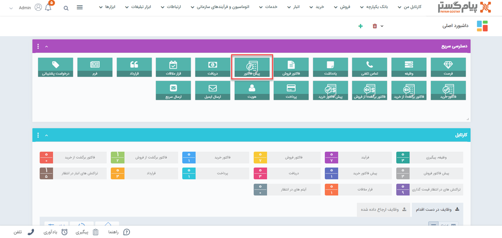

# تایید و شماره‌گذاری پیش‌فاکتور فروش
در صورتی که پیش‌فاکتورهای فروش ثبت‌شده نیازمند تایید و شماره‌گذاری باشند (در قسمت [شخصی‌سازی](https://github.com/1stco/PayamGostarDocs/tree/master/Help/Settings/Personalization-crm/Factor-management/Factor-management.md) گزینه نیاز به تایید و شماره‌گذاری فعال شده باشد) و شما به عنوان مسئول تایید/رد و یا مسئول شماره‌گذاری آن زیرنوع از پیش‌فاکتورهای فروش تعیین شده باشید، تمامی پیش‌فاکتورهای فروش  ثبت شده از آن زیرنوع برای بررسی در کارتابل شما قرار می‌گیرد. 
پیش‌فاکتورهای فروش که به تایید/رد و یا شماره‌گذاری نیاز داشته باشند، از طریق **کارتابل** به شخص مسئول نمایش داده می‌شوند. چنانچه مسئول انجام این امر هستید، برای مشاهده این پیش‌فاکتورهای فروش از یکی از این دو مسیر اقدام نمایید: 
- تب **کارتابل من** (نوار بالای صفحه) > **پیش‌فاکتور فروش** 
- **ویجت کارتابل** > **پیش‌فاکتور**

 
 
 با  کلیک بر روی کارتابل پیش‌فاکتورهای فروش، پیش‌فاکتورهای در انتظار تایید در جدول پایین  نمایش داده می‌شود. با کلیک بر روی هر ردیف، پیش‌فاکتورهای فروش  مربوط به مخاطب باز خواهد شد. با زدن دکمه‌های شماره‌گذاری، تایید و رد در نوار سفید بالای صفحه، اقدام مورد نیاز را انجام دهید. البته امکان تایید/رد و شماره‌‌گذاری از طریق کلیدهای نمایش داده شده در هر سطر (در کارتابل) نیز امکان‌پذیر می‌باشد. 
 
> **نکته** 
> اگر برای اطلاع‌رسانی به مسئول تایید و شماره‌گذاری و یا ثبت‌کننده آیتم، پیام تنظیم شده باشد، از طریق [پیام‌های سیستمی](https://github.com/1stco/PayamGostarDocs/blob/master/Help/home/NotificationManagement2.6.0.md) به کاربر مربوطه اطلاع داده می‌شود. در چنین حالتی ورود پیش‌فاکتور جدید به کارتابل به مسئول تایید و شماره‌گذاری و نتیجه آن شامل تایید،‌رد و شماره‌گذاری پیش‌فاکتور به ثبت‌کننده اطلاع‌ داده می‌شود. 

## نکات مرتبط با تایید و شماره‌گذاری پیش‌فاکتورهای فروش 
- پس از **شماره‌گذاری** توسط مسئول، تنها کاربر دارای مجوز «ویرایش شماره پس از شماره‌گذاری» یا «مدیر مالی» قادر به ویرایش شماره‌ی پیش‌فاکتور فروش  خواهد بود.
- پس از تایید/رد و شماره‌گذاری پیش‌فاکتورهای فروش  توسط مسئول، تنها کاربر دارای مجوز «ویرایش پس از شماره‌گذاری، تایید یا رد» یا «مدیر مالی» امکان ویرایش آن را خواهد داشت.
- پس از تایید/رد و شماره‌گذاری پیش‌فاکتور فروش توسط مسئول، تنها کاربر دارای مجوز «حذف پس از شماره گذاری، تایید یا رد» یا «مدیر مالی» امکان حذف آن را خواهد داشت.
