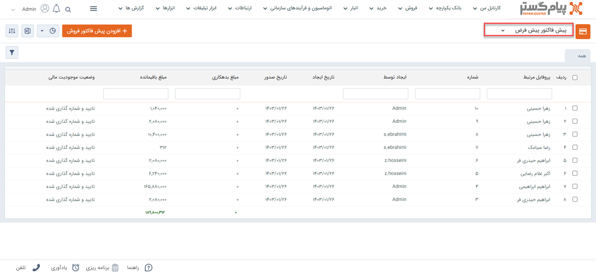
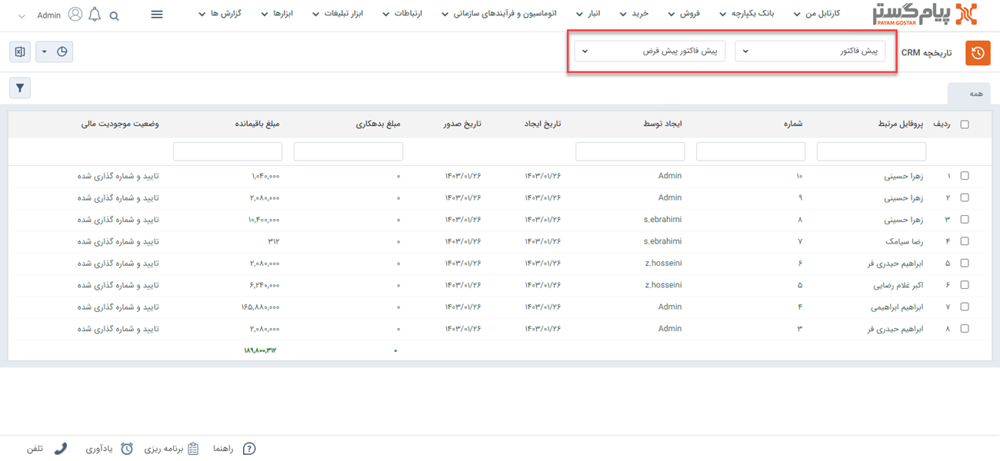
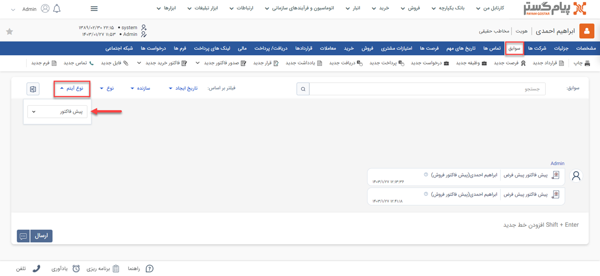
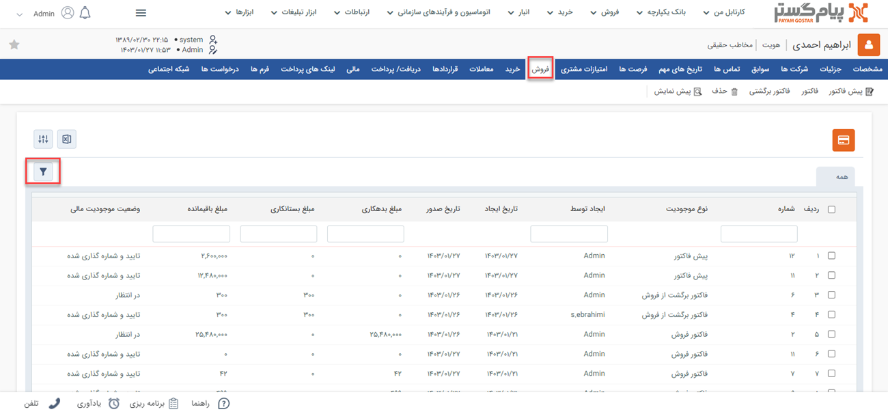
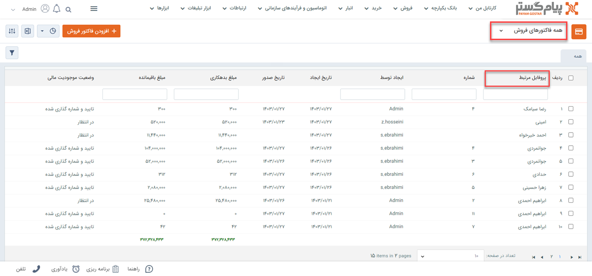
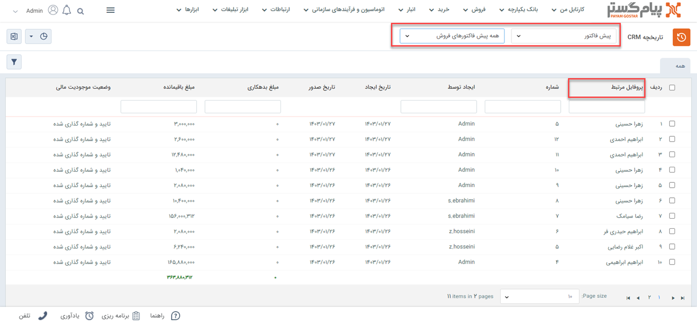

# مشاهده لیست پیش‌فاکتورهای فروش
دراین مقاله روش‌های مشاهده‌ی لیست پیش‌فاکتورهای فروش در دو حالت بررسی می‌شود: 
- [مشاهده لیست تمامی پیش‌فاکتورهای فروش ثبت شده](#AllQuotes)
- [مشاهده پیش‌فاکتورهای فروش ثبت شده برای یک هویت](#CustomerQuotes)

## مشاهده لیست همه پیش‌فاکتورهای فروش{#AllQuotes}
برای مشاهده لیست همه پیش فاکتورهای ثبت شده دو روش وجود دارد:
- از طریق **تب فروش** > **پیش فاکتور فروش** > **زیرنوع پیش‌فاکتور فروش**، تمامی پیش‌فاکتورهای ثبت شده از نوع زیرنوع انتخابی شما،‌ نمایش داده می‌شود.

از قسمت بالای صفحه می‌توانید سایر زیرنوع‌ها و یا همه را برای نمایش انتخاب نمایید. با انتخاب همه، تمامی پیش‌فاکتورهای فروش (از همه زیرنوع‌ها) در لیست به شما نمایش داده می‌شود.

- از طریق **تب بانک یکپارچه** > **تاریخچه CRM**  می توانید با اعمال فیلتر "نوع" بر روی پیش‌فاکتور، و انتخاب زیرنوع مورد نظر/همه در فیلتر کناری، تمامی پیش‌فاکتورهای فروش ثبت شده را مشاهده نمایید.

> **نکته** 
> در صورت داشتن مجوز مشاهده لیست و مشاهده آیتم زیرنوع‌های پیش‌فاکتورهای فروش، شما می‌توانید تمامی پیش‌فاکتورهای فروش ثبت شده را در این قسمت‌ها مشاهده نمایید. در این صورت تنها مجاز به مشاهده پیش‌فاکتورهای فروشی که خودتان ثبت کرده‌اید خواهید بود. 

## مشاهده لیست پیش‌فاکتورهای فروش یک هویت{#CustomerQuotes}
برای مشاهده لیست پیش‌فاکتورهای فروش ثبت شده برای یک مخاطب می‌توانید از چهار روش زیر اقدام نمایید: 

- از طریق صفحه **پروفایل مخاطب** > **تب سوابق** می‌توانید به پیش‌فاکتورهای فروش مخاطب دسترسی داشته باشید. بدین منظور با استفاده از ویجت جستجوی سریع، صفحه پروفایل هویت مورد نظر را باز کنید. در صفحه اصلی پروفایل هویت از قسمت سوابق  با اعمال فیلتر روی "نوع آیتم" و انتخاب «پیش‌فاکتور فروش» می‌توانید پیش‌فاکتورهای فروش هویت مورد نظر خود را مشاهده نمایید. 

- از طریق صفحه **پروفایل مخاطب** > **تب فروش** می‌توانید به پیش‌فاکتورهای فروش مشتری دسترسی داشته باشید. بدین منظور با استفاده از ویجت جستجوی سریع صفحه پروفایل هویت مورد نظر را باز کنید. در صفحه اصلی پروفایل هویت از قسمت فروش می‌توانید تمامی پیش‌فاکتورهای فروش مخاطب را (در کنار ‌فاکتورها و فاکتورهای برگشت از فروش وی) مشاهده نمایید. برای مشاهده پیش‌فاکتورهای فروش به تنهایی، می‌توانید از فیلتر استفاده نمایید. بدین منظور کافیست در بخش فیلتر، نوع را بر روی پیش‌فاکتور فروش تنظیم کرده و بر روی اعمال کلیک کنید.  

- از طریق **تب فروش** > **پیش‌فاکتور فروش** > **زیرنوع پیش‌فاکتور فروش** به صفحه لیست پیش‌فاکتورهای فروش رفته و در صورت نیاز زیرنوع پیش‌فاکتور فروش را به «همه پیش‌فاکتورهای فروش» تغییر دهید (از فلش کنار کادر قرمز بالا استفاده کنید). با استفاده از جستجوی «پروفایل مرتبط» پیش‌فاکتورهای فروش ثبت شده برای هویت مورد نظر را جدا کنید. بدین منظور کافیست نام هویت را در  قسمت مربوطه نوشته و Enter کنید.
 

- از طریق **تب بانک یکپارچه** > **تاریخچه CRM** با اعمال فیلتر(کادر قرمز بالا)،  پیش‌فاکتورها را یافته  و با استفاده از جستجوی «پروفایل مرتبط» (کادر قرمز پایین) پیش‌فاکتورهای فروش هویت مورد نظر را جدا کنید. بدین منظور کافیست نام هویت را در قسمت مربوطه نوشته و Enter کنید.

> **نکته** 
> برای مشاهده پیش‌فاکتور فروش در سابقه یک هویت باید مجوز مشاهده سوابق را بر روی آن زیرنوع هویت و همچنین مشاهده آیتم را در زیرنوع‌های پیش‌فاکتور فروش داشته باشید.  