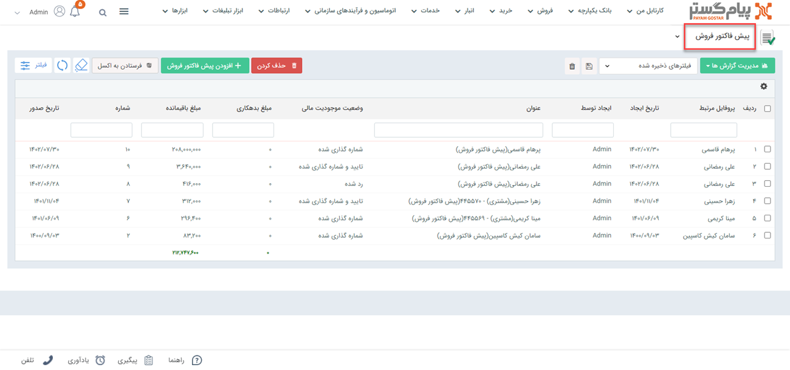
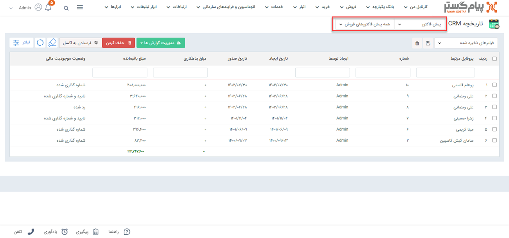
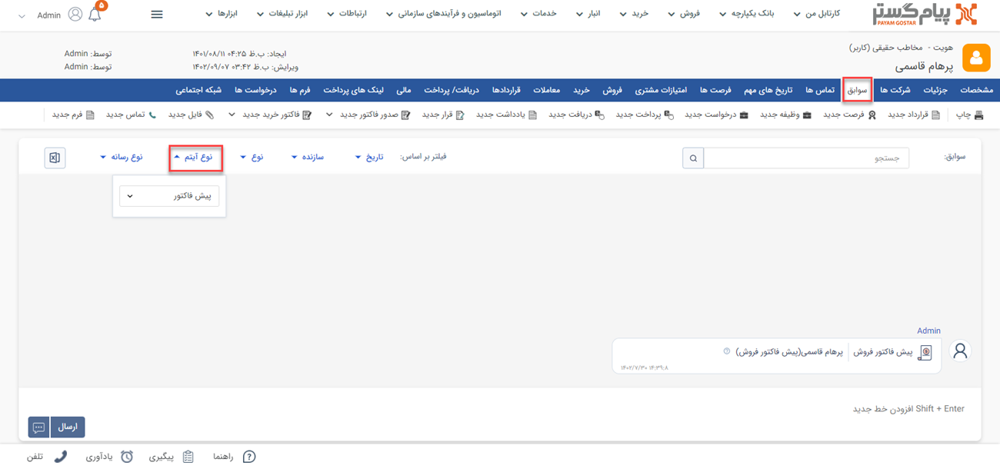
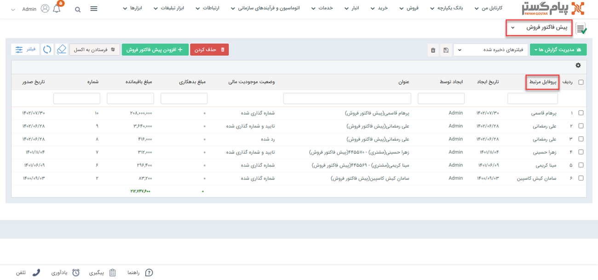

# لیست پیش فاکتورهای فروش
مشاهده لیست پیش فاکتورهای فروش از دو طریق امکان پذیر است:
- [مشاهده لیست پیش فاکتورهای ثبت شده برای تمامی هویت ها](#AllQuoteList)
- [مشاهده پیش فاکتور های ثبت شده برای یک هویت](#CustomerQuotList)

## مشاهده لیست همه پیش فاکتورهای فروش {#AllQuoteList}
برای مشاهده لیست همه پیش فاکتورهای ثبت شده دو روش وجود دارد:
- از طریق **تب فروش** > **پیش فاکتور فروش**، تمامی پیش فاکتورهای فروش قابل مشاهده است.

- از طریق **تب بانک یکپارچه** > **تاریخچه CRM**  می توانید با اعمال فیلتر روی "نوع"، تمامی پیش‌فاکتورهای فروش ثبت شده را مشاهده نمایید.

## مشاهده لیست پیش‌فاکتورهای فروش ثبت شده برای یک هویت{#CustomerQuoteList}
برای مشاهده لیست پیش فاکتورهای فروش صادر شده برای یک مشتری می توانید از طریق روش‌های زیر اقدام نمایید.
- 	در **صفحه اصلی هویت مشتری** > **سوابق** با اعمال فیلتر روی **"نوع آیتم"** می توانید پیش فاکتورهای فروش مشتری مورد نظر خود را مشاهده نمایید.  

- با کلیک روی در **تب فروش** در صفحه هویت مشتری و اعمال فیلتر روی "**نوع**" می‌توانید تمامی پیش‌فاکتورهای فروش ثبت شده برای این هویت را مشاهده نمایید.

- با کلیک روی **تب اصلی فروش** و انتخاب پیش‌فاکتورهای فروش،
 با انتخاب نام هویت در قسمت **پروفایل مرتبط** می‌توانید پیش‌فاکتورهای فروش مرتبط با هویت مورد نظر را مشاهده نمایید.
 

