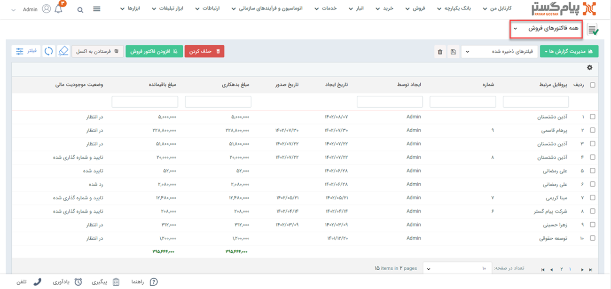
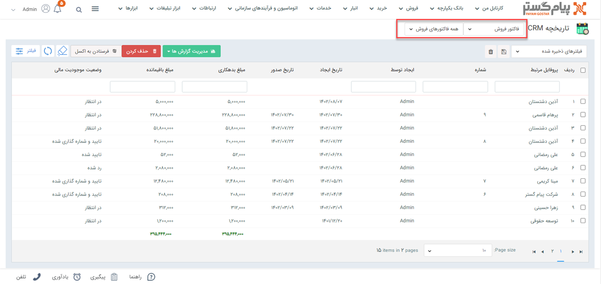
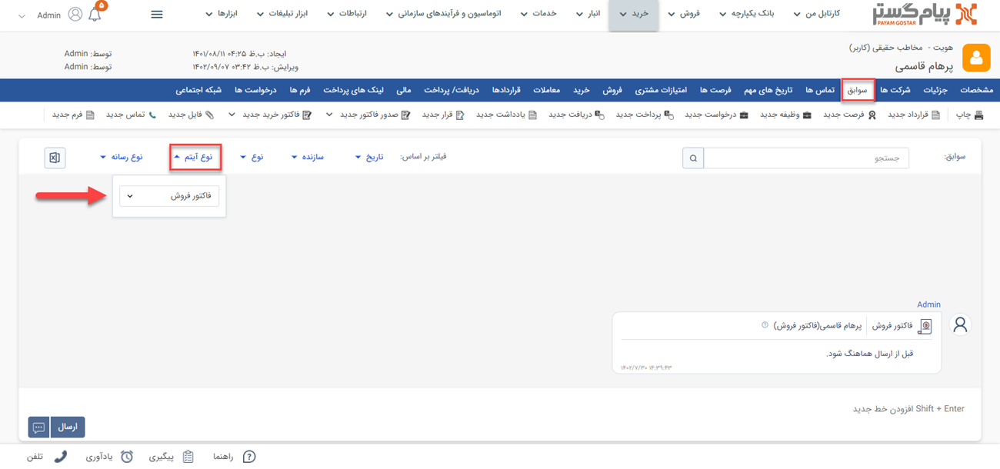
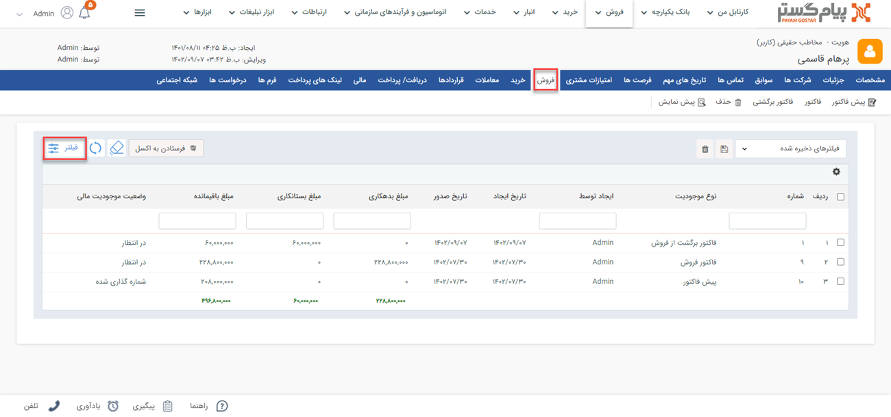
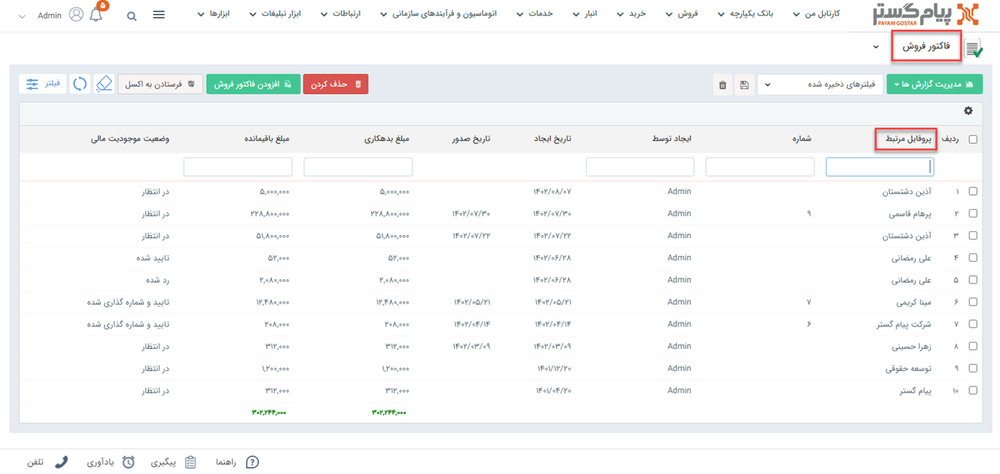

# مشاهده لیست  فاکتورهای فروش
دراین مقاله روش‌های مشاهده‌ی لیست فاکتورهای فروش در دو حالت بررسی می‌شود: 
- [مشاهده لیست تمامی فاکتورهای فروش ثبت شده](#AllSalesInvoices)
- [مشاهده فاکتورهای فروش ثبت شده برای یک هویت](#CustomerSalesInvoices)

## مشاهده لیست همه فاکتورهای فروش{#AllSalesInvoices}
برای مشاهده لیست همه فاکتورهای فروش ثبت شده دو روش وجود دارد:
- از طریق **تب فروش** > **فاکتور فروش** > **زیرنوع فاکتور فروش**، تمامی فاکتورهای ثبت شده از نوع زیرنوع انتخابی شما،‌ نمایش داده می‌شود.

از قسمت بالای صفحه می‌توانید سایر زیرنوع‌ها و یا همه را برای نمایش انتخاب نمایید. با انتخاب همه، تمامی فاکتورهای فروش (از همه زیرنوع‌ها) در لیست به شما نمایش داده می‌شود.

- از طریق **تب بانک یکپارچه** > **تاریخچه CRM**  می توانید با اعمال فیلتر "نوع" بر روی فاکتور فروش، و انتخاب زیرنوع مورد نظر/همه در فیلتر کناری، تمامی فاکتورهای فروش ثبت شده را مشاهده نمایید.

> **نکته** 
> در صورت داشتن مجوز مشاهده لیست و مشاهده آیتم زیرنوع‌های فاکتورهای فروش، شما می‌توانید تمامی فاکتورهای فروش ثبت شده را در این قسمت‌ها مشاهده نمایید. در این صورت تنها مجاز به مشاهده فاکتورهای فروشی که خودتان ثبت کرده‌اید خواهید بود. 

## مشاهده لیست فاکتورهای فروش یک هویت{#CustomerSalesInvoices}
برای مشاهده لیست فاکتورهای فروش ثبت شده برای یک مخاطب (خریدهای مشتری از شما) می‌توانید از چهار روش زیر اقدام نمایید: 

- از طریق صفحه **پروفایل مخاطب** > **تب سوابق** می‌توانید به فاکتورهای فروش مخاطب دسترسی داشته باشید. بدین منظور با استفاده از ویجت جستجوی سریع، صفحه پروفایل هویت مورد نظر را باز کنید. در صفحه اصلی پروفایل هویت از قسمت سوابق  با اعمال فیلتر روی "نوع آیتم" و انتخاب «فاکتور فروش» می‌توانید فاکتورهای فروش هویت مورد نظر خود را مشاهده نمایید. 

- از طریق صفحه **پروفایل مخاطب** > **تب فروش** می‌توانید به فاکتورهای فروش مشتری دسترسی داشته باشید. بدین منظور با استفاده از ویجت جستجوی سریع صفحه پروفایل هویت مورد نظر را باز کنید. در صفحه اصلی پروفایل هویت از قسمت فروش می‌توانید تمامی فاکتورهای فروش مخاطب را (در کنار پیش‌فاکتورها و فاکتورهای برگشت از فروش وی) مشاهده نمایید. برای مشاهده فاکتورهای فروش به تنهایی، می‌توانید از فیلتر استفاده نمایید. بدین منظور کافیست در بخش فیتر، نوع را بر روی فاکتور فروش تنظیم کرده و بر روی اعمال کلیک کنید.  

- از طریق **تب فروش** > **فاکتور فروش** > **زیرنوع فاکتور فروش** به صفحه لیست فاکتورهای فروش رفته و در صورت نیاز زیرنوع فاکتور فروش را به «همه فاکتورهای فروش» تغییر دهید (از فلش کنار کادر قرمز بالا استفاده کنید). با استفاده از جستجوی «پروفایل مرتبط» فاکتورهای فروش ثبت شده برای هویت مورد نظر را جدا کنید. بدین منظور کافیست نام هویت را در  قسمت مربوطه نوشته و Enter کنید.

- از طریق **تب بانک یکپارچه** > **تاریخچه CRM** با اعمال فیلتر(کادر قرمز بالا)،  فاکتورهای فروش را یافته  و با استفاده از جستجوی «پروفایل مرتبط» (کادر قرمز پایین) فاکتورهای فروش هویت مورد نظر را جدا کنید. بدین منظور کافیست نام هویت را در قسمت مربوطه نوشته و Enter کنید.

> **نکته** 
> برای مشاهده فاکتور فروش در سابقه یک هویت باید مجوز مشاهده سوابق را بر روی آن زیرنوع هویت و همچنین مشاهده آیتم را در زیرنوع‌های فاکتور فروش داشته باشید.  