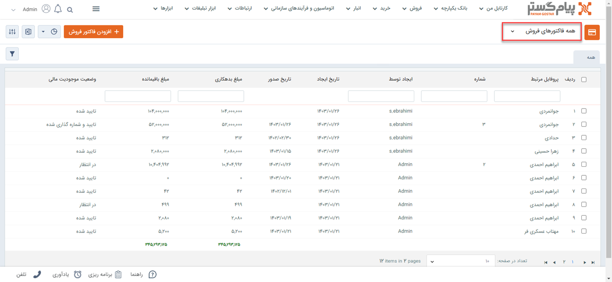
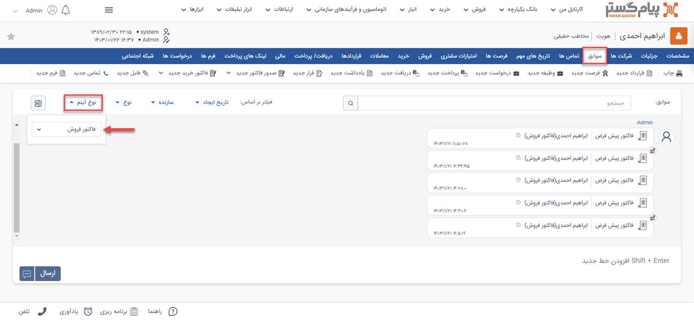

# مشاهده لیست  فاکتورهای فروش
دراین مقاله روش‌های مشاهده‌ی لیست فاکتورهای فروش در دو حالت بررسی می‌شود: 
- [مشاهده لیست تمامی فاکتورهای فروش ثبت شده](#AllSalesInvoices)
- [مشاهده فاکتورهای فروش ثبت شده برای یک هویت](#CustomerSalesInvoices)

## مشاهده لیست همه فاکتورهای فروش{#AllSalesInvoices}
برای مشاهده لیست همه فاکتورهای فروش ثبت شده در سیستم، می‌توانید از دو مسیر اقدام نمایید: 

- از مسیر **تب فروش** > **فاکتور فروش** > **زیرنوع فاکتور فروش** با انتخاب یکی از زیرنوع‌های فاکتور فروش، وارد صفحه فاکتورها می‌شوید. در این حالت، تمامی فاکتورهای فروش ثبت‌شده از زیرنوع انتخابی به شما نمایش داده‌می‌شود. 

از قسمت بالای صفحه می‌توانید سایر زیرنوع‌ها و یا همه را برای نمایش انتخاب نمایید. با انتخاب «همه فاکتورهای فروش»، تمامی فاکتورها از همه زیرنوع‌ها در لیست به شما نمایش داده‌می‌شود. 

- از مسیر **تب بانک یکپارچه** > **تاریخچه CRM**  می توانید با اعمال فیلتر «نوع» بر روی فاکتور فروش و انتخاب زیرنوع مورد نظر/همه در فیلتر کناری، تمامی فاکتورهای فروش ثبت شده را مشاهده نمایید.

> **نکته** 
> در صورت داشتن مجوز مشاهده لیست زیرنوع‌های فاکتور فروش، شما می‌توانید تمامی فاکتورهای فروش ثبت شده را در این قسمت‌ها مشاهده نمایید. در غیراین صورت تنها مجاز به مشاهده فاکتورهایی که خودتان ثبت کرده‌اید، خواهید بود. 

## مشاهده لیست فاکتورهای فروش ثبت شده برای یک هویت{#CustomerSalesInvoices}
برای مشاهده لیست فاکتورهای فروش ثبت شده برای یک مخاطب می‌توانید یکی از چهار مسیر زیر را انتخاب نمایید: 

- از طریق صفحه **پروفایل مخاطب** > **تب فروش** می‌توانید به فاکتورهای فروش مشتری دسترسی داشته‌باشید. بدین منظور با استفاده از ویجت جستجوی سریع، وارد صفحه پروفایل هویت مورد نظر شوید. در صفحه اصلی پروفایل هویت از قسمت «فروش» می‌توانید تمامی فاکتورهای مخاطب را مشاهده نمایید.  
توجه داشته‌باشید که در این صفحه همه‌ی انواع فاکتور فروش (پیش‌فاکتور فروش، فاکتور فروش و فاکتور برگشت از فروش) به شما نمایش داده‌می‌شود. برای اینکه فقط فاکتورهای فروش را مشاهده نمایید، با استفاده از فیلتر بالای صفحه، در قسمت نوع، «فاکتور» را انتخاب نمایید. 

- از طریق صفحه **پروفایل مخاطب** > **تب سوابق** نیز می‌توانید به فاکتورهای فروش ثبت شده برای مخاطب دسترسی داشته‌باشید. بدین منظور با استفاده از ویجت جستجوی سریع، وارد صفحه پروفایل هویت مورد نظر شوید. در صفحه اصلی پروفایل هویت، در تب سوابق، گزینه «فاکتور» را در لیست «نوع آیتم» انتخاب نمایید تا فاکتورهای فروش ثبت‌شده در فرآیند فروش هویت مورد نظر را مشاهده کنید. 

- از طریق **تب فروش** > **فاکتور فروش** > **زیرنوع فاکتور فروش** به صفحه لیست فاکتورهای فروش رفته و در صورت نیاز زیرنوع فاکتور فروش را به «همه فاکتورهای فروش» تغییر دهید (از فلش کنار کادر قرمز بالا استفاده کنید). با استفاده از جستجوی «پروفایل مرتبط» فاکتورهای فروش ثبت شده برای هویت مورد نظر را جدا کنید. بدین منظور کافیست نام هویت را در  قسمت مربوطه نوشته و Enter کنید. 

- از طریق **تب بانک یکپارچه** > **تاریخچه CRM** با اعمال فیلتر(کادر قرمز بالا)،  فاکتورها را یافته  و با استفاده از جستجوی «پروفایل مرتبط» (کادر قرمز پایین) فاکتورهای فروش هویت مورد نظر را جدا کنید. بدین منظور کافیست نام هویت را در قسمت مربوطه نوشته و Enter کنید. 

> **نکته** 
> برای مشاهده فاکتور فروش در سابقه یک هویت باید مجوز مشاهده سوابق را بر روی آن زیرنوع هویت و همچنین مشاهده آیتم را در زیرنوع‌های فاکتور فروش داشته‌باشید.  