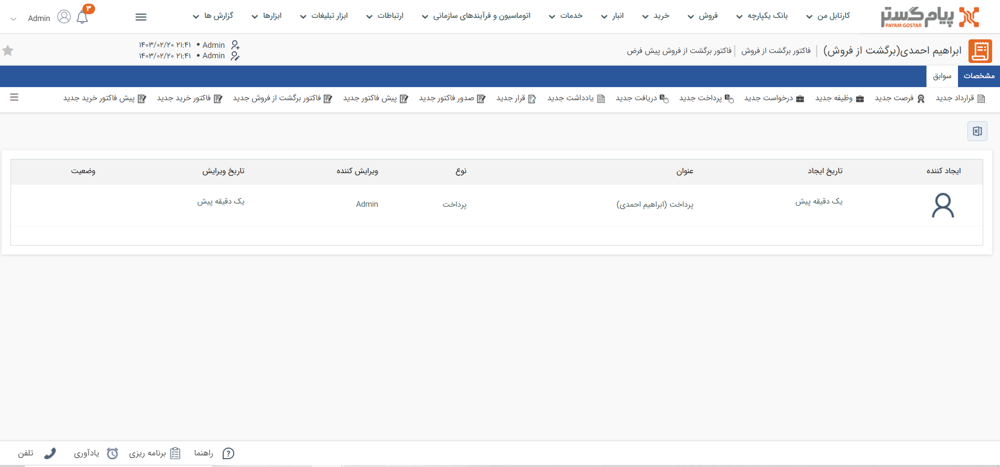

# سوابق هر فاکتور برگشت از فروش
موجودیت‌های مختلفی (از جمله پرداخت،‌درخواست پشتیبانی، وظیفه و سایر موارد) می‌توانند به فاکتور برگشت از فروش متصل باشند. این آیتم‌‌ها علاوه بر سوابق هویت، در سوابق فاکتور برگشت از فروشی که به آن متصل شده‌اند نیز قابل دسترس هستند. برای دسترسی به آن‌ها کافیست وارد صفحه فاکتور برگشتی مورد نظر شوید و بر روی تب سوابق کلیک کنید. 

به عنوان مثال، چنانچ در پی مرجوع کالا و ثبت فاکتور برگشت از فروش، اگر شما مبلغی را به مشتری عودت دهید و برای آن، متصل به این فاکتور برگشتی، آیتم پرداخت ثبت کنید، این پرداخت علاوه بر سوابق هویت، در سوابق فاکتور برگشت از فروش مربوط نیز قابل مشاهده است. 
نوار بالایی تب سوابق فاکتور برگشت از فروش فروش، امکان ثبت سوابق جدید را به شما می‌دهد. سوابقی که از این بخش ثبت شوند، به فاکتور مذکور متصل خواهند‌بود. 