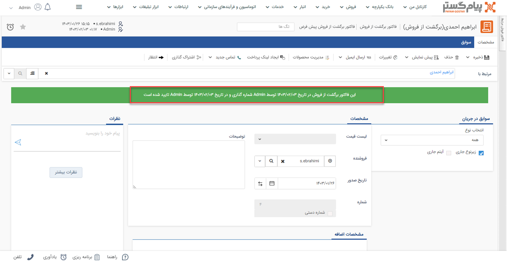
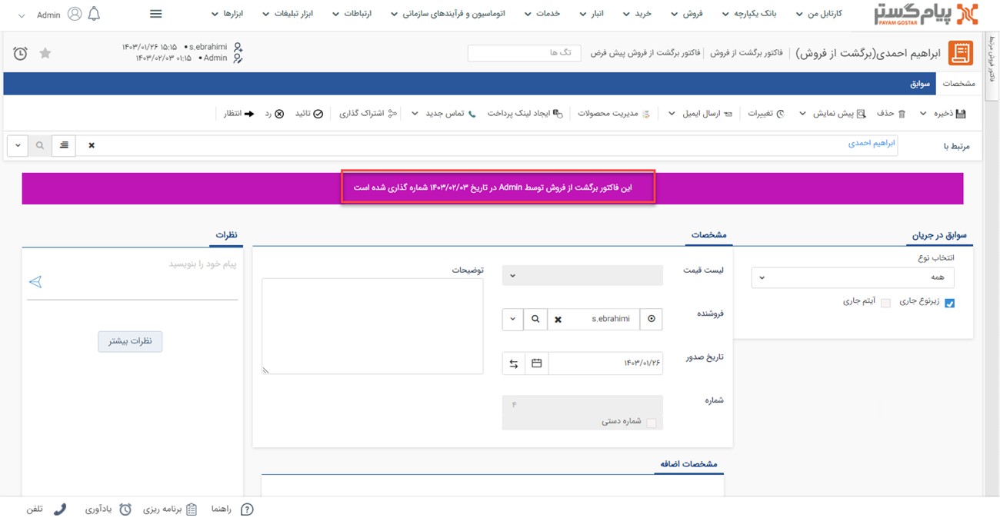
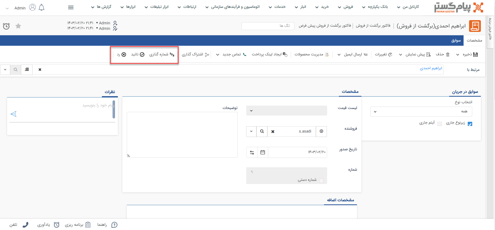

# تایید و شماره‌گذاری فاکتور برگشت از فروش
آیتم‌های مالی پس از ثبت در سیستم باید تایید و شماره‌گذاری شوند. این کار ممکن است به صورت دستی توسط کاربر و یا به صورت خودکار توسط سیستم انجام شود. 
فاکتور برگشت از فروش تایید نشده در پیام‌گستر فاقد اعتبار محسوب می‌شود. این بدین معناست مبلغ کالاهای برگشتی از بدهی مشتری کاسته نمی‌شود، در صورت استفاده از انبارداری تعدادی تعداد کالاهای برگشتی به موجودی کالا افزوده نمی‌شود و این فاکتورهای برگشتی در گزارشات فاکتورهای برگشت از فروش به شما نمایش داده‌نمی‌شوند. 
چنانچه پس از ذخیره‌ی فاکتور برگشتی، آیتم با نوار سبزرنگ، تایید و شماره‌گذاری آن را ااعلام کرد، یعنی فاکتور برگشتی به صورت خودکار تایید و شماره‌‌گذاری شده و نیاز به اقدامی در این راستا نیست. 

> **نکته** 
> با کلیک بر روی کلید «انتظار»‌ در نوار بالا، فاکتور برگشتی از حالت تایید و شماره‌گذاری خارج می‌شود. 

در غیراین صورت، چنانچه با نوار آبی‌رنگ مواجه شدید، فاکتور برگشت از فروش به صورت خودکار تایید شده و برای شماره‌گذاری، به کارتابل شخصی که مجوز شماره‌گذاری این زیرنوع فاکتور برگشت از فروش را دارد، می‌رود. 

در صورتی که پس از ثبت ‌فاکتور برشگتی، نوار بنفش‌رنگ را بالای آیتم مشاهده کردید، فاکتور برگشت از فروش به صورت خودکار شماره‌گذاری شده و برای تایید، به کارتابل شخصی که مجوز تایید این زیرنوع فاکتور برگشت از فروش را دارد، می‌رود. 

# روش تایید و شماره‌گذاری فاکتور برگشت از فروش
تمامی فاکتورهای برگشت از فروش که به صورت خودکار تایید و/یا شماره‌گذاری نشده‌باشند، در **کارتابل** کاربری که مسئول انجام این کار است، به وی نمایش داده‌می‌شود. مسئول انجام این کار،  اشخاصی هستند که مجوز تایید/رد و شماره‌گذاری داشته‌باشند. در نتیجه اگر مسئول تایید/رد و یا شماره‌گذاری فاکتور برگشتی هستید: 
از طریق کارتابل خود (تب کارتابل من در بالای صفحه و یا ویجت کارتابل) بر روی گزینه «فاکتور برگشت از فروش» کلیک کنید. تمامی ‌فاکتورهای برگشتی که باید تایید و یا شماره‌گذاری آن را انجام دهید، در این بخش به شما نمایش داده‌می‌شود. 

کلیدهای مقابل هر رکورد فاکتور برگشتی،‌امکان تایید، رد و شماره‌گذاری آن ‌فاکتور برگشت از فروش را در اختیار شما قرار می‌دهند. چنانچه جهت بررسی به مشاهده فاکتور برگشتی نیاز دارید، با کلیک بر روی هر ردیف، ‌فاکتور برگشت از فروش مربوطه باز خواهدشد. پس از انجام بررسی‌های مورد نظر می‌توانید با استفاده از کلیدهای شماره‌گذاری، تایید و رد در نوار سفید بالای صفحه،‌ اقدام مورد نیاز را در خصوص آن انجام دهید.  

ممکن است برای اطلاع‌رسانی ورود آیتم‌های مالی (از جمله ‌فاکتور برگشت از فروش) به کارتابل شما، پیام سیستمی تنظیم شده‌باشد. در این حالت هر فاکتور برگشتی که به منظور بررسی (تایید/رد و شماره‌گذاری) وارد کارتابل شما شود، ورود آن با یک پیغام به شما اطلاع داده‌می‌شود. این پیام‌ها ممکن است برای اعلام نتیجه نیز تنظیم شده باشند. در این حالت تایید/رد فاکتور برگشتی توسط شما (یا هر شخص دیگری که مسئول این کار باشد)، با یک پیام سیستمی به صادرکننده فاکتور اطلاع داده‌می‌شود. این اطلاع‌رسانی‌ها ممکن است از طریق پیامک، ایمیل و یا پیام‌های سیستمی انجام پذیرد. این پیغام اگر از نوع پیام‌های سیستمی باشد، در قسمت «یادآوری‌های سیستم من» (آیکون زنگوله‌‌ی بالای صفحه) به شما نمایش داده‌می‌شود.  

> **راهنمای مدیر سیستم** 
> برای آگاهی از نحوه تنظیم پیام اطلاع‌رسانی ورود یا تایید/رد فاکتور برگشت از فروش، به راهنمای [پیام‌های سیستمی](https://github.com/1stco/PayamGostarDocs/blob/master/Help/home/NotificationManagement2.6.0.md) مراجعه نمایید. 

## نکات مرتبط با تایید و شماره‌گذاری فاکتور برگشت از فروش
- پس از **شماره‌گذاری** توسط مسئول، تنها کاربر دارای مجوز «ویرایش شماره پس از شماره‌گذاری» یا «مدیر مالی» قادر به ویرایش شماره‌ی فاکتور برگشت از فروش خواهد‌بود.
- پس از تایید/رد و شماره‌گذاری فاکتور برگشت از فروش توسط مسئول، تنها کاربر دارای مجوز «ویرایش پس از شماره‌گذاری، تایید یا رد» یا «مدیر مالی» امکان ویرایش آن را خواهد داشت.
- پس از تایید/رد و شماره‌گذاری فاکتور برگشت از فروش توسط مسئول، تنها کاربر دارای مجوز «حذف پس از شماره گذاری، تایید یا رد» یا «مدیر مالی» امکان حذف آن را خواهد داشت.

> **نکته** 
> فاکتورهای برگشت از فروش پیش از تایید و یا پس از رد،‌ **اعتبار ندارند**. بر این اساس تاثیری بر بدهی مشتری و تعداد موجودی نخواهند‌داشت. 
