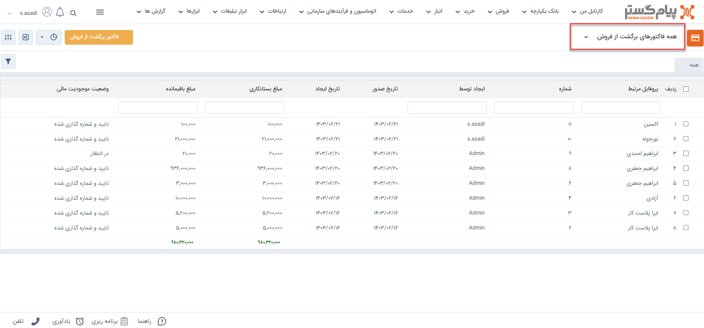
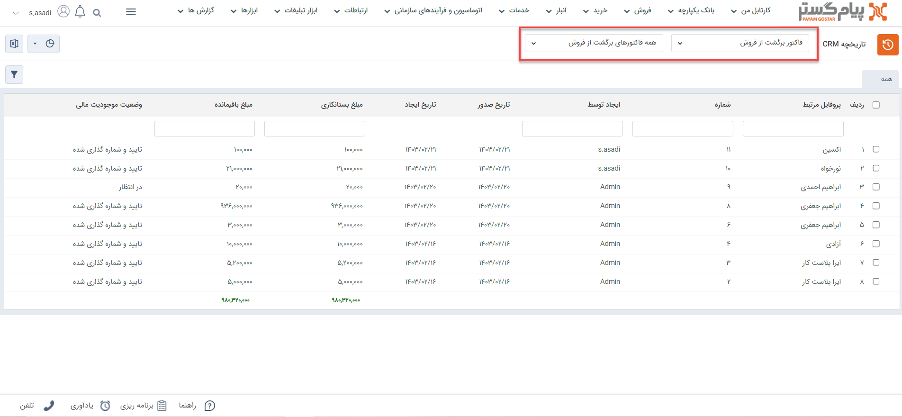
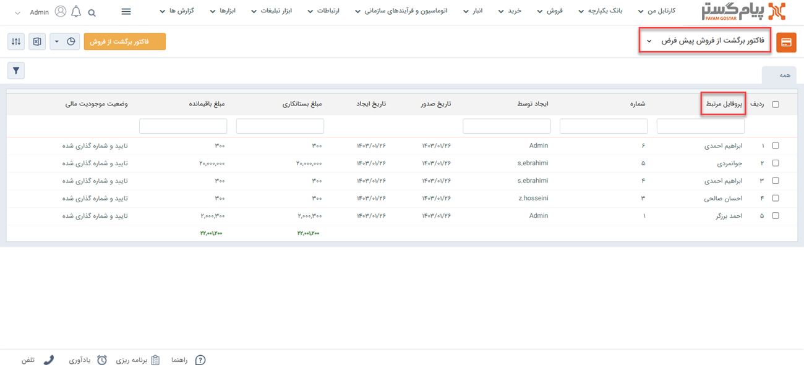
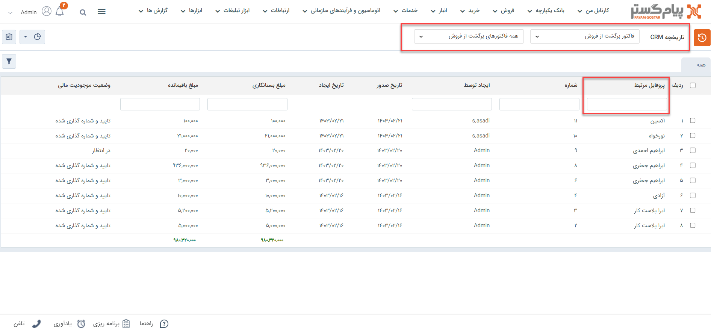

# لیست  فاکتورهای برگشت از فروش
دراین مقاله روش‌های مشاهده‌ی لیست فاکتورهای برگشت از فروش در دو حالت بررسی می‌شود: 
- [مشاهده لیست همه فاکتورهای برگشت از فروش ثبت شده](#AllReturnSalesInvoiceList)
- [مشاهده فاکتورهای برگشت از فروش ثبت شده برای یک هویت](#customerReturnSalesInvoiceList)

## مشاهده لیست همه فاکتورهای برگشت از فروش {#AllReturnSalesInvoiceList}
برای مشاهده لیست همه فاکتورهای برگشت از فروش ثبت شده در سیستم، می‌توانید از دو مسیر اقدام نمایید: 
- از مسیر **تب فروش** > **فاکتور برگشت از فروش** > **زیرنوع فاکتور برگشت از فروش** با انتخاب یکی از زیرنوع‌های فاکتور برگشت از فروش، وارد صفحه فاکتورهای برگشتی می‌شوید. در این حالت، تمامی فاکتورهای برگشت از فروش ثبت‌شده از زیرنوع انتخابی به شما نمایش داده‌می‌شود. 

از قسمت بالای صفحه می‌توانید سایر زیرنوع‌ها و یا همه را برای نمایش انتخاب نمایید. با انتخاب «همه فاکتورهای برگشت از فروش»، تمامی فاکتورهای برگشتی از همه زیرنوع‌ها در لیست به شما نمایش داده‌می‌شود. 

- از مسیر **تب بانک یکپارچه** > **تاریخچه CRM**  می توانید با اعمال فیلتر «نوع» بر روی فاکتور برگشت از فروش و انتخاب زیرنوع مورد نظر/همه در فیلتر کناری، تمامی فاکتورهای برگشت از فروش ثبت شده را مشاهده نمایید.

## مشاهده لیست فاکتورهای برگشت از فروش ثبت شده برای یک هویت{#customerReturnSalesList}
برای مشاهده لیست فاکتورهای برگشت از فروش ثبت شده برای یک مخاطب می‌توانید یکی از چهار مسیر زیر را انتخاب نمایید: 

- از طریق صفحه **پروفایل مخاطب** > **تب فروش** می‌توانید به فاکتورهای فروش مشتری دسترسی داشته‌باشید. بدین منظور با استفاده از ویجت جستجوی سریع، وارد صفحه پروفایل هویت مورد نظر شوید. در صفحه اصلی پروفایل هویت از قسمت «فروش» می‌توانید تمامی فاکتورهای مخاطب را مشاهده نمایید.  
توجه داشته‌باشید که در این صفحه همه‌ی انواع فاکتور فروش (پیش‌فاکتور فروش، فاکتور فروش و فاکتور برگشت از فروش) به شما نمایش داده‌می‌شود. برای اینکه فقط فاکتورهای برگشت از فروش را مشاهده نمایید، با استفاده از فیلتر بالای صفحه، در قسمت نوع، «فاکتور برگشت از فروش» را انتخاب نمایید. 

- از طریق صفحه **پروفایل مخاطب** > **تب سوابق** نیز می‌توانید به فاکتورهای برگشت از فروش ثبت شده برای مخاطب دسترسی داشته‌باشید. بدین منظور با استفاده از ویجت جستجوی سریع، وارد صفحه پروفایل هویت مورد نظر شوید. در صفحه اصلی پروفایل هویت، در تب سوابق، گزینه «فاکتور برگشت از فروش» را در لیست «نوع آیتم» انتخاب نمایید تا فاکتورهای برگشتی ثبت‌شده هویت مورد نظر را مشاهده کنید. 

- از طریق **تب فروش** > **فاکتور فروش** > **زیرنوع فاکتور برگشت از فروش** به صفحه لیست فاکتورهای برگشت از فروش رفته و در صورت نیاز زیرنوع فاکتور برگشت از فروش را به «همه فاکتورهای برگشت از فروش» تغییر دهید (از فلش کنار کادر قرمز بالا استفاده کنید). با استفاده از جستجوی «پروفایل مرتبط» فاکتورهای برگشت از فروش ثبت شده برای هویت مورد نظر را جدا کنید. بدین منظور کافیست نام هویت را در  قسمت مربوطه نوشته و Enter کنید. 

- از طریق **تب بانک یکپارچه** > **تاریخچه CRM** با اعمال فیلتر(کادر قرمز بالا)،  فاکتورهای برگشت از فروش را یافته  و با استفاده از جستجوی «پروفایل مرتبط» (کادر قرمز پایین) فاکتورهای برگشت از فروش هویت مورد نظر را جدا کنید. بدین منظور کافیست نام هویت را در قسمت مربوطه نوشته و Enter کنید. 

> **نکته** 
> برای مشاهده فاکتورهای برگشت از فروش در سابقه یک هویت باید مجوز مشاهده سوابق را بر روی آن زیرنوع هویت و همچنین مشاهده آیتم را در زیرنوع‌های فاکتور برگشت از فروش داشته‌باشید.  

