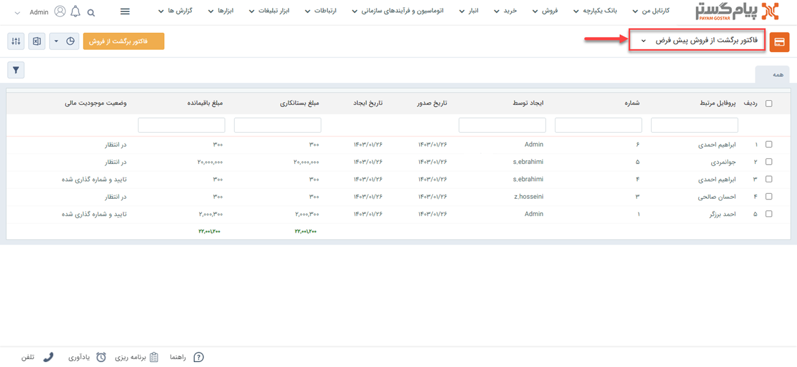
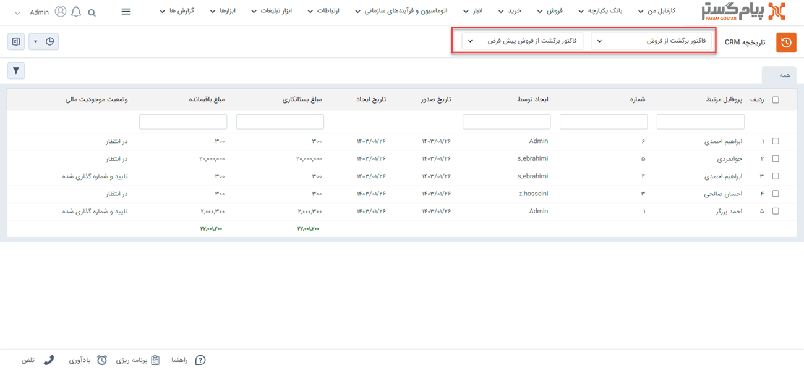
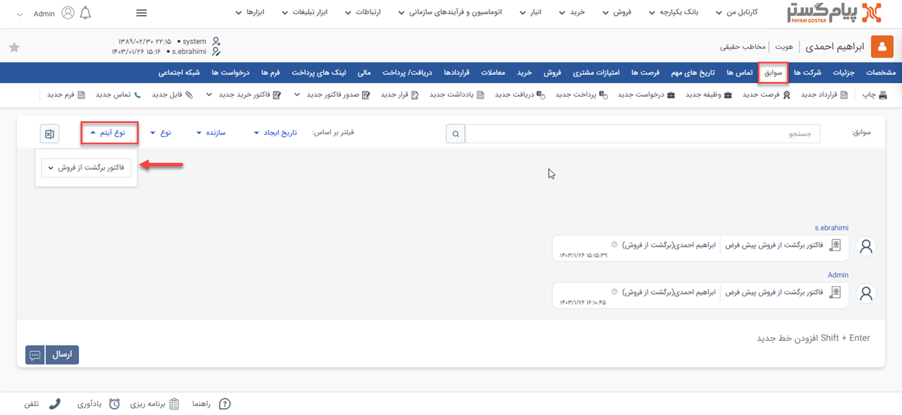
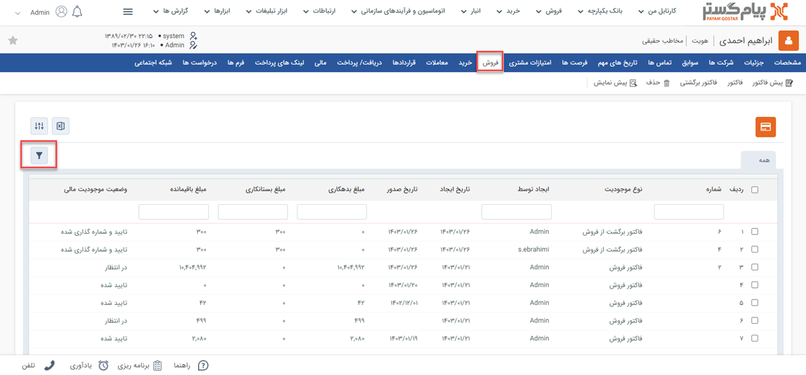
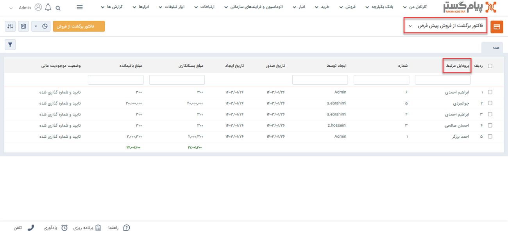

# لیست  فاکتورهای برگشت از فروش
فاکتور‌های برگشت از فروش ثبت شده را از دو مسیر اصلی می‌توانید مشاهده نمایید که عبارتند از:

- [مشاهده لیست همه فاکتورهای برگشت از فروش ثبت شده](#AllReturnSalesInvoiceList)
- [مشاهده فاکتورهای برگشت از فروش ثبت شده برای یک هویت](#customerReturnSalesInvoiceList)

## مشاهده لیست همه فاکتورهای برگشت از فروش {#AllReturnSalesInvoiceList}
 برای مشاهده لیست همه فاکتورهای برگشت از فروش ثبت شده دو روش اصلی وجود دارد:
- از طریق **تب فروش** > **فاکتور برگشت از فروش**، تمامی فاکتورهای برگشت از فروش ثبت شده قابل مشاهده است.

- از  **تب بانک یکپارچه** > **تاریخچه CRM**  می‌توانید با انتخاب فاکتور برگشت از فروش در آیتم‌های crm و انتخاب زیر نوع موردنظر از  فاکتورهای برگشت از فروش، لیست تمامی فاکتورهای برگشت از فروش ثبت شده در سیستم را مشاهده نمایید.

## مشاهده لیست فاکتورهای برگشت فروش ثبت شده برای یک هویت{#customerReturnSalesList}
برای مشاهده لیست فاکتورهای برگشت از فروش صادر شده برای یک هویت خاص می‌توانید از طریق  روش‌های زیر اقدام نمایید.
- 	در **صفحه اصلی هویت مشتری** > **سوابق** با اعمال فیلتر روی "**نوع آیتم**" می توانید فاکتورهای برگشت از فروش مشتری مورد نظر خود را مشاهده نمایید.  

-  با کلیک روی **تب فروش**  در صفحه هویت مشتری و اعمال فیلتر روی "**نوع**" می‌توانید تمامی فاکتورهای برگشت از فروش ثبت شده برای این هویت را مشاهده نمایید.

- با کلیک روی **تب اصلی فروش** و انتخاب فاکتورهای برگشت از فروش،
 با انتخاب نام هویت در قسمت **پروفایل مرتبط** می‌توانید فاکتورهای برگشت از فروش مرتبط با هویت مورد نظر را مشاهده نمایید.
 

