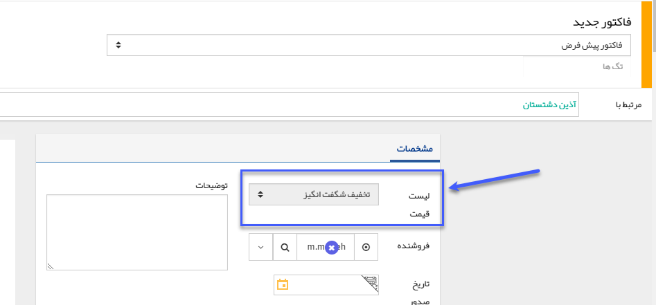

# مدیریت کلاس بندی مشتریان

می توانید کلاس بندی‌های مشخصی بر اساس حجم خرید و یاقرارداد‌های مالی ثبت شده در بازه‌های زمانی مختلف برای مشتریان خود تعریف نمایید. با توجه به کلاس بندی‌های تعریف شده هر کدام از مشتریان با توجه به حجم خرید (فاکتورهای فروش و یا قراردادهای صادر شده برای مشتری) در یکی از کلاس ها قرار می‌گیرند، که نام آن کلاس در صفحه مشخصات هر مخاطب نمایش داده خواهد شد تا کاربران نرم افزار در قسمت های مختلفی مانند فروش یا پشتیبانی بتوانند بر اساس کلاس مشتری سرویس یا خدمات خود را به او ارائه کنند.

علاوه بر این می توانید برای هر یک از کلاس های مشتری، یک لیست قیمت مشخص را در نظر بگیرید تا در زمان صدور فاکتور برای مشتری، در صورتی که مشتری در کلاس بندی خاصی قرار گرفته باشد، لیست قیمت مربوطه برای او لحاظ شود (به طور مثال اگر بخواهید برای مشتریانی که سالانه بیش از 10 میلیون تومان خرید می کنند در فروش های بعدی به صورت خودکار 10 درصد تخفیف لحاظ گردد، می توانید با استفاده از تعریف یک کلاس بندی بر این اساس و تعریف لیست قیمت تخفیف 10 درصدی این کار را انجام دهید)

**1. فیلتر:** می توانید برای یافتن کلاس بندی مورد نظر خود از بین کلاس بندی های تعریف شده، از فیلترهای موجود استفاده نمایید.

**2. لیست کلاس بندی ها:** در این قسمت لیست کلاس بندی های تعریف شده را به همراه جزئیات مرتبط با هریک مشاهده می کنید. در صورت نیاز می توانید هریک از آن ها را ویرایش و یا حذف کنید.

**3. اولویت بندی:** از آنجایی که کلاس بندی بر اساس حجم خرید در بازه های زمانی مختلف(هفتگی، ماهانه، سالانه و دائمی) تعیین می گردد، ممکن است یک مشتری بر اساس حجم خرید خود در بیش از یک کلاس بندی قرار گیرد(در شکل بالا کلاس طلایی برای حجم خرید ماهانه بیش از 10 میلیون و کلاس مشتریان ویژه برای همین حجم خرید و در بازه زمانی سالانه تعریف شده است، بنابراین درصورتی که مشتری ماهانه خرید بالای 10 میلیون داشته باشد به طور همزمان در هر دو کلاس قرار خواهد گرفت)، بنابراین اولویت بندی کلاس های تعریف شده را می توان در این قسمت تعیین کرد.

**4. کلاس جدید:** با کلیک بر روی دکمه اضافه کردن می توانید یک کلاس جدید برای مشتریان تعریف کنید. 

**A. عنوان:** یک نام دلخواه برای این کلاس وارد کنید. در صورتی که مشتری بر اساس حجم خرید خود در این کلاس قرار گیرد، این نام در صفحه مشخصات پروفایل او نمایش داده خواهد شد.

**B**. بازه زمانی مرتبط با این کلاس را مشخص نمایید. به طور مثال اگر گزینه ماهانه را انتخاب کنید، برای قرار گرفتن مشتری در این کلاس، باید در کمتر از یک ماه به میزان حجم خرید مشخص شده، برای او فاکتور فروش ثبت گردد.

**C**. سقف و کف حجم خرید مرتبط با این کلاس را مشخص کنید(به ریال). توجه کنید که می توانید یکی از فیلدها را خالی بگذارید (مانند شکل بالا برای خرید های ماهانه بیش از 10 میلیون)

**D. لیست قیمت:** می توانید برای این کلاس، یک لیست قیمت مشخص را از لیست قیمت تعریف شده در بخش مدیریت لیست قیمت ها انتخاب کنید. در این صورت زمانی که یک مشتری در این کلاس قرار بگیرد، هنگام صدور فاکتور برای مشتری، این لیست قیمت به صورت خودکار لحاظ خواهد شد.

>  نکته: برای ایجاد و ویرایش لیست قیمت ها به[ مدیریت لیست قیمت ها](https://github.com/1stco/PayamGostarDocs/blob/master/Help/Settings/Price-list-management/Price-list-management.md) مراجعه کنید.

