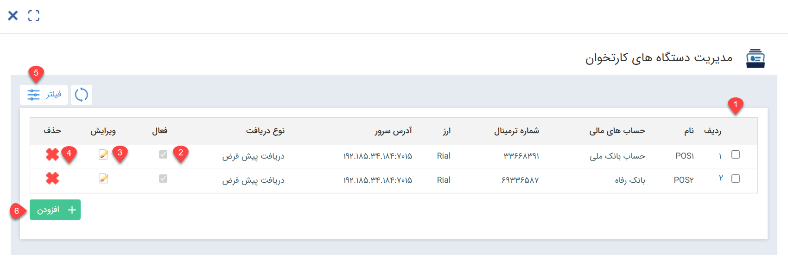
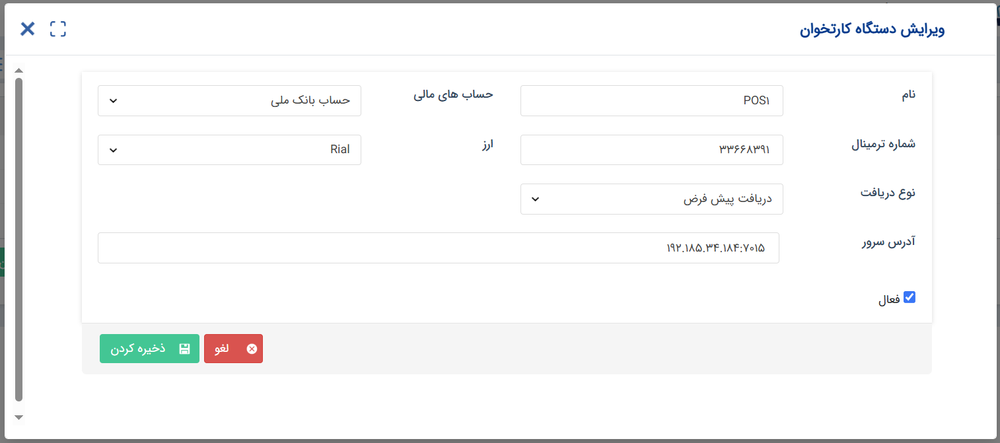

# مدیریت دستگاه‌های کارتخوان

در صورت تمایل به استفاده از قابلیت اتصال به دستگاه‌های کارتخوان به پیام‌گستر، نیاز است که مشخصات ترمینال‌های مختلف در آن تعریف شده باشد. در این حالت کاربران می‌توانند با ارسال درخواست به دستگاه کارتخوان مورد نظرشان (که پیش‌تر در نرم افزار تعریف شده‌اند) و انجام تراکنش از طرف آن، پرداخت مشتری را به انجام برسانند. برای اتصال درستگاه کارتخوان به پیام‌گستر، لازم است که مشخصات آن را در نرم‌افزار تعریف کرده باشید. در این صفحه می‌توانید لیست دستگاه‌های متصل شده را مشاهده کنید، اطلاعات آن را ویرایش نمایید و  دستگاه جدیدی را به این لست اضافه کنید. 

در این صفحه می‌توانید: 
1. خلاصه‌ای از اطلاعات دستگاه را مشاهده کنید.
2. فعال/غیرفعال بودن هر دستگاه را ملاحظه نمایید.
3. اطلاعات آن‌ را ویرایش کنید.
4. مشخصات این دستگاه را حذف نمایید. 
5. لیست دستگاه‌های مختلف را بر اساس هر یک از ویژگی‌های آن‌ها فیلتر نمایید.
6. اقدام به تعریف مشخصات دستگاه کارتخوان جدید نمایید.

> **نکته** 
> توجه داشته باشید که پیش از تعریف دستگاه در نرم‌افزار، لازم است که سرویس آن بر روی سیستم شما نصب شده باشد. 

## افزودن دستگاه کارتخوان جدید
برای افزودن دستگاه کارتخوان جدید، پس از افزودن بر روی کلید افزودن، مشخصات دستگاه را مشخص کنید: 

1. برای دستگاه مورد نظر یک عنوان در نظر بگیرید. عنوان را به نوعی انتخاب نمایید که شناسایی آن برای کاربران ساده باشد. 
2. از بین حساب‌های مالی که پیش‌تر در نرم‌افزار تعریف کرده‌اید (برای مشاهده آن‌ها می‌توانید به صفحه مدیریت حساب‌های مالی مراجعه نمایید)، یک حساب را انتخاب کنید تا دریافت مرتبط با واریزی برای آن حساب ثبت شود. 
3. شماره ترمینال دستگاه کارتخوان مورد نظر را وارد نمایید. این شماره را می‌توانید از روی صفحه اصلی با بخش «اطلاعات پایانه» در دستگاه خود مشاهده نمایید. 
4. از بین ارز‌های تعریف شده در نرم‌افزار، ارز مورد نظر را انتخاب کنید.
5. یک زیرنوع را جهت ثبت دریافت مشتری انتخاب نمایید. در صورت واریز مبلغ توسط مشتری از طریق این دستگاه، یک دریافت از زیرنوعی که در این قسمت مشخص کرده‌اید برای وی ثبت می‌شود. 
6. آدرس سروری که سرویس مدیریت دستگاه‌های کارتخوان بر روی آن نصب شده را وارد کنید. 
7. توجه داشته باشید که دستگاه بر روی حالت فعال قرار داشته باشد. در صورت نیاز به قطع دسترسی کاربران به این دستگاه می‌توانید به صورت موقت یا دائم آن را غیرفعال نمایید.  
در نهایت کافی است که این اطلاعات را ذخیره نمایید.