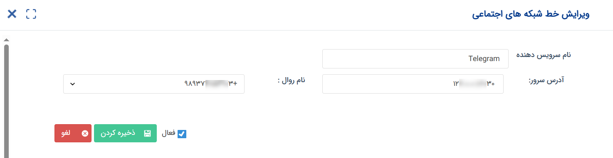
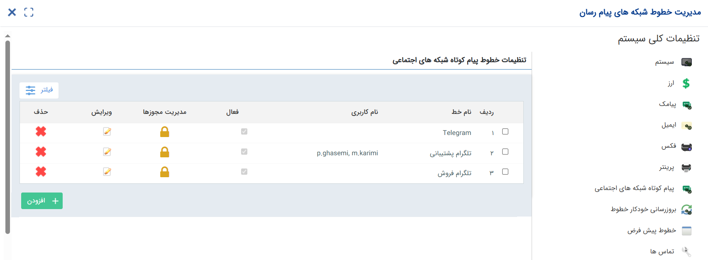

# مدیریت خطوط پیام کوتاه شبکه‌های اجتماعی

برای استفاده از شبکه‌های اجتماعی برای ارسال پیام، لازم است که خط یا خطوطی که شبکه‌های اجتماعی شما بر روی آن‌ها ایجاد شده‌اند را در این قسمت تعریف نمایید. در حال حاضر، قابلیت ارسال پیام در شبکه اجتماعی تلگرام فراهم می‌باشد. در ادامه به بررسی تنظیمات خطوط پیام کوتاه شبکه‌های اجتماعی می‌پردازیم. 

## افزودن خط جدید
برای افرودن خط جدید، با کلیک بر روی کلید «افزودن» وارد صفحه مشخصات خط شوید.  

- **نام سرویس‌دهنده:** برای خط یک عنوان تعیین کنید. این نام صرفاً جهت شناسایی خط در نرم‌افزار کاربرد دارد و به مخاطبان (دریافت‌کننده پیام) نمایش داده نمی‌شود. اگر از چند خط برای ارسال و دریافت پیام‌های شبکه‌های اجتماعی استفاده می‌کنید، بهتر است نام را به گونه‌ای انتخاب کنید که شناسایی آن برای کاربران، ساده باشد. به عنوان مثال خطی که تلگرام آن در دسترس تیم فروش است را با عنوان «تلگرام فروش» تعریف کنید. این نام می‌تواند به فارسی یا انگلیسی انتخاب شود.
- **آدرس سرور:** آدرس سروری که سرویس تلگرام (برنامه‌ای برای اتصال تلگرام به نرم‌افزار شما) بر روی آن نصب شده‌است را در این قسمت وارد نمایید. 
- **نام روال:** پس از وارد کردن آدرس سرور سرویس تلگرام، تمامی خطوطی که در سرویس تلگرام تعریف کرده‌باشید، در این قسمت به شما نمایش داده‌می‌شود و می‌توانید خط مورد نظر را انتخاب کنید. این همان خطی است که مخاطبان از طریق آن با تلگرام شما در ارتباط خواهندبود. 

پس از تکمیل مشخصات، ابتدا خط را فعال نموده و سپس تنظیمات خود را ذخیره نمایید. 

## تنظیمات خطوط پیام کوتاه شبکه‌های اجتماعی
در این جدول می‌توانید لیستی از خطوط تعریف شده برای ارسال و دریافت پیام‌های شبکه‌های اجتماعی را مشاهده نمایید. برای اطلاع از نحوه‌ی مدیریت خطوط، راهنمای زیر را مطالعه نمایید. 

### مدیریت مجوزها
از این قسمت می‌توانید سطوح دسترسی کاربران مختلف به خط مورد نظر را مشخص کنید. به صورت کلی، وقتی هیچ مجوزی بر روی خط تعیین نشده‌باشد، تمامی کاربران به آن دسترسی خواهندداشت و به عبارتی خط عمومی در نظر گرفته می‌شود. در صورت نیاز به محدود کردن دسترسی کاربران به هر یک از خطوط، کاربران مجاز به استفاده از خط را مشخص کنید. 
با کلیک بر روی آیکون مجوز مقابل هر خط، لیست مجوزهای تعریف شده برای کاربران  بر روی آن خط را می‌توانید مشاهده کنید. برای تعریف مجوز کافیست که بر روی کلیدن افزودن کلیک کنید. 
در صفحه مجوز خط، کاربر مورد نظر را انتخاب و نوع مجوز را مشخص نمایید. در این بخش، سه نوع دسترسی قابل تخصیص می‌باشد: 
- **ارسال:** کاربر با داشتن این مجوز، در صورت داشتن مجوز استفاده از ابزار ارسال پیام می‌تواند از این خط برای ارسال پیام استفاده نماید.
- **دریافت:** کاربر با داشتن این مجوز، در صورت داشتن دسترسی بر روی صندوق دریافت پیام‌ها می‌تواند پیام‌های دریافتی از این خط را مشاهده نماید.
- **لیست سیاه:** امکان دسترسی به لیست سیاه را به کاربر می‌دهد.

در صورت افزودن مجوز برای یک یا چند کاربر، خط از حالت عمومی خارج شده و در لیست خطوط شبکه‌های اجتماعی، در جدول نیز نام کاربران دارای مجوز نمایش داده می‌شود.  

> **نکته** 
> توجه داشته باشید که اعطای مجوز بر روی یک خط، به منزله‌ی دسترسی کاربر به ارسال یا دریافت پیام از آن خط نمی‌باشد. کاربر برای ارسال پیام در شبکه‌های اجتماعی به مجوز «ارسال پيام کوتاه شبکه‌های اجتماعی» و برای مشاهده‌ی پیام‌های دریافتی به مجوز «مشاهده ليست پيام‌های ارسالی/دريافتی» نیاز دارد. کاربر در صورت داشتن مجوز ارسال پیام کوتاه شبکه‌های اجتماعی، از طریق خطوطی می‌تواند پیام ارسال کند که مجوز ارسال را بر روی آن خط داشته باشد و یا خطوطی که هیچ مجوزی بر روی آن تعریف نشده‌باشد و عمومی باشد. در مورد مشاهده پیام‌های دریافتی نیز به صورت مشابه در صورت داشتن دسترسی به لیست پیام‌های دریافتی، پیام‌های دریافت شده از خطوط عمومی و خطوطی که بر روی آن‌ها مجوز دریافت دارد را مشاهده می‌کند. 

### ویرایش و حذف
در صورت نیاز به ویرایش هر یک از اطلاعات خط، بر روی آیکون ویرایش کلیک کنید. چنانچه بنا به شرایط نیاز به غیرفعال کردن یک خط به صورت موقت دارید، می‌توانید از طریق کلید ویرایش وارد صفحه ویرایش خط شبکه‌های اجتماعی شوید، آن را غیرفعال کرده (تیک فعال را بردارید) و سپس تنظیمات خود را ذخیره نمایید. 
در صورت نیاز به حذف دائمی خط نیز می‌توانید از آیکون حذف در مقابل آن خط استفاده کنید. به خاطر داشته‌باشید که حذف خطوطی که در حال استفاده از آن‌ها هستید امکان‌پذیر نمی‌باشد. به عبارت دیگر، برای حذف یک خط ابتدا باید تمامی برنامه‌های تبلیغاتی تنظیم شده برو روی آن و سوابق ارسالی و دریافتی موجود از آن خط را حذف نمایید، تا امکان حذف خط برایتان فراهم شود. بر این اساس و با توجه به اینکه حذف سوابق ممکن است اقدام مطلوبی نباشد، بهتر است در شرایط عدم نیاز به خط، آن را غیرفعال نمایید و از حذف آن صرف نظر کنید. 