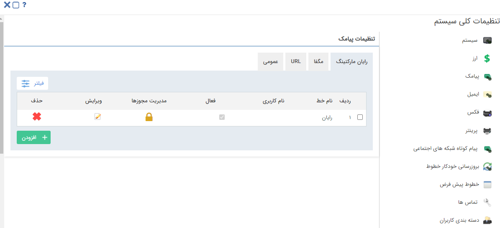

# مدیریت خطوط پیام کوتاه

در پیام‌گستر می‌توان انواع مختلف خطوط پیامکی را در بخش **[تنظیمات کلی]** تعریف نمود. قسمت **[پیامک]** برای تعریف خطوط پیام کوتاه می‌باشد که جزییات این بخش در ادامه شرح داده شده است:

**1-** برای تعریف خط پیامکی ابتدا اپراتور مورد نظر خود را انتخاب نمایید، سپس بر روی دکمه **افزودن** کلیک کنید.

**2-** اطلاعات هر اپراتور را از قبل تهیه نموده و در فیلدهای مرتبط وارد نمایید.

در صفحه مدیریت خطوط پیامکی علاوه بر تعریف خطوط جدید، امکان ویرایش، حذف و تعیین مجوزهای خطوط تعریف شده در این بخش وجود دارد.

**3-** بعد از تعریف خطوط مورد نظر، از قسمت [مدیریت مجوزها] مجوزهای مربوط به هر خط را برای کاربران تعیین نمایید. با کلیک بر روی این قسمت لیست مجوزهای تعریف شده برای کاربران نیز نمایش داده می‌شود. با کلیک بر روی دکمه افزودن می‌توانید، مجوز جدیدی برای خط تعریف کنید.

**سه دسترسی زیر بر روی خطوط قابل تخصیص می باشند:**

**ارسال:** دسترسی ارسال از این خط را به کاربر می‌دهد.

**دریافت:** دسترسی به صندوق دریافت روی این خط را به کاربر می‌دهد.

**لیست سیاه:** امکان دسترسی به لیست سیاه را به کاربر می‌دهد.

> **نکته:** در صورت اینکه هیچ گونه مجوزی روی یک خط تعریف نکنید، این خط به صورت عمومی لحاظ می‌گردد و همه کاربران سیستم به آن دسترسی کامل دارند، به محض اینکه شما برای کاربر خاصی روی این خط مجوز تعریف می‌کنید، تنها کاربر مورد نظرتان به این خط دسترسی دارد. حتی ایجاد کننده خط هم برای استفاده هیچ مجوزی ندارد.

### اپراتورهای قابل پشتیبانی در پیام‌گستر :

- [تعریف خطوط URL](https://github.com/1stco/PayamGostarDocs/blob/master/help2.5.4/Settings/General-settings/payamak/url.md)

ارسال پیامک از سایر اپراتورها از طریق URL انجام می‌شود. لازم است اطلاعات پنل پیامکی خود را در بخش تنظیمات URL در تنظیمات کلی > پیامک وارد کنید و هنگام ارسال پیام‌کوتاه نوع رسانه خود را روی URL قرارداده تا از این طریق پیامک ارسال شود.

- [تعریف خطوط مگفا](https://github.com/1stco/PayamGostarDocs/blob/master/help2.5.4/Settings/General-settings/payamak/magfa.md)

اپراتور ارائه کننده خطوط اینترنتی با سرشماره 3000؛ در بخش مگفا در تنظیمات کلی > پیامک اطلاعات مورد نیاز را وارد کرده و هنگام ارسال پیام‌کوتاه نوع رسانه خود را روی مگفا قرار داده تا از این طریق پیامک ارسال شود.
 

- [تعریف خطوط پرتال اول](https://github.com/1stco/PayamGostarDocs/blob/master/help2.5.4/1st/2.6.0/1st.md)

اپراتور ارائه دهنده خطوط با سرشماره‌ی 3000 و خط‌های 8 رقمی متناظر با خطوط ثابت؛ برای ارتباط با تجارت اول باید دارای یک حساب کاربری در تجارت اول (www.1st.ir) باشید پس از ثبت‌نام در سایت می‌توانید از طریق منوی بالای صفحه پیام‌گستر، 1st.ir را باز کنید و مشخصات کاربری خود را وارد نمایید و از برقراری اتصال اطمینان حاصل نمایید.

- [GSM Modem](https://github.com/1stco/PayamGostarDocs/blob/master/help2.5.4/Marketing/sms/gsm/modm-gsm-set.md)

با نصب و راه‌اندازی دستگاه GSM Modem می‌توانید از طریق سیم کارت پیام خود را ارسال نمایید.

> **نکته:** لازم به ذکر است امکان تعریف خط رایان مارکتینگ جدید وجود ندارد و در این بخش تنها خطوطی که در گذشته تعریف شده قابل مشاهده می‌باشد. 
