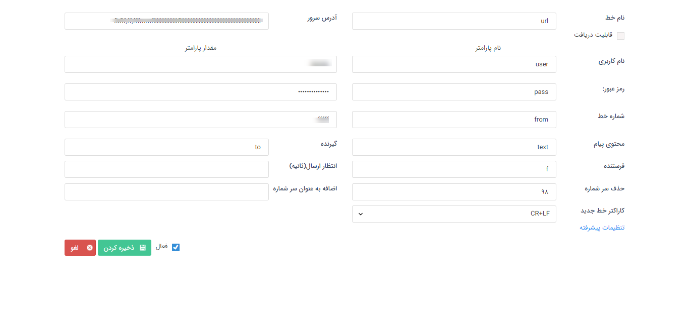

# تعریف خطوط url

 قبل از اقدام، باید سرویس استفاده از URL برای شما فعال باشد. مستندات تنظیم خط پیامکی خود را از اپراتور ارائه دهنده آن بصورت یک url که به شکل query string می‌باشد، دریافت کنید.

 1- یک نام دلخواه برای **نام خط** برگزینید و سایر مقادیر را متناظر با مستندات ارائه شده از طرف اپراتور وارد کنید.

 2- در صورتی که این خط پیامکی قابلیت دریافت پیام دارد و قصد نمایش پیام‌های دریافتی آن در نرم‌افزار پیام‌گستر را دارید، **قابلیت دریافت** را فعال کنید.

امکان افزودن پیشوند بصورت ثابت و حذف پیش شماره‌ی مشخص از شماره مخاطب نیز در این بخش وجود دارد. درصورت عدم استفاده از این خط، می‌توانید آن را در این قسمت غیرفعال کنید.

> **نکته:** لازم به ذکر است اگر مقداری در فیلد **حذف سرشماره** تعریف شود، بصورت خودکار + از سرشماره‌ی مخاطب حذف می گردد.

