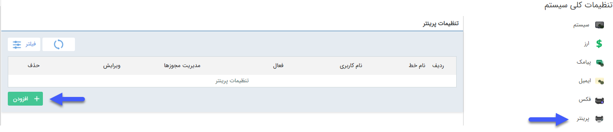
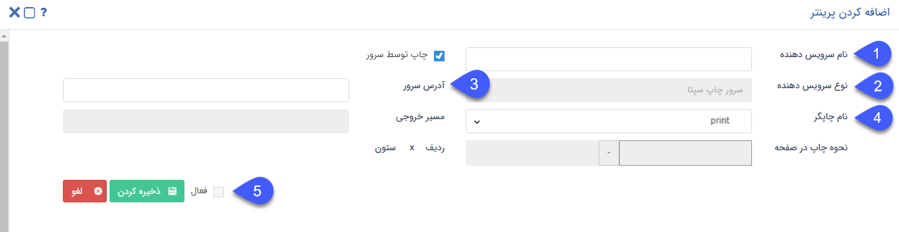

# مدیریت چاپ (تعریف پرینتر)

تنظیمات مرتبط با چاپگرهای متصل به نرم‌افزار را در این قسمت انجام دهید. برای تعریف چاپگر جدید بر روی **افزودن** کلیک نمایید.

 
 
 اطلاعات مربوط به سرویس چاپگر را در این قسمت وارد نمایید. لازم به ذکر است تنظیمات مربوط به روش و نحوه چاپ در صفحه در [**سپتا‌پرینت**](https://github.com/1stco/PayamGostarDocs/blob/master/Help/Settings/General-settings/printer/printer.md) انجام خواهد شد.
 
 
 

**1.نام سرویس دهنده:** به پرینتری که تعریف می‌کنید نامی اختصاص دهید.

**2.نوع سرویس دهنده:** می‌توانید نوع سرویس مورد استفاده  برای پرینتر را تعیین نمایید.

**3.آدرس سرور:** باید آدرس سرور یا  IP آن را در این قسمت وارد نمایید .

**4.نام چاپگر:** نام چاپگر مورد نظر را انتخاب کنید. پس از تنظیم سپتا پرینت، نام چاپگر در این قسمت قابل انتخاب است.

**5.چک باکس فعال:** می‌توانید این خط را از این قسمت فعال یا غیر فعال نمایید.

