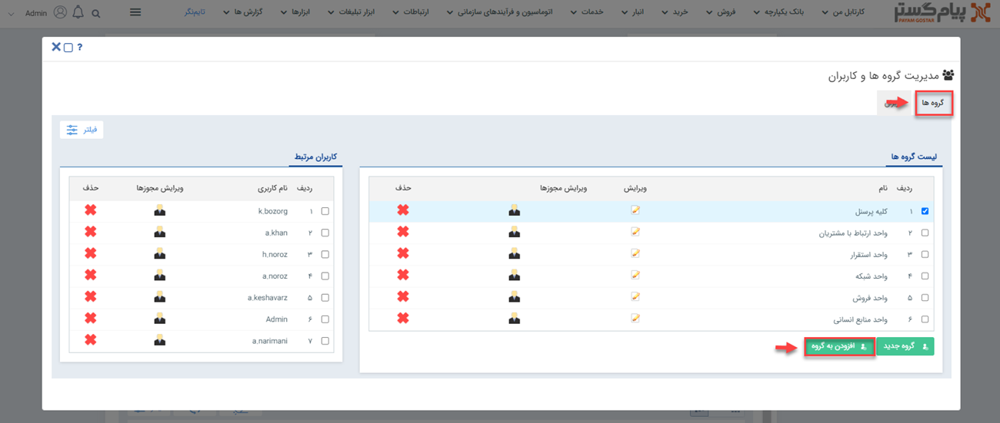
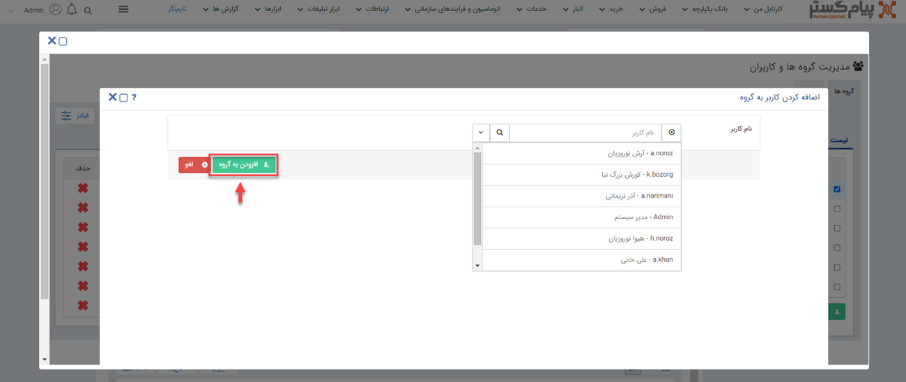
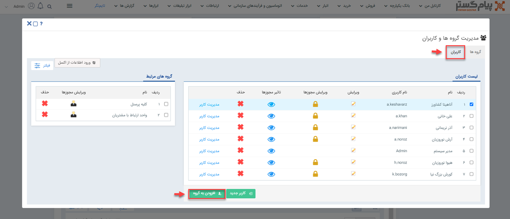
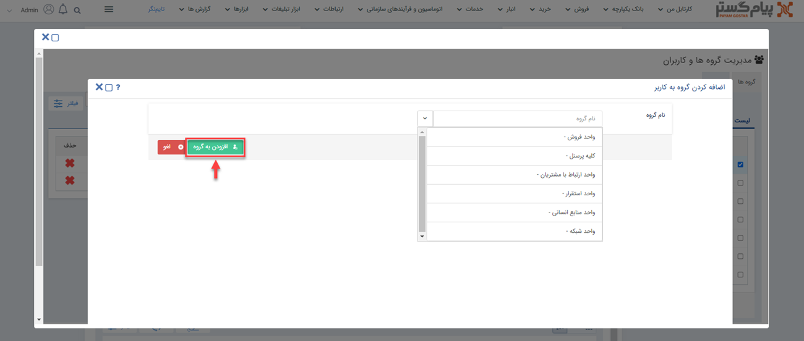

# افزودن کاربر به گروه کاربری

برای اضافه کردن کاربر به گروه‌های کاربری، می‌توانید از دو روش اقدام نمایید: 
**1. از صفحه‌ی گروه‌های کاربری:**  در این روش شما باید از منوی سه‌خط (همبرگری) بالای صفحه، مسیر **تنظیمات** > **مدیریت گروه‌ها و کاربران** > **گروه‌ها** را طی کرده و بر روی گزینه‌ی **افزودن به گروه** کلیک کنید. 

در پنجره‌ی باز شده از بین نام کاربران در لیست کشویی، فرد مدنظر را انتخاب کرده و سپس گزینه‌ی **افزودن به گروه** را می‌زنید. 

**2. از صفحه‌ی کاربران:** در این روش شما باید از منوی سه‌خط (همبرگری) بالای صفحه، مسیر **تنظیمات** > **مدیریت گروه‌ها و کاربران** > **کاربران** را طی کرده و بر روی گزینه‌ی **افزودن به گروه** کلیک کنید.

در پنجره‌ی باز شده از بین نام گروه‌ها در لیست کشویی، گروه مدنظر را انتخاب کرده و سپس گزینه‌ی **افزودن به گروه** را بزنید.

