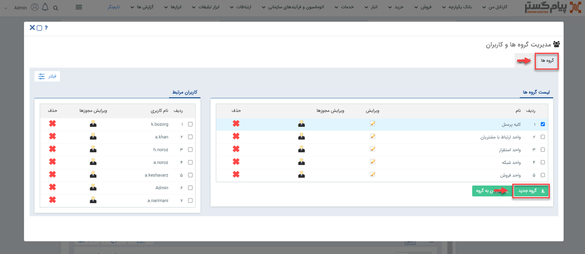
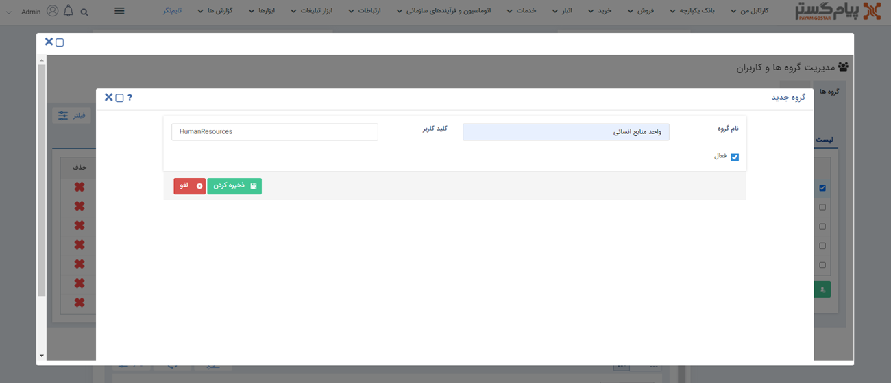

# ایجاد گروه کاربری جدید

برای ایحاد گروه‌ کاربری جدید در سیستم، باید مراحل زیر را به‌ترتیب طی نمایید. 
**1)** از منوی سه‌خط (همبرگری) بالای صفحه، مسیر
 **تنظیمات** > **مدیریت گروه ها و کاربران** > **گروه ها** را طی کرده و سپس بر روی گزینه‌ی **گروه جدید** کلیک کنید.

**2)** در مرحله‌ی بعدی باید نام گروه و کلید کاربر را وارد کرده و با تیک زدن چک‌باکس، مشخص کنید که می‌خواهید گروه جدیدتان فعال یا غیرفعال باشد؛ در نهایت با کلیک بر روی گزینه‌ی **ذخیره کردن**، اطلاعات گروه را در سیستم Save کنید. 

> **نکته** 
از گزینه‌ی **کلید کاربر** برای ارتباط با صفحات وب استفاده می‌شود و  توصیه ما به شما این است که از روش نگارشی Camel Case برای نوشتن آن استفاده نمایید. در روش Camel Case تمامی کلمات، بدون فاصله و پشت سر هم می‌آیند و برای مشخص کردن واژه‌ها، حرف اول هر کلمه بزرگ نوشته می‌شود مانند: LowerCamelCase
