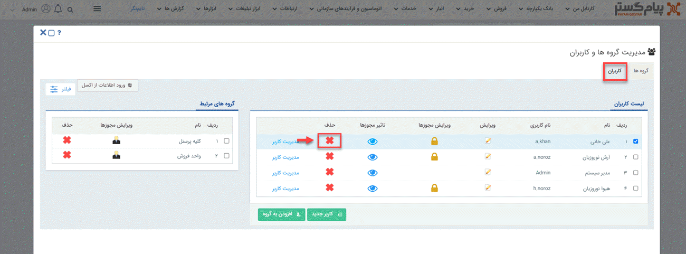
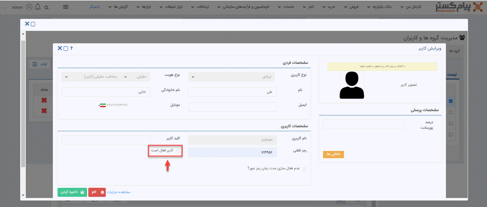

# حذف و غیر فعال کردن کاربر

**حذف کاربر**: برای حذف کاربران از نرم‌افزار باید از منوی سه‌خط (همبرگری) بالای صفحه، مسیر **تنظیمات** > **مدیریت گروه ها و کاربران** > **کاربران** را طی کنید. سپس با کلیک بر روی **علامت ضربدر** (×) می‌توانید کاربر مدنظر خود را از سیستم حذف نمایید. 

> **نکته** 
اگر یک کاربر در سابقه‌ی فعالیت خود در نرم‌افزار، کار خاصی را انجام داده باشد که از جهت گزارش‌گیری و بررسی تاریخچه سوابق دارای اهمیت باشد، سیستم اجازه‌ی حذف آن کاربر را به شما نخواهد داد و برای این منظور باید کاربر مدنظر را غیرفعال کنید.

**غیرفعال کردن کاربر**: برای غیرفعال کردن کاربر، باید در صفحه‌ی اصلی مدیریت کاربران (همین صفحه)، بر روی گزینه‌ی **ویرایش** کلیک کنید. 

در این مرحله، صفحه‌ی اطلاعات کاربر برای شما باز می‌شود و می‌توانید با غیرفعال کردن (برداشتن تیک) چک‌باکس **کاربر فعال است**، حساب کاربر مدنظر را از حالت فعال خارج کنید.

>**نکته**  
 این نکنه را باید در نظر داشته باشید که تعداد کاربران فعال در نرم‌افزار، با توجه به نوع بسته‌ی خریداری شده متغیر بوده و در حالت عادی، سیستم می‌تواند اطلاعات پنج کاربر فعال و بی‌نهایت کاربر غیرفعال  را در خود ذخیره داشته باشد؛ درصورتی‌که نیاز به تعداد کاربر فعال بیشتری دارید، باید به‌صورت جداگانه اقدام نمایید. 
