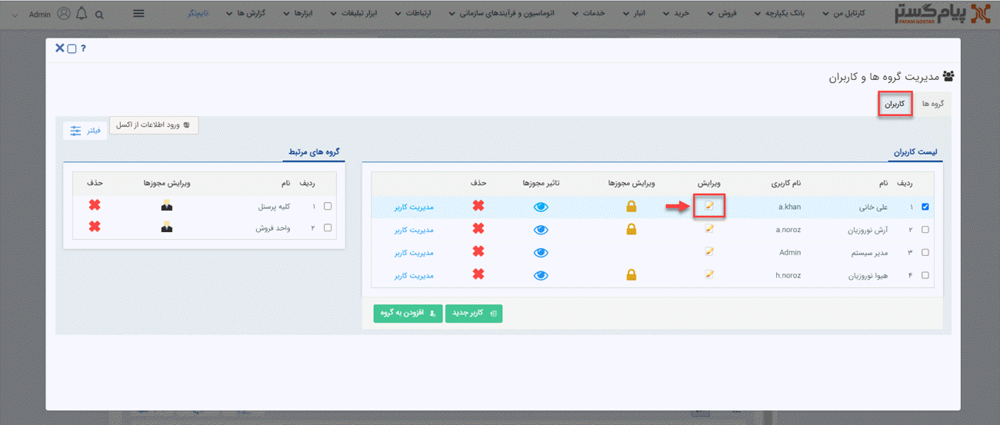
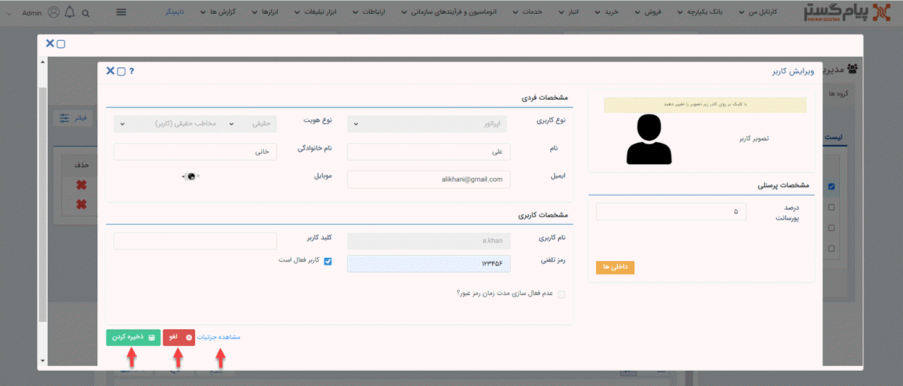
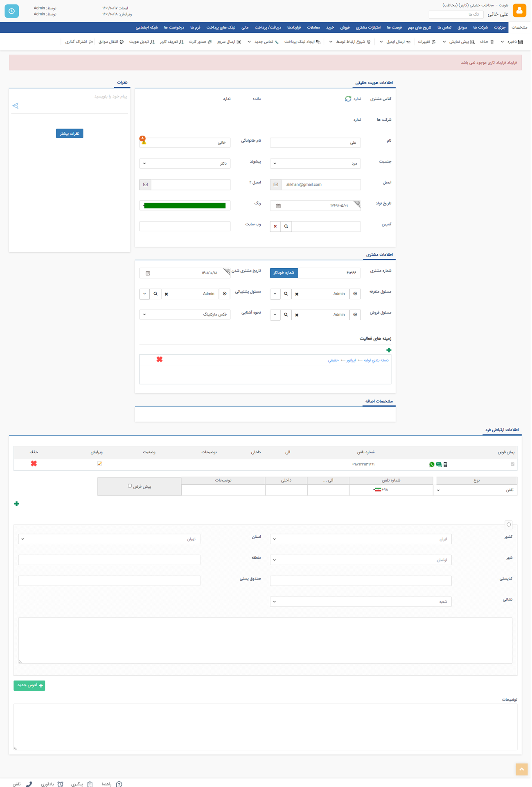

# ویرایش اطلاعات کاربر

به‌منظور ادیت اطلاعات کاربران، باید از منوی سه‌خط (همبرگری) بالای صفحه، مسیر **تنظیمات** > **مدیریت گروه ها و کاربران** > **کاربران** را طی کنید. سپس بر روی آیکون **ویرایش** کلیک کرده و وارد صفحه‌ی اطلاعات شخصی کاربر شوید.

در این صفحه شما می‌توانید مشخصات پرسنلی، فردی و کاربری کاربر موردنظر مثل تصویر، درصد پورسانت، نام و نام‌خانوادگی، آدرس ایمیل، شماره موبایل، نام کاربری، کلید کاربر، رمز تلفنی و... را بررسی و ویرایش نمایید. در نهایت با زدن دکمه‌ی **ذخیره کردن** یا **لغو**، تغییرات خود را ذخیره کرده و یا از آن صرف‌نظر کنید. 
> **نکته** 
**نوع کاربری** و **نوع هویت** فیلدهایی هستند که پس از ثبت و ذخیره حساب کاربری، به‌هیچ‌وجه امکان تغییر آن را نخواهید داشت.  

همچنین می‌توانید با کلیک بر روی **مشاهده جزئیات**، برای بررسی بیشتر وارد صفحه‌ی هویت کاربر شوید تا به کلیه‌ی اطلاعات و سوابق کاربر دسترسی پیدا کنید. شما در این صفحه می‌توانید تمامی فعالیت‌های کاربر را در سیستم چک کرده و در صورت نیاز آیتم‌ها و سوابق جدید برایش تعریف و یا سایر اطلاعات را ویرایش نموده و در نهایت آن را ذخیره کنید.

