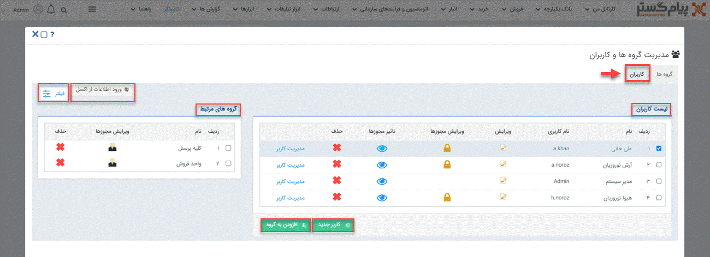

# صفحه اصلی مدیریت کاربران

برای ایحاد، ادیت و حذف هر گونه کاربری در نرم‌افزار، باید به صفحه‌ی اصلی مدیریت کاربران رفته و از آن‌جا  برای هدف‌تان اقدام نمایید. به‌این‌منظور باید از منوی سه‌خط (همبرگری) بالای صفحه، مسیر **تنظیمات** > **مدیریت گروه ها و کاربران** > **کاربران** را طی کنید. 

در صفحه‌ی **کاربران**، لیست تمامی کاربران تعریف شده در سیستم قابل مشاهده است. شما با کلیک بر روی **نام** و **نام کاربری** می‌توانید، هر یک از کاربران را انتخاب نموده و در گام بعدی با کلیک بر روی سایر آیکون‌ها اطلاعات دیگر مربوط به آن کاربر را مشاهده و ویرایش نمایید. 
**ویرایش اطلاعات کاربر**: با کلیک بر روی آیکون *ویرایش* می‌توانید به تمامی اطلاعات فردی کاربر مثل نام، نام‌خانوادگی، موبایل، ایمیل، تصویر کاربر، رمز تلفنی و... دست پیدا کنید و در صورت نیاز آن را تغییر داده و ذخیره نمایید. 
**ویرایش مجوزها**: با استفاده از آیکون *ویرایش مجوزها* می‌توانید لیست کامل مجوز   ماژول‌های مربوط به آن کاربر را مشاهده و در صورت نیاز هر گونه مجوزی را برایش فعال و یا غیرفعال کنید.  
**تاثیر مجوزها**:
لیست تمامی مجوزهایی که برای  کاربر مدنظر فعال کرده‌اید را می‌توانید در آیکون *تاثیر مجوزها*، مشاهده نمایید. 
**حذف کاربر**: این امکان برای شما فراهم شده که با زدن *علامت ضربدر* (×) کاربر مدنظرتان را از نرم‌افزار حذف کنید. توجه داشته باشید که اگر کاربر منظور، فعالیت خاصی در سیستم انجام داده باشد که با حذف آن، بخشی از گزارشات و سوابق با مشکل روبه‌رو شود، سیستم امکان حذف را به شما نمی‌دهد و باید کاربری آن را از بخش ویرایش، غیرفعال نمایید. 
**مدیریت کاربر**: با کلیک بر روی *مدیریت کاربر* می‌توانید به کنسول مدیریت کاربر دست پیدا کرده و به بررسی اطلاعات کاربری فرد هم‌چون رمز عبور، آخرین ورود، تاریخ به‌روزرسانی و... بپردازید و در نهایت با کلیک بر روی **ورود به سایت** وارد حساب کاربری‌اش شوید. 
**ایجاد کاربر جدید**: برای ایجاد کاربر جدید باید بر روی دکمه‌ی *کاربر جدید* کلیک کنید. 
**ایجاد کاربران جدید از طریق اکسل**: درصورتی‌که تعداد کاربران جدیدتان زیاد باشد می‌توانید با زدن *ورود اطلاعات از اکسل*، از اکسل برای اضافه کردن سریع‌تر و یک‌باره‌ی کاربران به نرم‌افزار کمک بگیرید. 
**اضافه کردن کاربر به گروه**: می‌توانید پس از انتخاب کاربر، از گزینه‌ی *افزودن به گروه* برای اضافه شدن کاربر به گروه مدنظرتان که از قبل آن را ایجاد کرده‌اید، استفاده نمایید.  
**فیلتر**: در صورتی که تعداد کاربران زیاد باشد پیدا کردن کاربر هدف‌تان کمی دشوار می‌شود، در این شرایط می‌توانید از *فیلتر* کمک بگیرید و با استفاده از فیلدهای نام کاربری، نوع کاربر، نام، شرکت، دپارتمان و وضعیت بتوانید راحت‌تر کاربرتان را در لیست پیدا کنید. 
**گروه‌های مرتبط**: برای بررسی عضویت هر یک از کاربران در گروه‌های ایجاد شده در نرم‌افزار، باید پس از انتخاب کاربر، لیست گروه‌هایی که فرد در آن عضو بوده را در کادر *گروه‌های مرتبط* مشاهده نمایید. باید توجه داشته باشید که با کلیک بر روی آیکون *ویرایش مجوزها*  می‌توانید به لیست کامل مجوزهایی که به افراد آن گروه داده شده، دسترسی داشته و در صورت نیاز آن‌ها را تغییر دهید. 
حال اگر بخواهید که کاربر مدنظرتان را از یک گروه حذف نمایید، می‌توانید با کلیک بر روی علامت ضربدر (×) به هدف‌تان برسید. 
