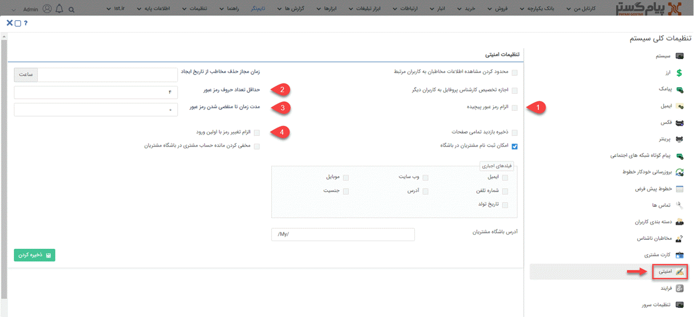

# تنظیمات رمز عبور حساب کاربران

برای اعمال تنظیمات مربوط به رمز عبور کاربران، باید از منوی چند خطی (همبرگری)، مسیر **تنظیمات** > **تنظیمات کلی** > **امنیتی** را طی کنید.
در این قسمت تنظیمات مرتبط با موارد امنیتی کاربران در نرم افزار را مشاهده خواهید کرد.

شما با استفاده از فیلدهای زیر می‌توانید تنظیمات مدنظر برای رمز عبور کاربران خود را انجام دهید. 
**1. الزام رمز عبور پیچیده:** در صورت فعال کردن این گزینه، رمز عبور کاربران باید حداقل شامل یک حرف بزرگ انگلیسی، یک حرف کوچک انگلیسی و یک عدد باشد. (توجه داشته باشید به‌محض فعال شدن این گزینه تمامی کاربرانی که از این لحظه وارد نرم افزار می‌شوند باید رمز عبور خود را به حالت رمز عبور پیچیده تغییر دهند.) 
**2. حداقل تعداد حروف رمز عبور:**  در این فیلد باید حداقل تعداد کاراکترهایی که کاربر برای رمز عبور خود باید در نظر بگیرد را مشخص کنید.  
**3. مدت زمان تا منقضی شدن رمز عبور:**  در این فیلد باید تعداد روزهایی که پس از آن، رمز عبور کاربر منقضی شود را تعیین کنید. برای مثال اگر 30 را وارد کنید کاربران باید هر 30 روز یک‌بار، رمز عبور خود را تغییر دهند. در صورت 0 قرار دادن این فیلد، محدودیتی برای کاربر در نظر گرفته نمی‌شود و نیازی به تغییر رمز کاربران نخواهد بود. 
**4. الزام تغییر رمز با اولین ورود:** در صورتی که این گزینه را فعال کنید، کاربران باید در اولین ورود خود به نرم افزار، رمز عبور تعیین شده در هنگام ساخت کاربر را تغییر دهند. 
