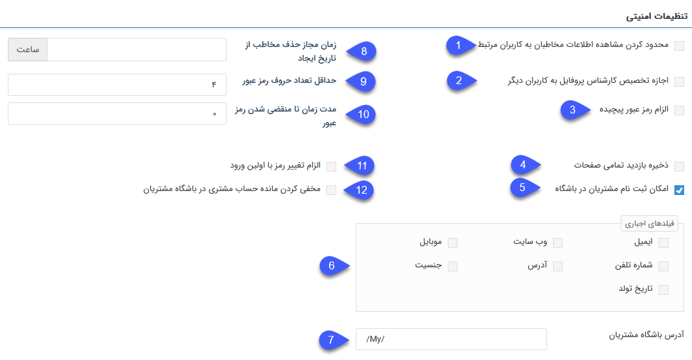

# تنظیمات امنیتی

در این قسمت تنظیمات مرتبط با موارد امنیتی نرم‌افزار را مشاهده می‌کنید.

**1. محدودکردن مشاهده اطلاعات مخاطبان به کاربران مرتبط:** اجازه مشاهده اطلاعات کاربران را فقط به مسئولین (مسئول فروش، مسئول متفرقه، مسئول پشتیبانی) تخصیص داده شد که در صفحه [مشخصات مخاطب](https://github.com/1stco/PayamGostarDocs/blob/master/help%202.5.4/Integrated-bank/Database/General-specifications/General-specifications.md) مشخص شده‌اند می‌دهد. (  کاربران دارای مجوز مدیر بانک اطلاعاتی از این محدودیت مستثنا هستند )

**2. اجازه تخصیص کارشناس پروفایل به کاربران دیگر:** با این امکان کاربری که به‌عنوان مسئول پروفایل در صفحه مشخصات مخاطب انتخاب شده است می‌تواند مسئول جایگزینی را به‌جای خود انتخاب کند.

**3. الزام رمز عبور پیچیده:** در صورت فعال‌کردن این گزینه، رمز عبور کاربران باید حداقل شامل یک حرف بزرگ، یک حرف کوچک و عدد باشد. (توجه داشته باشید به‌محض فعال‌شدن این گزینه تمامی کاربرانی که از این لحظه وارد نرم‌افزار می‌شوند باید رمز عبور خود را به حالت رمز عبور پیچیده تغییر دهند.) 

**4. ذخیره بازدید تمامی صفحات:** آزمایشی

**5.امکان ثبت‌نام مشتریان در باشگاه:** در صورت فعال نمودن این گزینه، لینک ثبت‌نام در صفحه ورود به نرم‌افزار نمایش داده می‌شود و مشتریان می‌توانند برای اخذ کاربری باشگاه مشتریان، ثبت‌نام انجام دهند.

**6. فیلدهای اجباری فرم ثبت‌نام:** در صورت فعال نمودن امکان ثبت‌نام مشتریان در باشگاه، از این قسمت می‌توانید برخی از فیلدهای فرم ثبت‌نام را اجباری کنید تا حتماً توسط مشتریان تکمیل گردند.
 
 
**7.آدرس باشگاه مشتریان:** در این قسمت می‌توانید آدرس موردنظر برای دسترسی به باشگاه مشتریان از طریق Url را تعیین کنید.

 
**8. زمان مجاز حذف مخاطب از تاریخ ایجاد:** در این قسمت مدت‌زمان مجاز برای حذف تمامی مخاطبان از زمان ایجاد شده تعیین می‌شود در نظر داشته باشید حتی در صورت داشتن مجوز حذف آیتم بعد از گذشتن زمان تعیین شده حذف امکان‌پذیر نمی‌باشد.

 
**9. حداقل تعداد حروف رمز عبور:** حداقل تعداد کاراکترهایی که کاربر برای رمز عبور خود باید در نظر بگیرد را مشخص کنید.
 

**10. مدت‌زمان تا منقضی شدن رمز عبور:** تعداد روزهایی که پس از آن، رمز عبور کاربر منقضی می‌شود را تعیین کنید. برای مثال اگر 20 را وارد کنید کاربران باید هر 20 روز یکبار رمز عبور خود را تغییر دهند. در صورت 0 قراردادن این فیلد، محدودیتی برای کاربر در نظر نمی‌گیرد.

**11. الزام تغییر رمز با اولین ورود:** در صورت فعال نمودن این گزینه، کاربران باید در اولین ورود خود به نرم‌افزار، رمز عبور تعیین شده در هنگام ساخت کاربر را تغییر دهند.

**12. مخفی کردن مانده‌حساب مشتری در باشگاه مشتریان:**  در صورت فعال‌بودن  فیلد مانده‌حساب پروفایل هویت در باشگاه مشتریان  نمایش داده نمی‌شود. 