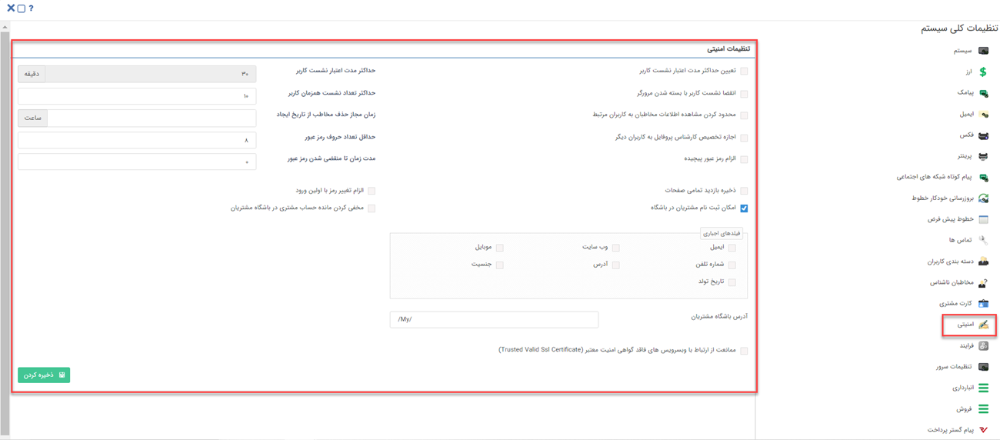

# تنظیمات امنیتی

در این قسمت تنظیمات مرتبط با موارد امنیتی نرم‌افزار را مشاهده می‌کنید.

**۱. تعیین حداکثر مدت اعتبار نشست کاربر:** طبق این تنظیمات (به منظور حفظ نکات امنیتی)، به صورت پیش‌فرض، محدودیت ۳۰ دقیقه‌ای برای نشست در نرم‌افزار برای کاربران در نظر گرفته شده است. این بدین معناست که کاربر پس از ۳۰ دقیقه برای فعالیت نیاز به درج نام‌کاربری و رمز عبور خود دارد. برای تغییر این محدودیت، گزینه مذکور را فعال کرده و زمان آن را در کادر مقابل ویرایش نمایید. توجه داشته باشید حداقل زمان ممکن برای درج در این قسمت، ۵ دقیقه می‌باشد. 

**۲. انقضا نشست کاربر با بسته شدن مرورگر:** با فعال کردن این گزینه، در صورت بسته شدن مرورگر، کاربران برای ورود به حساب کاربری خود باید مجدداً نام کاربری و رمز عبور خود را درج و اقدام به ورود نماید. 

**۳. حداکثر تعداد نشست همزمان کاربر:** در این قسمت می‌توانید تعیین نمایید کاربران، حداکثر از چند طریق می‌توانند به صورت همزمان وارد حساب کاربری خود شوند. این تعداد انواع مرورگرها و اپلیکیشن موبایل را که کاربر در آن لحظه از طریق آن‌ها وارد نرم‌افزار شده را در نظر می‌گیرد. 

**۴. محدودکردن مشاهده اطلاعات مخاطبان به کاربران مرتبط:** اجازه مشاهده اطلاعات کاربران را فقط به مسئولین (مسئول فروش، مسئول متفرقه، مسئول پشتیبانی) تخصیص داده شد که در صفحه [مشخصات مخاطب](https://github.com/1stco/PayamGostarDocs/blob/master/Help/Integrated-bank/Database/General-specifications/General-specifications.md) مشخص شده‌اند می‌دهد. (  کاربران دارای مجوز مدیر بانک اطلاعاتی از این محدودیت مستثنا هستند ) 

**۵. زمان مجاز حذف مخاطب از تاریخ ایجاد:** در این قسمت مدت‌زمان مجاز برای حذف تمامی مخاطبان از زمان ایجاد شده تعیین می‌شود در نظر داشته باشید حتی در صورت داشتن مجوز حذف آیتم بعد از گذشتن زمان تعیین شده حذف امکان‌پذیر نمی‌باشد. 

**۶. اجازه تخصیص کارشناس پروفایل به کاربران دیگر:** با این امکان کاربری که به‌عنوان مسئول پروفایل در صفحه مشخصات مخاطب انتخاب شده است می‌تواند مسئول جایگزینی را به‌جای خود انتخاب کند. 

**۷. حداقل تعداد حروف رمز عبور:** حداقل تعداد کاراکترهایی که کاربر برای رمز عبور خود باید در نظر بگیرد را مشخص کنید. 

**۸. الزام رمز عبور پیچیده:** در صورت فعال‌کردن این گزینه، رمز عبور کاربران باید حداقل شامل یک حرف بزرگ، یک حرف کوچک و عدد باشد. (توجه داشته باشید به‌محض فعال‌شدن این گزینه تمامی کاربرانی که از این لحظه وارد نرم‌افزار می‌شوند باید رمز عبور خود را به حالت رمز عبور پیچیده تغییر دهند.)  

**۹. مدت‌زمان تا منقضی شدن رمز عبور:** تعداد روزهایی که پس از آن، رمز عبور کاربر منقضی می‌شود را تعیین کنید. برای مثال اگر 20 را وارد کنید کاربران باید هر 20 روز یکبار رمز عبور خود را تغییر دهند. در صورت 0 قراردادن این فیلد، محدودیتی برای کاربر در نظر نمی‌گیرد. 

**۱۰. ذخیره بازدید تمامی صفحات:** این بخش در حالت آزمایش می‌باشد. 

**۱۱. الزام تغییر رمز با اولین ورود:** در صورت فعال نمودن این گزینه، کاربران باید در اولین ورود خود به نرم‌افزار، رمز عبور تعیین شده در هنگام ساخت کاربر را تغییر دهند. 

**۱۲.امکان ثبت‌نام مشتریان در باشگاه:** در صورت فعال نمودن این گزینه، لینک ثبت‌نام در صفحه ورود به نرم‌افزار نمایش داده می‌شود و مشتریان می‌توانند برای اخذ کاربری باشگاه مشتریان، ثبت‌نام انجام دهند. 
در صورت فعال کردن این گزینه، فیلدهای الزامی برای ثبت‌نام را از کادر نمایش داده شده انتخب نمایید. 

**۱۳. مخفی کردن مانده‌حساب مشتری در باشگاه مشتریان:**  در صورت فعال‌بودن  فیلد مانده‌حساب پروفایل هویت در باشگاه مشتریان  نمایش داده نمی‌شود.  

**۱۴.آدرس باشگاه مشتریان:** در این قسمت می‌توانید آدرس موردنظر برای دسترسی به باشگاه مشتریان از طریق Url را تعیین کنید. 

**۱۵. ممانعت از ارتباط با وبسرویس‌های فاقد گواهی امنیت معتبر (Trusted Valid Ssl Certificate):** در صورت استفاده از وب‌سرویس و فعال کردن این گزینه، وب‌سرویس‌هایی که گواهی امنیت نداشته باشند، در سیستم قابل استفاده نخواهند بود. 

 پس از تکمیل تنظیمات، برای ثبت تغییرات اعمال شده، بر روی کلید «ذخیره» کلیک نمایید.
 

 

 

 

