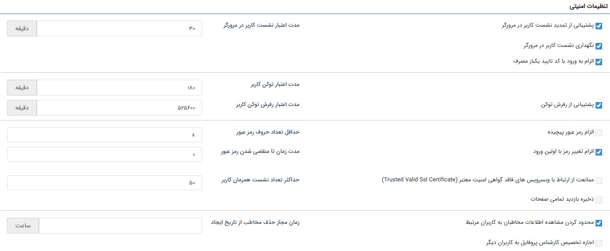
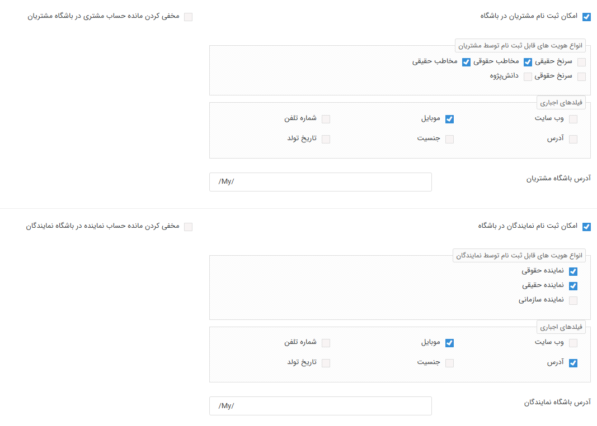

# تنظیمات امنیتی

در این قسمت می‌توانید تنظیمات مرتبط با ملاحظات امنیتی نرم‌افزار را اعمال نمایید. 

- **پشتیبانی از تمدید نشست کاربر در مرورگر:** با افزوده شدن موارد امنیتی به نرم‌افزار، کاربر پس از زمان مشخصی (۳۰ دقیقه به صورت پیش‌فرض) از نرم‌افزار خارج شده و نیازمند ورود مجدد است. به عبارتی، نشست هر کاربر در نرم‌افزار به مدت محدودی اعتبار خواهدداشت. با فعال کردن این گزینه، زمان اعتبار نشست کاربر در نرم‌افزار به جای زمان ورود، از آخرین فعالیت وی در پیام‌گستر در نظر گرفته‌می‌شود. به عنوان مثال با در نظر گرفتن مدت اعتبار نشست ۳۰ دقیقه‌ای، کاربر تا ۳۰ دقیقه پس از آخرین **فعالیت** خود در نرم‌افزار، در آن معتبر شناخته شده و پس از آن نیازمند ورود مجدد است. لکن در صورت غیرفعال بودن این گزینه، کاربر ۳۰ دقیقه پس از زمان **ورود** به نرم‌افزار باید اقدام به ورود مجدد نماید. 
- **مدت اعتبار نشست کاربر در مرورگر:** طبق این تنظیمات (به منظور حفظ نکات امنیتی)، به صورت پیش‌فرض، محدودیت ۳۰ دقیقه‌ای برای نشست در نرم‌افزار برای کاربران در نظر گرفته شده‌است. این بدین معناست که کاربر پس از ۳۰ دقیقه، برای فعالیت در نرم‌افزار، نیاز به ورود مجدد با نام‌کاربری و رمز عبور خود دارد. مدت زمان اعتبار نشست کاربر را می‌توانید بین ۵ تا ۱۰۰۸۰ دقیقه تعیین نمایید. 
- **نگهداری نشست کاربر در مرورگر:** با فعال کردن این گزینه، در صورت بسته شدن مرورگر، کاربران با باز کردن مجدد مرورگر می‌توانند بدون نیاز به تکرار نام کاربری و رمز عبور، وارد نرم‌افزار شوند. این موضوع منوط بر این است که اعتبار نشست کاربر بر اساس زمان تعیین شده، منقضی نشده‌باشد. 
- **الزام به ورود با کد تایید یک‌بار مصرف:**{#OTP} با فعال کردن این گزینه، تمامی کاربران از جمله کاربران نرم‌افزار، نمایندگان و مشتریان باشگاه، برای ورود به حساب کاربری خود ملزم به ورود کد یکبار مصرف (OTP) خواهند بود. بر این اساس کاربر هنگام ورود، پس از کلیک بر روی کلید ارسال کد، کد یکبار مصرفی را از طریق پیام دریافت کرده و می‌تواند با استفاده از آن وارد حساب خود شود. پیام مذکور (که همان پیام کد دو عاملی است) جهت ارسال کد یکبار مصرف از بخش [مدیریت پیام‌های سیستمی](https://github.com/1stco/PayamGostarDocs/blob/master/Help/Basic-Information/Manage-system-messages/2.6.0/Manage-system-messages.md) قابل تنظیم است و می‌توانید پیام کوتاه، فکس و پیام شبکه اجتماعی را به عنوان رسانه‌ی مورد نظر خود انتخاب نمایید. توجه داشته‌باشید که پیام از رسانه، از طریق خط پیش‌فرض آن رسانه برای کاربر ارسال می‌شود.
- **پشتیبانی از رفرش توکن:**{#RefreshToken} نوعی توکن برای حفظ دسترسی‌های موقت است که به شما این امکان را می‌دهد که پس از انقضا، بدون نیاز به اعتبارسنجی مجدد دسترسی‌های خود را حفظ کنید. چنانچه از نرم‌افزاری استفاده می‌کنید که از توکن پیام‌گستر استفاده می‌کند (مثلاً تایم‌نگر)، می‌توانید با فعال کردن این گزینه، **مدت اعتبار توکن کاربر** و **مدت اعتبار رفرش توکن کاربر** را برای آن تعیین نمایید. 
- **الزام رمز عبور پیچیده:** در صورت فعال‌ کردن این گزینه، رمز عبور کاربران باید حداقل شامل یک حرف بزرگ، یک حرف کوچک و عدد باشد. (توجه داشته‌باشید به‌محض فعال‌شدن این گزینه تمامی کاربرانی که از این لحظه وارد نرم‌افزار می‌شوند باید رمز عبور خود را به حالت رمز عبور پیچیده تغییر دهند.)  
- **حداقل تعداد حروف رمز عبور:** حداقل تعداد کاراکترهایی که کاربر برای رمز عبور خود باید در نظر بگیرد را مشخص کنید. 
- **الزام تغییر رمز با اولین ورود:** در صورت فعال نمودن این گزینه، کاربران باید در اولین ورود خود به نرم‌افزار، رمز عبور تعیین شده در هنگام ایجاد کاربر (رمز اولیه) را تغییر دهند. 
- **مدت‌ زمان تا منقضی شدن رمز عبور:** تعداد روزهایی که پس از آن، رمز عبور کاربر منقضی می‌شود را تعیین کنید. برای مثال اگر عدد ۲۰ را در این قسمت درج نمایید، کاربران باید هر ۲۰ روز یکبار رمز عبور خود را تغییر دهند. با درج عدد ۰ در این بخش، رمز کاربران بدون انقضا بوده و الزامی برای تغییر رمز به صورت دوره‌ای برای آنان در نظر گرفته‌نمی‌شود. چنانچه در صفحه اطلاعات کاربر، گزینه «رمز عبوز هرگز منقضی نگردد» فعال شده‌باشد، این محدودیت برای آن کاربر اعمال نمی‌گردد. 
- **ممانعت از ارتباط با وبسرویس‌های فاقد گواهی امنیت معتبر (Trusted Valid Ssl Certificate):** در صورت استفاده از وب‌سرویس و فعال کردن این گزینه، وب‌سرویس‌هایی که گواهی امنیت نداشته‌باشند، در سیستم قابل استفاده نخواهند‌بود. 
- **حداکثر تعداد نشست همزمان کاربر:** در این قسمت می‌توانید تعیین نمایید کاربران، حداکثر از چند طریق می‌توانند به صورت همزمان وارد حساب کاربری خود شوند. این تعداد انواع مرورگرها و اپلیکیشن موبایل را که کاربر در آن لحظه از طریق آن‌ها وارد نرم‌افزار شده را در نظر می‌گیرد. 

> **نکته** 
> برخی الزامات امنیتی فوق، برای هر کاربر به صورت جداگانه نیز قابل اعمال می‌باشد. برای دسترسی به تنظیمات امنیتی مرتبط با هر کاربر از بخش [مدیریت گروه‌ها و کاربران](https://github.com/1stco/PayamGostarDocs/blob/master/Help/Settings/GroupsAndUsersManagement/UserManagementConsole-2.8.7.md)، به صفحه کنسول مدیریت کاربر مراجعه نمایید. 

- **ذخیره بازدید تمامی صفحات:** این بخش در حالت آزمایش می‌باشد. 
- **محدودکردن مشاهده اطلاعات مخاطبان به کاربران مرتبط:** با فعال کردن این گزینه، فقط کاربرانی که به عنوان مسئول فروش، مسئول پشتیبانی یا مسئول متفرقه در [صفحه هویت](https://github.com/1stco/PayamGostarDocs/blob/master/Help/Integrated-bank/Database/General-specifications/General-specifications.md) تعریف شده‌اند، اجازه‌ی مشاهده صفحه پروفایل هویت را خواهندداشت. توجه داشته‌باشید که کاربر دارنده مجوز مدیر بانک اطلاعاتی، با توجه به دسترسی تام به بانک، از این قاعده مستثنی خواهدبود. 
- **زمان مجاز حذف مخاطب از تاریخ ایجاد:** در این قسمت مدت‌ زمان مجاز برای حذف مخاطبان (پس از زمان ایجاد) مشخص می‌شود. در نظر داشته‌باشید حتی در صورت داشتن مجوز حذف آیتم بعد از گذشتن زمان تعیین شده در این قسمت، حذف مخاطب امکان‌پذیر نمی‌باشد. 
- **اجازه تخصیص کارشناس پروفایل به کاربران دیگر:** با فعال کردن این گزینه، کاربری که به‌عنوان مسئول (مسئول فروش، مسئول پشتیبانی یا مسئول متفرقه) در پروفایل در یک هویت درج شده‌است، می‌تواند مسئول دیگری جایگزین مسئول فعلی نماید. 

- **امکان ثبت‌نام مشتریان در باشگاه:** در صورت فعال نمودن این گزینه، در صفحه ورود به نرم‌افزار، لینکی برای ثبت‌نام نمایش داده‌می‌شود و مشتریان می‌توانند برای اخذ کاربری باشگاه مشتریان،از این طریق اقدام به ثبت‌نام نمایند. در صورت فعال کردن این گزینه، فیلدهای الزامی برای ثبت‌نام را از کادر نمایش داده شده، انتخاب نمایید. 
- **مخفی کردن مانده‌حساب مشتری در باشگاه مشتریان:** در صورت فعال‌ بودن گزینه، مانده‌حساب هویت مشتری، در داشبورد او در باشگاه به وی نمایش داده‌نمی‌شود.  
- **انواع هویت‌های قابل ثبت‌نام توسط مشتریان:** هنگام ثبت‌نام در باشگاه مشتریان، کاربران باید نوع هویت خود را انتخاب کنند. در این قسمت می‌توانید انتخاب کنید که امکان انتخاب کدام زیرنوع برای مشتریان فراهم باشد. تمامی زیرنوع‌های هویت تعریف شده در نرم‌افزار که پروفایل آن‌ها از نوع «مشتری» باشند، در این قسمت به شما نمایش داده‌می‌شود و می‌توانید گزینه‌های مورد نظر خود را از بین آن‌ها انتخاب نمایید.  
- **فلیدهای اجباری:** اگر این امکان را به مشتریان داده‌اید که خودشان بتوانند در باشگاه ثبت‌‌نام کنند، فیلدهایی که برای ثبت‌نام مشتریان در باشگاه الزامی است را انتخاب نمایید. 
- **آدرس باشگاه مشتریان:** در این قسمت می‌توانید آدرس مورد نظر برای دسترسی به باشگاه مشتریان از طریق Url را تعیین کنید. به صورت پیش‌فرض، آدرس باشگاه همان آدرس نرم‌افزار شما با درج /My/ در انتهای URL خواهدبود. 
همین تنظیمات را در مورد نمایندگان باشگاه نیز تکمیل نمایید. 
- **امکان ثبت‌نام نمایندگان در باشگاه:** در صورت فعال نمودن این گزینه، در صفحه ورود به نرم‌افزار، لینکی برای ثبت‌نام نمایش داده‌می‌شود و نمایندگان می‌توانند برای اخذ کاربری باشگاه،از این طریق اقدام به ثبت‌نام نمایند. در صورت فعال کردن این گزینه، فیلدهای الزامی برای ثبت‌نام را از کادر نمایش داده شده، انتخاب نمایید. 
- **مخفی کردن مانده‌حساب نماینده در باشگاه:** در صورت فعال‌ بودن گزینه، مانده‌حساب هویت نماینده، در داشبورد او در باشگاه به وی نمایش داده‌نمی‌شود.  
- **انواع هویت‌های قابل ثبت‌نام توسط نمایندگان:** هنگام ثبت‌نام در باشگاه نمایندگان، کاربران باید نوع هویت خود را انتخاب کنند. در این قسمت می‌توانید انتخاب کنید که امکان انتخاب کدام زیرنوع برای نمایندگان فراهم باشد. تمامی زیرنوع‌های هویت تعریف شده در نرم‌افزار که پروفایل آن‌ها از نوع «نماینده» باشند، در این قسمت به شما نمایش داده‌می‌شود و می‌توانید گزینه‌های مورد نظر خود را از بین آن‌ها انتخاب نمایید.  
- **فلیدهای اجباری:** اگر این امکان را به نمایندگان داده‌اید که خودشان بتوانند در باشگاه ثبت‌‌نام کنند، فیلدهایی که برای ثبت‌نام نمایندگان در باشگاه الزامی است را انتخاب نمایید. 
- **آدرس باشگاه نمایندگان:** در این قسمت می‌توانید آدرس مورد نظر برای دسترسی به باشگاه نمایندگان از طریق Url را تعیین کنید. به صورت پیش‌فرض، آدرس باشگاه همان آدرس نرم‌افزار شما با درج /My/ در انتهای URL خواهدبود. 

> **نکته** 
> توجه داشته‌باشید که باشگاه نمایندگان و مشتریان در واقع یک بستر مشترک (باشگاه) با دو نوع کاربری مجزا هستند. به همین سبب تنظیمات کاربران از نوع مشتری از تنظیمات کاربران از نوع نماینده به صورت جداگانه در نظر گرفته شده‌است. 

 پس از تکمیل تنظیمات، برای ثبت تغییرات اعمال شده، بر روی کلید «ذخیره» کلیک نمایید. 
 

 

 

 

