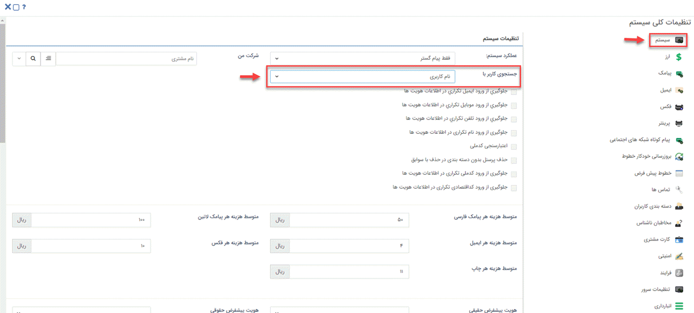

# نمایش نام کاربر در نرم افزار

برای انجام تنظیمات نمایش نام کاربری، باید از منوی بالای صفحه، مسیر **تنظیمات** > **تنظیمات کلی** > **سیستم** را طی کنید.
در این بخش می‌توانید انتخاب کنید که نمایش و جستجوی کاربر در نرم‌افزار با *نام و نام‌خانوادگی* باشد یا *نام کاربری*.

