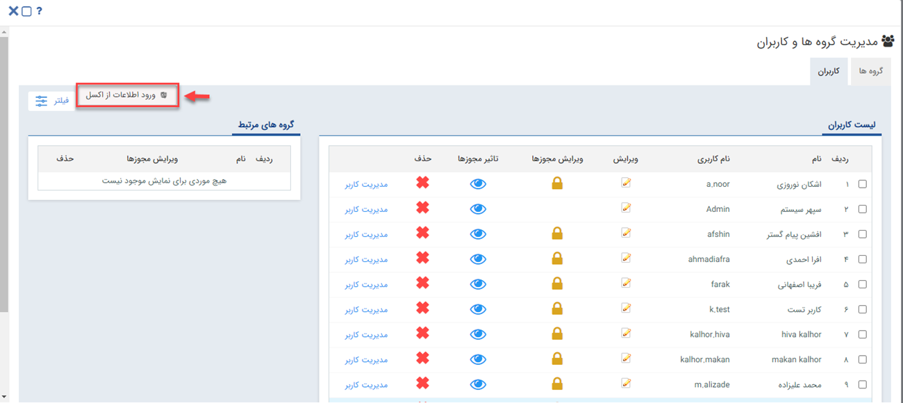
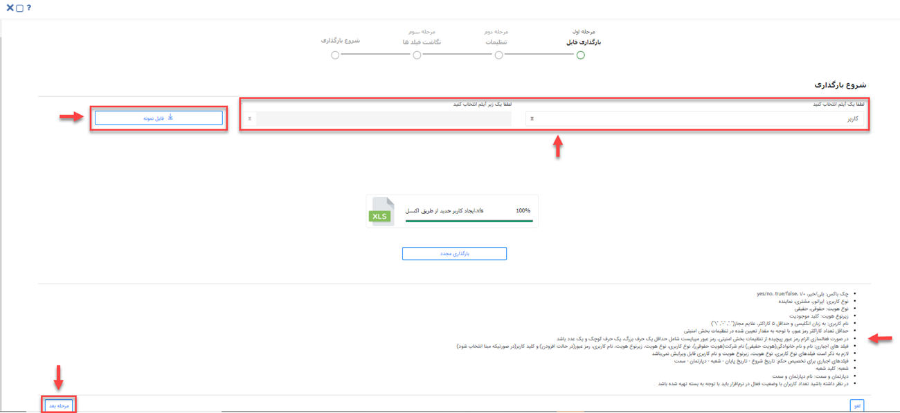
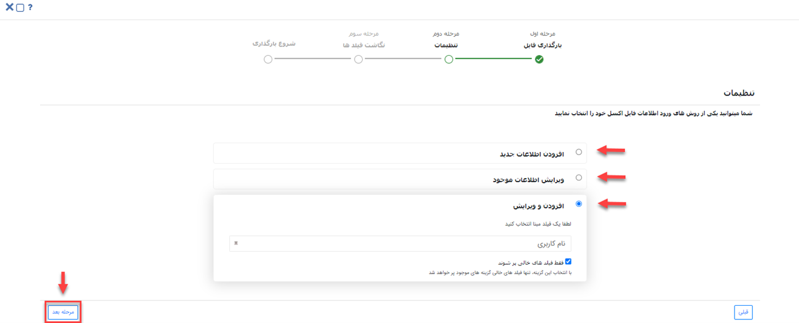
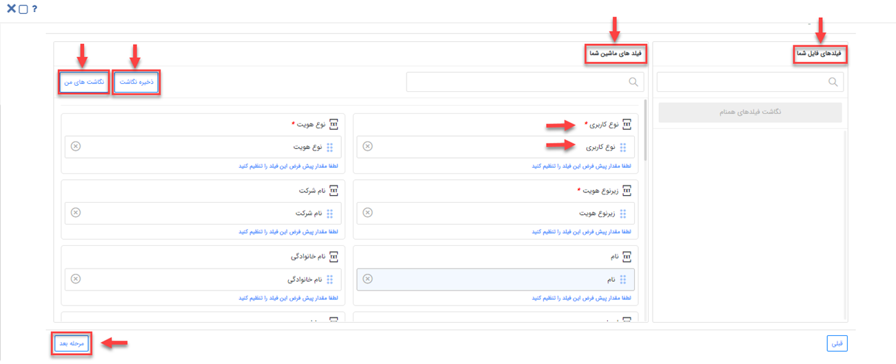

# ایجاد کاربر جدید از طریق اکسل

می‌توانید برای ایجاد کاربر جدید، به‌جز روش عادی (دستی)، از اکسل هم کمک بگیرید. *ایجاد کاربر جدید از طریق اکسل* زمانی کارایی خود را نشان می‌دهد که شما بخواهید تعداد زیادی کاربر را در زمان کوتاه در سیستم ایجاد کنید. برای این منظور باید از منوی سه‌خط (همبرگری) که در سمت چپ نوار بالایی نرم‌افزار قرار گرفته، مسیر **تنظیمات** > **مدیریت گروه‌ها و کاربران** > **کاربران**  را طی کرده و پس از باز شدن پنجره زیر روی گزینه‌ی **ورود اطلاعات از اکسل** کلیک کنید. 

### 1) فرمت و مقادیر ورود اطلاعات کاربران
 
•	**فیلد چک باکس:** true/false، بلی/خیر، yes/no، 0/1

•	**نوع‌ کاربری:** اپراتور، مشتری یا نماینده 

•	**نوع هویت:** حقیقی یا حقوقی 

•	**زیرنوع هویت:** کلید موجودیت در شخصی‌سازی زیرنوع هویت

•	**نام کاربری:** به انگلیسی و حداقل 5 کاراکتر باشد. علایم مجاز که می‌توان در نام کاربری استفاده کرد ”\“ , ”-“ , ”.“ است.

•	**رمز عبور:** حداقل تعداد کاراکتر مجاز برای رمز عبور با توجه به مقدار تعیین شده در تنظیمات رمز عبور حساب کاربری است.

•	**شعبه:** کلید کاربر شعبه 

•	**دپارتمان:** نام دپارتمان 

•	**سمت:** نام سمت 

•	در صورت فعال‌سازی الزام رمز عبور پیچیده از تنظیمات رمز عبور حساب کاربری، باید برای رمز عبور حداقل یک حرف بزرگ، یک حرف کوچک و یک عدد قرار دهید. 
•	فیلدهای الزامی را که شامل ستون‌های نام و نام‌خانوادگی (در صورت انتخاب هویت حقیقی)، نام شرکت (در صورت انتخاب هویت حقوقی)، نوع کاربری، نوع هویت، زیرنوع هویت، نام کاربری، رمز عبور (در حالت افزودن کاربر) و کلید کاربر (در صورت انتخاب به‌عنوان مبنا) می‌شوند، حتما باید در فایل اکسل پر کنید.

> **نکته** 
برای تخصیص حکم پرسنلی، باید فیلدهای تاریخ شروع، تاریخ پایان، شعبه، دپارتمان و سمت که اجباری هستند را در فایل اکسل مقداردهی کنید.

### 2) مراحل ورود اطلاعات

#### • مرحله اول: بارگذاری فایل

می‌توانید با کلیک بر روی **فایل نمونه**، یک اکسل با تمام سربرگ‌هایی که می‌بایست برای *ساخت کاربر از طریق اکسل* پر نمایید را دانلود کنید. سپس با کمک نکاتی که برای راهنمایی در پایین صفحه برایتان نمایش داده شده، اکسل مدنظر را مقداردهی کنید. شما با توجه به نوع هویتی که برای ثبت اطلاعات کاربران قبلا در قسمت شخصی‌سازی نرم‌افزار خود ایجاد کرده‌اید، فیلد آیتم و زیرآیتم را مقداردهی می‌کنید. این قسمت دارای لیست کشویی بوده و می‌توانید از آن، گزینه‌ی موردنظرتان را انتخاب نمایید. 
در این مرحله، فایل اکسل خود را از قسمت **بارگذاری فایل** انتخاب یا از طریق drag & drop آپلود کرده و در نهایت با کلیک بر روی **مرحله بعد** وارد مرحله دوم می‌شوید. 

#### • مرحله دوم: تنظیمات

در این مرحله می‌توانید تنظیمات مربوط به ورود اطلاعات یا ویرایش اطلاعات را انجام دهید. 
  الف) افزودن اطلاعات جدید: با انتخاب این روش کاربران جدید در اکسل را به نرم‌افزار اضافه می‌کنید. می‌توانید مبنای شناسایی را نام کاربری یا کلید کاربری انتخاب نمایید تا براساس آن جستجوی تکراری بودن انجام شود، در صورت تکراری نبودن مقدار مبنای انتخاب شده، آن اطلاعات به نر‍‌م‌افزار اضافه می‌شود و اگر تکراری باشد اطلاعات کاربر به نرم‌افزار اضافه نمی‌شود. 
 ب) ویرایش اطلاعات موجود: در این قسمت براساس مبنای انتخاب شده (نام کاربری یا کلید کاربری) جستجوی تکراری بودن انجام می‌شود و در صورت تکراری بودن مبنا، ویرایش انجام خواهد شد و اگر کاربر جدید باشد، اطلاعات آن به نرم‌افزار اضافه نمی‌شود. به‌عنوان مثال اگر مبنا را نام کاربری انتخاب کنید، اطلاعات مرتبط با این نام کاربری در نرم‌افزار ویرایش خواهند شد. 
 *فقط فیلدهای خالی پر شوند:* در صورتی که این چک‌پاکس را فعال کنید، تنها فیلدهای خالی کاربرانی که از قبل در سیستم موجود بوده‌اند، مقداردهی می‌شوند و فیلدهایی که قبلا مقداردهی شده بودند، هیچ‌گونه ادیتی نخواهند شد.

> **نکته** 
 لازم‌به‌ذکر است در مورد به‌روزرسانی اطلاعات، فیلدهای نام کاربری، نوع هویت، زیرنوع هویت و نوع کاربری قابل ویرایش نیستند.  

 پ) افزودن و ویرایش: در این روش براساس مبنای انتخاب شده (نام کاربری یا کلید کاربری) جست‌وجوی تکراری‌ها انجام می‌شود. در صورت تکراری بودن مبنای انتخاب شده، ویرایش انجام شده و در صورت تکراری نبودن به نرم‌افزار اضافه می‌شود. به‌عنوان مثال اگر مبنا را نام کاربری انتخاب کنید، درحالتی‌که نام کاربری قبلا در سیستم ایجاد شده باشد، اطلاعات کاربر بر اساس فیلدهای اکسل ویرایش می‌شود و درصورتی‌که نام کاربری قبلا در سیستم ثبت نشده باشد، به نرم‌افزار اضافه می‌شود. 
 *فقط فیلدهای خالی پر شوند:* در صورتی‌که این چک باکس را فعال کنید، در شرایط تکراری بودن کاربر، تنها فیلدهای خالی مقداردهی می‌شوند.
 

#### •  مرحله‌ سوم: نگاشت فیلدها

در این مرحله نام ستون‌های فایل اکسل در بخش **فیلدهای فایل شما**  نمایش داده می‌شود و در بخش **فیلدهای ماشین شما** فیلدهای اطلاعات کاربر که در سیستم موجود است را خواهید دید. فیلدهای هم‌نام به‌صورت خودکار نگاشت می‌شوند و همچنین شما با انتخاب "نگاشت فیلدهای همنام" امکان نگاشت را خواهید داشت. باید توجه داشته باشید که با drag & drop فیلدها، امکان نگاشت آن‌ها با فیلد‌های سیستم نیز وجود دارد.  شما می‌توانید نگاشت مورد نظر خود را با استفاده از **ذخیره نگاشت**، ذخیره کنید و در صورت نیاز بعدا از لیست نگاشت‌ها (نگاشت‌های من) آن را انتخاب کنید. 
همچنین شما در لیست نگاشت‌های من امکان ویرایش یا حذف نگاشت ذخیره شده را نیز خواهید داشت. 
> **نکته** 
 با توجه به اینکه ممکن است در فایل اکسل هم کاربر حقیقی و هم کاربر حقوقی ثبت کرده باشید، لذا در مرحله "نگاشت فیلدها"، ستون‌های "نام، نام خانوادگی، نام شرکت، فعال و عدم فعال‌سازی" را حتما باید نگاشت کنید، منظور از نگاشت، صرفا جای‌گذاری ستون‌ها در فیلدهای مرتبط است و الزامی به مقدار داشتن این ستون‌ها نیست. بدیهی است فیلدهایی که الزاما باید دارای مقدار باشند نیز می‌بایست نگاشت شوند (فیلدهای الزامی در بخش فرمت ورود اطلاعات به‌صورت کامل شرح داده شده است).

#### • مرحله چهارم: شروع بارگذاری

در صورت بروز مشکل در بارگذاری اطلاعات، خطای مرتبط در این گام نمایش داده می‌شود؛ شما می‌توانید پس از گرفتن گزارش از لیست خطاهای اکسل و اصلاح اشتباهات، مراحل بارگذاری را دوباره انجام دهید. برای بررسی این مورد می‌بایست از منو، گزینه‌‌های **گزارش‌ها** > **وضعیت عملیات انبوه** را انتخاب نمایید و به‌این ترتیب می‌توان نتایج ورود اطلاعات را مشاهده و اصلاح کنید.

### 3) نکات
 
- در صورت استفاده از نسخه سازمانی تعداد کاربران باشگاه مشتریان بدون محدودیت و در صورت استفاده از نسخه استاندارد تعداد کاربران باشگاه مشتریان 5000 نفر است.
- تعداد کاربران فعال در سیستم، با توجه به نوع بسته خریداری شده خواهد بود.
- ورود کاربران از طریق اکسل نیازمند مجوز **مدیر گروه و کاربران** بوده، همپنین در صورت تخصیص حکم پرسنلی نیاز به مجوز **مدیریت حکم‌ها** یا **مدیر سیستم** است.
