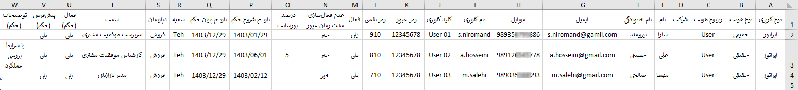
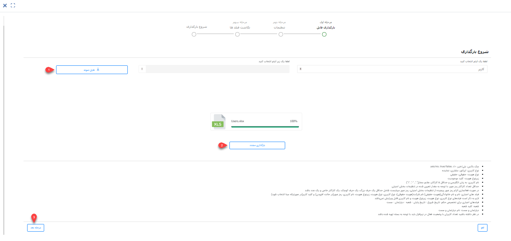
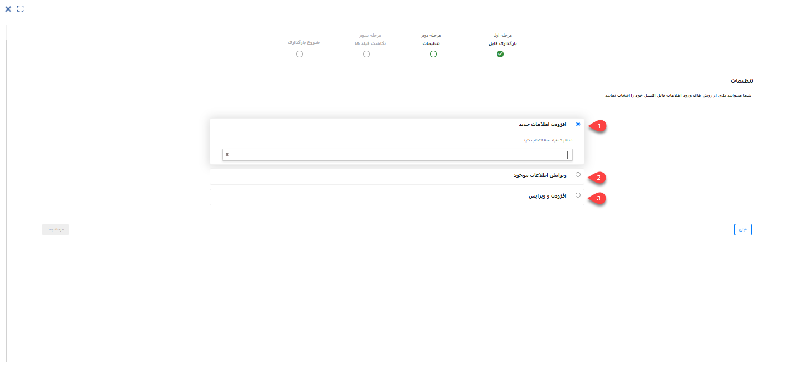
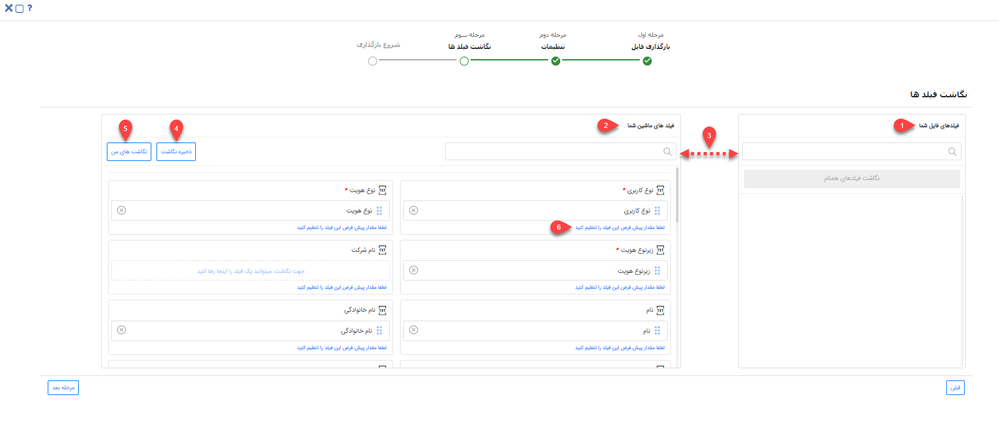

# ایجاد کاربر جدید از طریق اکسل

اگر تعداد کاربرانتان زیاد است و ایجاد کاربر به صورت تکی برایتان زمان‌بر است، می‌توانید از روش ورود اکسلی استفاده نمایید. بدین ترتیب می‌توانید اطلاعات کاربران مورد نظر را در اکسل درج نمایید و سپس به صورت یکجا در نرم‌افزار بارگذاری کنید. در این حالت کاربران مورد نظر ایجاد شده و اطلاعات آن‌ها در فیلدهای مربوطه وارد می‌شود. هم‌زمان با ایجاد کاربر، می‌توانید حکم‌های پرسنلی کاربران را نیز از همین طریق ایجاد نمایید. 
این روش علاوه بر ایجاد کاربر و تخصیص حکم‌های پرسنلی، در ویرایش اطلاعات کاربران و حکم‌های پرسنلی نیز بسیار کارآمد است. به عنوان مثال می‌توانید به کمک این روش، شماره موبایل کاربران و یا شرایط حکم‌های پرسنلی‌شان را به صورت یکجا ویرایش و به‌روزرسانی نمایید. 
برای اینکه بارگذاری اکسل کاربران و حکم‌های پرسنلی، بدون مواجهه با خطا و با موفقیت به اتمام برسد، لازم است که قوانین و فرمت مورد پذیرش را، در تهیه و بارگذاری اکسل رعایت کنید. در این راهنما تمامی موارد لازم برای تنظیم صحیح فایل اکسل، به همراه شیوه بارگذاری آن مطرح شده‌است. بدین منظور در این راهنما به موارد زیر می‌پردازیم: 
- [تهیه فایل اکسل کاربران و حکم‌های پرسنلی](#UsersExcelSetting)
- [روش بارگذاری فایل اکسل کاربران و حکم‌های پرسنلی](#UsersExcelUploading)
- [مجوزهای لازم برای بارگذاری اکسل کاربران و حکم‌های پرسنلی](#UsersExcelPermision)

## تنظیمات فایل اکسل{#UsersExcelSetting}
برای ورود اطلاعات کاربران از طریق اکسل، ابتدا باید اکسل مورد نظر را بر اساس فرمت مورد پذیرش نرم‌افزار تنظیم کنید. بدین منظور می‌توانید اکسلی با ستون‌هایی که در تصویر می‌بینید ایجاد کنید و یا از فایل نمونه استفاده نمایید. فایل نمونه در مرحله‌ی اول بارگذاری به شما ارائه می‌شود (جلوتر به آن می‌رسیم). 
برای اینکه بتوانید کاربران را به همراه حکم پرسنلی‌شان در نرم‌افزار ایجاد کنید، به اکسلی نیاز دارید که تمامی فیلدهای اطلاعاتی کاربر را در کنار فیلدهای اطلاعاتی حکم‌های پرسنلی داشته‌باشد. در تهیه‌ی اکسل مذکور، از راهنمای زیر استفاده کنید تا یک فایل کامل و مناسب برای بارگذاری در پیام‌گستر داشته‌باشید: 

تصویر فوق،‌ ستون‌های مورد نیاز برای بارگذاری کاربر را بر اساس فیلدهای کاربر نشان می‌دهد. برای تکمیل اطلاعات مربوط به فیلدهای پیش‌فرض به راهنمایی‌های زیر توجه داشته‌باشید: 
- **نوع کاربری:** برای تعیین نوع کاربری، «اپراتور» را درج کنید.
- **نوع هویت:** منظور از نوع هویت، حقیقی یا حقوقی بودن آن است. در نتیجه برای کاربر، عبارت «حقیقی» را در ستون هویت وارد کنید.
- **زیرنوع هویت:** برای تعیین زیرنوع هویت لازم است که «کلید زیرنوع موجودیت» مورد نظر را وارد کنید. برای پیدا کردن کلید زیرنوع هویت، از مسیر **تنظیمات** > **شخصی‌سازی CRM** > **نمای کلی** وارد صفحه مدیریت موجودیت‌های  CRM و  قسمت هویت شوید و سپس از بین زیرنوع‌های موجودیت هویت، مخاطب حقیقی (کاربر) را پیدا کنید. با کلیک بر روی آیکون ویرایشی که مقابل آن مشاهده می‌کنید، می‌توانید وارد صفحه ویرایش آن شوید و در بخش «کد»، کلید آن را پیدا کنید.
- **نام:** نام شخص را به صورت فارسی وارد نمایید.	
- **نام‌خانوادگی:** نام‌خانوادگی شخص را به فارسی وارد نمایید.
- **ایمیل:** آدرس ایمیل کاربر را وارد کنید. 
- **موبایل:** شماره موبایل کاربر را وارد کنید. توجه داشته‌باشید که برای تعریف موبایل، از ۹۸+ یا ۹۸ به جای صفر ابتدای شماره موبایل استفاده کنید.
- **نام کاربری:** یک نام کاربری انگلیسی برای کاربر مورد نظر تعریف کنید. نام کاربری باید به زبان انگلیسی و حداقل شامل ۵ کاراکتر باشد تا هنگام بارگذاری با مشکل مواجه نشوید. بهترین الگو برای نام کاربری، استفاده از ابتدای نام در کنار نام خانوادگی به انگلیسی است که با نقطه از هم جدا شده‌اند. به عنوان مثال برای کاربری با نام «مهسا صالحی»، نام‌ کاربری «m.salehi»  می‌تواند مناسب باشد.
- **کلید کاربری:** کلید کاربری ترکیبی از حروف انگلیسی و عدد است که باید به منحصر به‌فرد بودن آن توجه لازم را داشته‌باشید. 
- **رمز عبور:** برای کاربر مورد نظر، رمز عبور تعریف کنید. توجه داشته‌باشید که اگر تنظیمات الزام رمز پیچیده یا حداقل کاراکتر برای رمز عبور فعال است، این نکات را هنگام تعریف رمز در ستون‌های اکسل خود در نظر بگیرید. چرا که اگر در رمزهای تعریف شده، الزامات رمز عبور رعایت نشده‌باشد، بارگذاری با خطا مواجه شده و کاربری مورد نظر ایجاد نمی‌شود. با توجه به اینکه کاربران پس از ورود به حساب کاربری خود ملزوم به تغییر رمز هستند، پیشنهاد می‌شود که همه‌ی رمزها را ۱۲۳۴۵۶۷۸ تعریف نمایید.
- **رمز تلفنی:** برای کاربر مورد نظر رمز تلفنی تعریف کنید. این رمز تلفنی برای تنظیمات ویپ استفاده می‌شود و ورد آن الزامی نمی‌باشد.
- **فعال:** فعال بودن حساب کاربری را با درج «بلی» در ستون فعال، مشخص کنید. 
- **عدم فعال‌سازی مدت زمان عبور:**  با درج «بلی» در این ستون، رمز عبور کاربر در مدت زمان تعیین شده در بخش تنظیمات امنیتی منقضی نمی‌شود.
- **درصد پورسانت:** در صورت نیاز، درصد پورسانت کاربر را به صورت عدد و بدون درج علامت ٪ در ستون درصد پورسانت وارد کنید. 

اگر قصد دارید برای کاربران خود، حکم‌های پرسنلی نیز ثبت کنید، سایر ستون‌های فایل را نیز بر اساس راهنمایی‌های زیر پر کنید. در غیر این صورت، ستون‌های اضافی را حذف کرده و به مرحله بارگذاری بروید. 

- **تاریخ شروع حکم:** تاریخ شروع حکم پرسنلی را مشخص کنید. توجه داشته‌باشید که این ستون را با فرمت تاریخ شمسی (روز/ماه/سال) وارد نمایید.
- **تاریخ پایان حکم:** تاریخ پایان حکم را مشخص کنید. توجه داشته‌باشید که این ستون را نیز با فرمت تاریخ شمسی (روز/ماه/سال) وارد نمایید.
- **شعبه:** برای مشخص کردن شعبه مورد نظر، کد شعبه را وارد کنید. برای به دست آوردن کد شعبه از مسیر **اطلاعات پایه** > **مدیریت شعب، دپارتمان و سمت** وارد صفحه چارت سازمانی شوید و شعبه مورد نظر را انتخاب کنید. با کلیک راست بر روی شعبه و انتخاب گزینه‌ی ویرایش وارد صفحه ویرایش شعبه شوید و کلید شعبه را از بخش اطلاعات پیدا کنید. در صورت عدم وجود کلید، یک کلید (متشکل از حروف انگلیسی و عدد) برای آن تعریف کنید تا بتوانید از آن برای بارگذاری حکم‌های پرسنلی از طریق اکسل استفاده کنید.
- **دپارتمان:**نام دپارتمان را با عنوان فارسی آن‌ها در ستون‌ بعدی وارد کنید. توجه داشته‌باشید که عبارت مندرج در اکسل (به عنوان نام دپارتمان) دقیقاً باید منطبق با نام تعریف شده در چارت سازمانی باشد. به همین منظور از روی چارت سازمانی‌ای که در صفحه مقابل خود دارید برای درج صحیح و کامل اسامی استفاده کنید.
- **سمت:** نام  سمت را نیز با عنوان فارسی آن‌ در ستون‌ بعدی وارد کنید. برای تعیین سمت، لازم است که ابتدا شعبه و سپس به ترتیب دپارتمان و سمت مورد نظر را در سه ستون مجزا درج کرده‌باشید.

> **نکته** 
> برای تخصیص حکم پرسنلی، فیلدهای «تاریخ شروع»، «تاریخ پایان»، «شعبه»، «دپارتمان» و «سمت» اجباری می‌باشد و در صورت خالی بودن هر یک از این ستون‌ها، امکان ایجاد حکم پرسنلی مهیا نمی‌باشد. 

- **فعال (حکم):** فعال بودن حکم پرسنلی را با درج «بلی» در این ستون مشخص کنید.
- **پیش‌فرض (حکم):** پیش‌فرض بودن حکم را با درج «بلی» در این ستون‌ مشخص کنید.
- **توضیحات (حکم):** در صورت نیاز به درج توضیحات در حکم پرسنلی، در ستون توضیحات (حکم) می‌توانید آن را وارد کنید.

## مراحل بارگذاری فایل اکسل{#UsersExcelUploading}
ایجاد کاربر و تخصیص حکم پرسنلی در پیام‌گستر از طریق بارگذاری اکسل، چهار مرحله‌ی اصلی دارد: 

### بارگذاری فایل
برای بارگذاری فایل اکسل کاربران، از مسیر **تنظیمات** > **مدیریت گروه‌ها و کاربران**  وارد صفحه لیست کاربران شوید و بر روی کلید «ورود اطلاعات از اکسل» کلیک کنید تا صفحه بارگذاری به شما نمایش داده‌شود. 

،با توجه به اینکه مسیر ایجاد کاربر را در پیش گرفته‌اید، نوع کاربر به صورت پیش‌فرض برای آن انتخاب شده‌است. همان طور که پیش‌تر به آن اشاره شد، با کلیک بر روی کلید فایل نمونه (شماره ۱) می‌توانید قالب نمونه اکسل برای درج اطلاعات کاربران و حکم‌های پرسنلی‌شان را دریافت نمایید. اگر از اکسل تصویر نمونه برای تهیه فایل اکسل خود استفاده کرده‌اید، نیازی به دریافت این فایل نمی‌باشد.  
پس از تنظیم فایل اکسل، با کلیک بر روی کلید بارگذاری فایل (شماره ۲)، فایل مورد نظر را انتخاب و بارگذاری کنید. پس از اتمام بارگذاری، کلید مرحله‌ی بعد (شماره ۳) در پایین صفحه برای شما فعال می‌شود. با کلیک بر روی این کلید، برای اعمال تنظیمات به مرحله‌ی بعدی می‌روید. 

### تنظیمات بارگذاری فایل
در این بخش باید تنظیمات لازم جهت تعیین روش ورود اطلاعات را مشخص کنید.

**1. افزودن اطلاعات جدید** 
با انتخاب این گزینه، تمامی کاربران جدید موجود در اکسل بر اساس مبنای انتخابی شما شناسایی و بارگذاری می‌شود. در این مرحله می‌توانید فیلد «کلید کاربری» یا «نام کاربری» را به عنوان مبنای شناسایی انتخاب کنید. بر اساس فیلد مبنا، جستجوی تکراری بودن انجام شده و در صورت تکراری نبودن کاربر (یعنی اگر کاربری با این نام یا کد کاربری در سیستم وجود نداشته‌باشد)، آن کاربر به لیست کاربران اضافه می‌شود. 
**2. ‌ویرایش اطلاعات موجود** 
در این حالت، بر اساس فیلدی که به عنوان مبنا انتخاب شده‌است (نام‌ یا کد کاربری)، جستجو انجام‌می‌شود. در صورت وجود کاربری با نام‌ یا کد کاربری مشابه، کاربر مربوطه  و حکم پرسنلی‌اش ویرایش شده و اطلاعات موجود در اکسل برای آن درج می‌شود. در صورت یافت نشدن کاربر با چنین نام‌ یا کدی، اطلاعات آن سطر از اکسل بارگذاری نخواهدشد .
با انتخاب چک باکس " فقط فیلد‌های خالی پر شوند" تنها فیلدهای خالی کاربر و حکم پرسنلی‌اش مقداردهی شده و فیلدهایی که دارای اطلاعات می‌باشند بدون تغییر باقی می‌مانند. 

> **نکته** 
> لازم‌ به‌ ذکر است که فیلدهای نام کاربری، نوع هویت، زیرنوع هویت و نوع کاربری قابل ویرایش نیستند.  

**3. افزودن و ویرایش** 
در این حالت بر اساس فیلد مبنای انتخاب شده جستجو انجام می‌شود. در صورت وجود کاربری با اطلاعات فیلد مبنا (کاربر با نام کاربری یا کد مشابه)، کاربر مربوطه ویرایش می‌شود و در صورت یافت نشدن کاربر با نام‌ کاربری یا کد کاربری یکسان (فیلد مبنا)، آن رکورد به عنوان کاربر جدید به نرم‌افزار اضافه می‌شود. 
با انتخاب چک باکس "فقط فیلد‌های خالی پر شوند"،‌ تنها فیلدهای خالی کاربران و حکم‌های پرسنلی یافت شده (بر اساس فیلد مینا) مقداردهی شده و فیلدهای دارای مقدار، بدون تغییر باقی می‌ماند. در صورت یافت نشدن کاربر  با نام یا کد کاربری مشابه (فیلد مبنا)، کاربر جدید ایجاد می‌گررد. 

برای ادامه‌ی فرآیند بارگذاری، بر روی کلید مرحله بعدی کلیک کنید. 

### نگاشت فیلدها
در مرحله سوم، سرستون‌های فایل اکسل در بخش «فیلدهای فایل شما» (شماره ۱) و فیلدهای موجود در مشخصات کاربر در بخش «فیلدهای ماشین شما» (شماره ۲) نمایش داده‌می‌شود. در واقع در این بخش مشخص می‌شود که اطلاعات هر ستون اکسل باید در کدام فیلد فرم‌ وارد شود. 
در صورت یکسان بودن نام ستون با نام فیلد مربوطه،‌ نگاشت به صورت خودکار انجام می‌گیرد. در غیر این صورت باید با drag & drop نام هر ستون را از بخش فیلدهای فایل شما (سمت راست) به فیلد مربوطه در بخش فیلدهای ماشین شما (سمت چپ) متصل نمایید. در این شرایط برای یافتن عنوان مورد نظر در هر دو بخش می‌توانید از قابلیت جستجو (شماره ۳)‌ استفاده کنید. 

اگر نگاشت خود را به صورت دستی انجام داده‌اید، می‌توانید نگاشت خود را ذخیره نمایید (شماره ۴). در صورت استفاده مجدد از این اکسل یااکسل مشابه برای بارگذاری، با کلیک بر روی نگاشت‌های من (شماره ۵)، نگاشت به صورت خودکار انجام می‌شود. شما می‌توانید نگاشت‌های پرکاربرد خود را در سیستم ذخیره نموده و در وقت خود صرفه‌جویی کنید. در لیست نگاشت‌های من امکان ویرایش یا حذف نگاشت ذخیره شده نیز وجود دارد. 
شما این امکان را دارید که برای هر فیلد مقداری را به عنوان مقدار پیش‌فرض (شماره ۶) در نظر بگیرید تا در صورت خالی بودن مقدار فیلد در اکسل، فیلد با مقدار پیش‌فرض که در این قسمت تعریف کرده‌اید، پر می‌شود. 
برای شروع بارگذاری، روی کلید مرحله بعدی کلیک کنید.  

### شروع بارگذاری
بارگذاری فایل ممکن است لحظاتی زمان ببرد. پس از اتمام فرآیند بارگذاری، در صورت بارگذاری موفق اکسل،‌ انجام موفقیت‌آمیز آن در این صفحه اعلام می‌شود.اگر ورود اطلاعات بدون خطا و با موفقیت انجام شده‌باشد، برای هر ردیف اکسل، یک کاربر و یک حکم پرسنلی در پیام‌گستر ایجاد می‌شود. پیشنهاد می‌شود که پس از آن به صفحه‌ی لیست گروه‌ها و کاربران و پس از آن به صفحه مدیریت حکم‌های پرسنلی بروید و نتیجه را بررسی کنید. 
در منوی گزارش‌ها، بخش وضعیت عملیات انبوه می‌توانید نتایج ورود اطلاعات را مشاهده کنید. اگر فرآیند بارگذاری آغاز شود اما به هر دلیلی امکان بارگذاری برخی سطرها وجود نداشته‌باشد، با دانلود فایل اکسل از این بخش می‌توانید خطا و علت خطا را مشاهده نمایید. برای دانلود فایل، بر روی جزئیات رکورد مربوطه کلیک کرده و خروجی اکسل دریافت کنید. در اکسل دریافتی، سطرهای دارای مشکل با رنگ قرمز مشخص شده و در ستون آخر دلیل بروز خطا درج شده‌است. 

چنانچه بارگذاری فایل با خطا مواجه شده‌باشد و بارگذاری انجام نشود، پیغامی مشابه تصویر فوق به شما نمایش داده‌می‌شود. توجه داشته‌باشید که در این حالت، به سبب آغاز نشدن فرآیند بارگذاری، امکان دریافت فایل خطا از بخش گزارشات انبوه وجود ندارد. در چنین شرایطی فایل اکسل خود را مجدد بررسی و با فرمت راهنما مطابقت دهید. پس از رفع خطاهای فایل، مجدد اقدام به بارگذاری نمایید.

## مجوزهای مورد نیاز برای ایجاد کاربر و حکم پرسنلی از طریق اکسل{#UsersExcelPermision}
برای ایجاد کاربر و حکم پرسنلی از طریق اکسل،‌ کاربر باید دارای مجوزهای زیر باشد:
- برای اینکه کاربر بتواند اقدام به بارگذاری اکسل کاربران، جهت ایجاد کاربر و یا ویرایش آن نماید، باید مجوز **مدیر گروه و کاربران** را داشته‌باشد.
- برای اینکه کاربر، بتواند همزمان با کاربران، حکم‌های پرسنلی آنان را از طریق اکسل ایجاد یا ویرایش کند، باید مجوز **مدیریت حکم‌ها** را داشته‌باشد.
- کاربر دارنده مجوز**مدیر سیستم** می‌تواند بدون نیاز به مجوز دیگری از طریق اکسل اقدام به ایجاد یا ویرایش کاربران و حکم‌های پرسنلی‌شان نماید.
